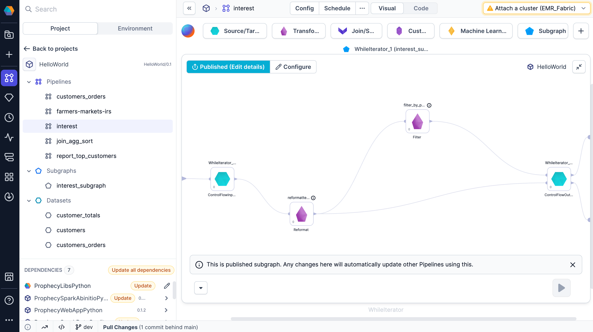
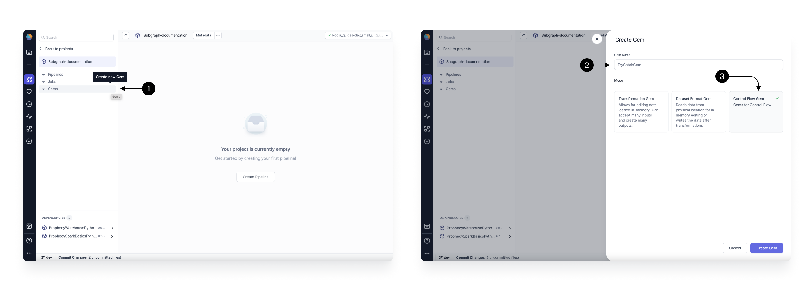

Subgraph gems let you take multiple different gems and wrap them under a single reusable parent gem. In other words, they allow you to group complex logic into reusable components.

## Types of subgraphs

There are three types of subgraphs available by default. The [basic](/engineers/basic-subgraph) subgraph is a great introduction to using subgraphs. Use the individual subgraph documentation to learn how to build each type of subgraph.

| Name                                        | Description                                                                                                                     |
| ------------------------------------------- | ------------------------------------------------------------------------------------------------------------------------------- |
| [Basic](/engineers/basic-subgraph)          | Captures one or more gems within a pipeline to reuse across other pipelines and projects.                                       |
| [Table Iterator](/engineers/table-iterator) | Iterates over one or more gems for each row of the first input DataFrame. Table iterator is available for Python projects only. |
| [Custom](#build-a-custom-subgraph-type)     | Apply any custom logic to the group of gems present inside the subgraph.                                                        |

## Reuse subgraphs

To make a subgraph reusable in your project, you must **Publish** the subgraph. This adds it to the **Subgraph** section of the project browser. It also makes the subgraph available when the project is imported as a dependency to another project.



## Build a custom subgraph type

You can also create your own Subgraph to apply any custom logic on the group of gems present inside it. For example Try Catch, other kinds of Iterators, etc.

To create your own Subgraph type, Go to the project you want to create the gem in.
Click on the **(1) Create Gem** button. This will open up the **Create Gem** Form. Provide a **(2) Name** for the gem, and select the mode as **Control Flow Gem**.



This takes you to the gem code editor with a basic structure of the code generated. Here you can start modifying your gem dialog, validation, and processing logic. Visit the [gem builder documentation](/docs/extensibility/gem-builder/spark-gem-builder.md) for more details.

The newly constructed Subgraph gem appears in the Subgraph section of the project browser and can be utilized within any pipeline of this project. Furthermore, if you publish this project to the [Package Hub](/engineers/package-hub), other projects can utilize the Subgraph gem via a package dependency.


## What's next

To learn more about Spark subgraphs, see the following pages:

```mdx-code-block
import DocCardList from '@theme/DocCardList';
import {useCurrentSidebarCategory} from '@docusaurus/theme-common';

<DocCardList items={useCurrentSidebarCategory().items}/>
```
