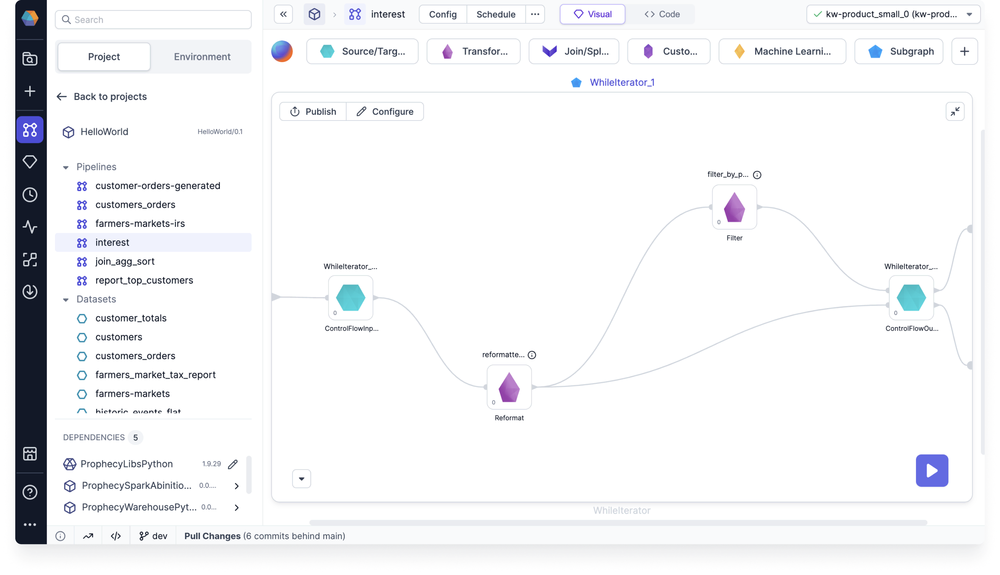
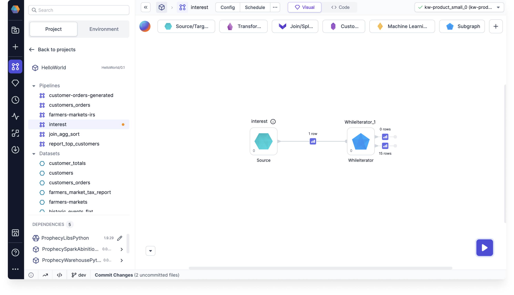

import Requirements from '@site/src/components/gem-requirements';

<Requirements
  python_package_name=""
  python_package_version=""
  scala_package_name=""
  scala_package_version=""
  scala_lib=""
  python_lib=""
  uc_single="14.3+"
  uc_shared="14.3+"
  livy=""
/>

The WhileIterator allows you to group a set of gems together, and then run them one after another repeatedly in a loop.

## Input

The input of the WhileIterator can be any dataset. Importantly, the output schema of the WhileIterator **must** match or be a subset of the input schema. This is because the output feeds back into the input as the subgraph is iterating (looping).

## Configuration

:::info
Before setting the WhileIterator configuration, make sure you are familiar with [pipeline configurations](docs/Spark/configuration.md).
:::

Once you have a WhileIterator subgraph on your canvas, set configurations by opening the subgraph and clicking on **Configuration**. The following table describes the parameters you need to set.

| Parameter                                                | Tab           | Description                                                                                                                                                                                                                          |
| -------------------------------------------------------- | ------------- | ------------------------------------------------------------------------------------------------------------------------------------------------------------------------------------------------------------------------------------ |
| Max iterations                                           | Settings      | The maximum number of loops that will be performed.                                                                                                                                                                                  |
| Populate iteration number in config variable             | Settings      | A checkbox to enable if you want to keep track of iteration numbers in a variable.                                                                                                                                                   |
| Select config variable name to populate iteration number | Settings      | The name of the config variable that will store the iteration number.                                                                                                                                                                |
| Schema                                                   | Configuration | A table where you define configuration variables. You can **Copy Pipeline Configs** to inherit these from your pipeline. If you want to populate the iteration number in a config variable, make sure to include that variable here. |
| Config                                                   | Configuration | An area where you can define default values for variables in one or more configurations.                                                                                                                                             |

## Subgraph

Within the WhileIterator, you can design a flow with multiple gems to create your desired output.

Importantly, you also need to understand the two inputs of the WhileIterator_Output. The order of your inputs is important:

- The **in0** dataset contains the DataFrame for the **following** iteration. If this dataset becomes empty, the loop is terminated.
- The **in1** dataset passes on an individual iteration. You'll see the entire list of iterations as the output of the WhileIterator gem.

## Break condition

There are two scenarios in which the WhileIterator will break:

- The **in0** dataset of the WhileIterator_Output becomes empty.
- The maximum number of iterations is reached.

## Output

There are two outputs of the WhileIterator:

- The **out0** dataset that contains the output of the **last iteration** of the WhileIterator.
- The **out1** dataset that contains the whole list of iterations produced by the WhileIterator. This is produced by performing a union on all output iterations.

---

## Example

Imagine you are simulating an investment that earns a fixed percentage of interest per year. You want to keep compounding the interest until your investment reaches a desired amount. You can use the WhileIterator gem to produce a dataset demonstrating this yearly growth.

For this example, the input of the WhileIterator will be a simple table that describes your starting investment and the fixed interest rate.

| year | principal | interest_rate |
| ---- | --------- | ------------- |
| 0    | 1000      | 0.05          |

### Add Reformat gem

Now, let's use a Reformat gem in the WhileIterator subgraph to update the **Year** and **Principal** each iteration.

1. Add the Reformat gem inside the WhileIterator.
1. Connect WhileIterator_Input to the Reformat gem.
1. Connect the Reformat gem to the WhileIterator_Output.
1. Configure the **Expressions** table as it is shown below.

| Target Column | Expression                             |
| ------------- | -------------------------------------- |
| year          | year + 1                               |
| principal     | principal + principal \* interest_rate |
| interest_rate | interest_rate                          |

### Terminate loop

The while loop will stop if the **in0** dataset becomes empty. How can the **in0** dataset become empty? In this example:

1. Add a Filter gem with the condition `principal < 2000`.
1. Connect the Reformat gem output to the input of the Filter gem.
1. Connect the Filter gem output to the input of WhileIterator_Output.

This way, the Filter gem will return data as-is until the principal reaches 2000. After that, the record is filtered out, and the loop will terminate.

### View output data

The **out0** dataset should be empty because we used a Filter gem to return an empty set when the `principal > 2000`.

Below is an example **out1** dataset. This lets you project how your principal will grow over the years.

| year | principal      | interest_rate |
| ---- | -------------- | ------------- |
| 1    | 1050           | 0.05          |
| 2    | 1102.5         | 0.05          |
| 3    | 1157.625       | 0.05          |
| 4    | 1215.50625     | 0.05          |
| 5    | 1276.2815625   | 0.05          |
| 6    | 1340.095640625 | 0.05          |
| 7    | 1407.100422656 | 0.05          |
| 8    | 1477.455443789 | 0.05          |
| 9    | 1551.328215978 | 0.05          |
| 10   | 1628.894626777 | 0.05          |
| 11   | 1710.339358116 | 0.05          |
| 12   | 1795.856326022 | 0.05          |
| 13   | 1885.649142323 | 0.05          |
| 14   | 1979.931599439 | 0.05          |
| 15   | 2078.928179411 | 0.05          |
