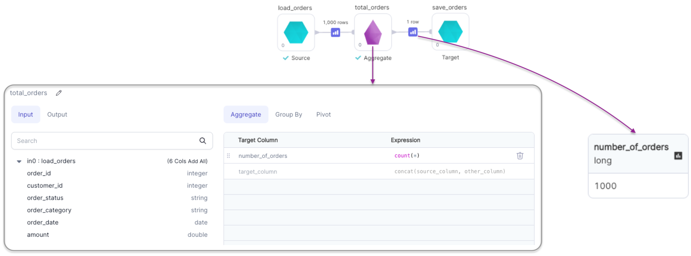
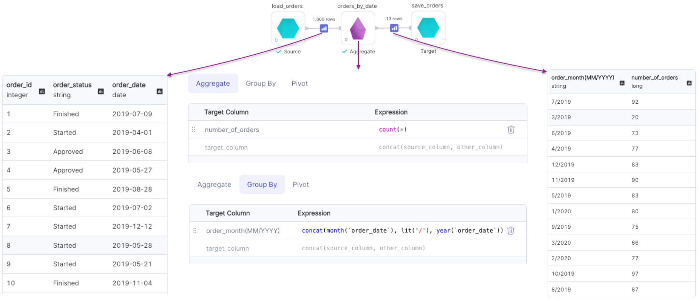
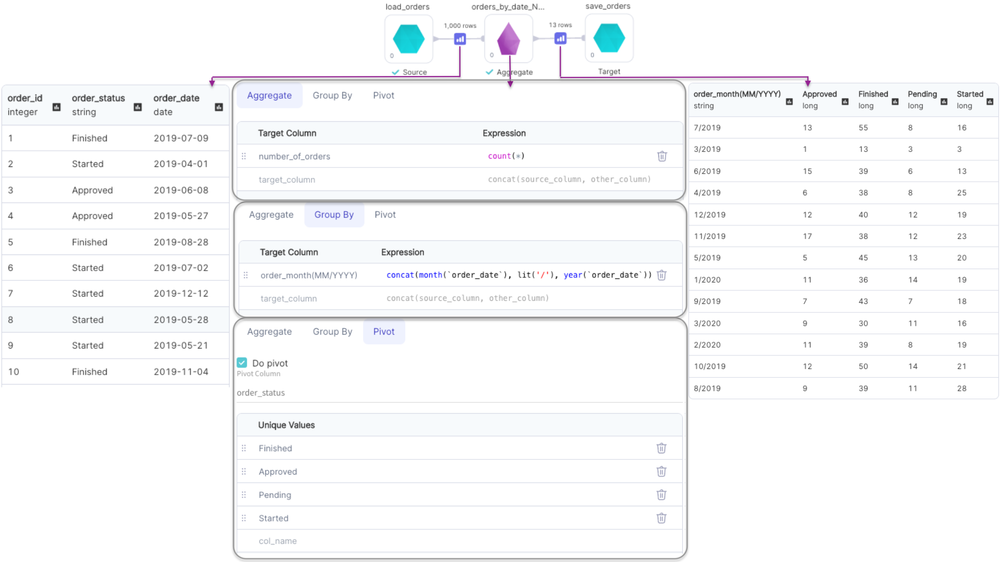

import Requirements from "../\_gem-requirements.mdx";

<h3><span class="badge">Spark Gem</span></h3>

Allows you to group the data and apply aggregation methods and pivot operation.

## Requirements

<Requirements
  packagename="ProphecySparkBasicsPython"
  packageversion="0.0.1"
  scalalib=""
  pythonlib=""
  packageversion143="Supported"
  packageversion154="Supported"
  additional_requirements=""
/>

## Parameters

| Parameter                     | Description                                                                                                                                                                                                                                     | Required                                           |
| ----------------------------- | ----------------------------------------------------------------------------------------------------------------------------------------------------------------------------------------------------------------------------------------------- | -------------------------------------------------- |
| DataFrame                     | Input DataFrame                                                                                                                                                                                                                                 | True                                               |
| Target column (Aggregate Tab) | Output column name of aggregated column                                                                                                                                                                                                         | True                                               |
| Expression (Aggregate Tab)    | Aggregate function expression<br/> Eg: `sum("amount")`, `count(*)`, `avg("amount")`                                                                                                                                                             | True                                               |
| Target column (Group By Tab)  | Output column name of grouped column                                                                                                                                                                                                            | Required if `Pivot Column` is present              |
| Expression (Group By Tab)     | Column expression to group on <br/> Eg: `col("id")`, `month(col("order_date"))`                                                                                                                                                                 | Required if a `Target Column`(Group By) is present |
| Pivot column                  | Column name to pivot                                                                                                                                                                                                                            | False                                              |
| Unique values                 | List of values in `Pivot Column` that will be translated to columns in the output DataFrame                                                                                                                                                     | False                                              |
| Propagate All Input Columns   | If `true`, all columns from the DataFrame would be propagated to output DataFrame. By default all columns apart from ones specified in `group by`, `pivot`, `aggregate` expressions are propagated as `first(col_name)` in the output DataFrame | False                                              |

:::info
Providing `Unique values` while performing pivot operation improves the performance of the operation since Spark does not have to first compute the list of distinct values of `Pivot Column` internally.
:::

## Examples

### Aggregation without Grouping



````mdx-code-block
import Tabs from '@theme/Tabs';
import TabItem from '@theme/TabItem';

<Tabs>

<TabItem value="py" label="Python">

```py
def total_orders(spark: SparkSession, in0: DataFrame) -> DataFrame:
    return in0.agg(count(lit(1)).alias("number_of_orders"))
```

</TabItem>
<TabItem value="scala" label="Scala">

```scala
object total_orders {
  def apply(spark: SparkSession, in: DataFrame): DataFrame =
    in.agg(count(lit(1)).as("number_of_orders"))
}
```

</TabItem>
</Tabs>

````

### Aggregation with Grouping



````mdx-code-block
<Tabs>

<TabItem value="py" label="Python">

```py
def orders_by_date(spark: SparkSession, in0: DataFrame) -> DataFrame:
    df1 = in0.groupBy(concat(month(col("order_date")), lit("/"), year(col("order_date")))
                      .alias("order_month(MM/YYYY)"))
    return df1.agg(count(lit(1)).alias("number_of_orders"))
```

</TabItem>
<TabItem value="scala" label="Scala">

```scala
object orders_by_date {
  def apply(spark: SparkSession, in: DataFrame): DataFrame =
    in.groupBy(
        concat(month(col("order_date")), lit("/"), year(col("order_date")))
          .as("order_month(MM/YYYY)")
      )
      .agg(count(lit(1)).as("number_of_orders"))
}
```
</TabItem>
</Tabs>

````

### Pivot Columns



````mdx-code-block
<Tabs>

<TabItem value="py" label="Python">

```py
def orders_by_date_N_status(spark: SparkSession, in0: DataFrame) -> DataFrame:
    df1 = in0.groupBy(concat(month(col("order_date")), lit("/"), year(col("order_date"))).alias("order_month(MM/YYYY)"))
    df2 = df1.pivot("order_status", ["Approved", "Finished", "Pending", "Started"])
    return df2.agg(count(lit(1)).alias("number_of_orders"))
```

</TabItem>
<TabItem value="scala" label="Scala">

```scala
object orders_by_date_N_status {
  def apply(spark: SparkSession, in: DataFrame): DataFrame =
    in.groupBy(
        concat(month(col("order_date")), lit("/"), year(col("order_date")))
          .as("order_month(MM/YYYY)")
      )
      .pivot(col("order_status"),
             List("Approved", "Finished", "Pending", "Started")
      )
      .agg(count(lit(1)).as("number_of_orders"))
}
```
</TabItem>
</Tabs>

````

### Propagate all input Columns

This option in used to propagate all columns from input DataFrame to output DataFrame.
By default `first(col_name)` is used as aggregate function for columns not specified in `group by`, `pivot`, `aggregate` expressions.

<div class="wistia_responsive_padding" style={{padding:'56.25% 0 0 0', position:'relative'}}>
<div class="wistia_responsive_wrapper" style={{height:'100%',left:0,position:'absolute',top:0,width:'100%'}}>
<iframe src="https://user-images.githubusercontent.com/103921419/185245719-2be22f30-c84f-4b85-8712-be626c77e4e4.mp4" title="Aggregate Propagate columns" allow="autoplay;fullscreen" allowtransparency="true" frameborder="0" scrolling="no" class="wistia_embed" name="wistia_embed" msallowfullscreen width="100%" height="100%"></iframe>
</div></div>

````mdx-code-block
<Tabs>

<TabItem value="py" label="Python">

```py
def Aggregate_1(spark: SparkSession, in0: DataFrame) -> DataFrame:
    df1 = in0.groupBy(col("customer_id"))

    return df1.agg(
        *[first(col("order_date")).alias("order_date")],
        *[
          first(col(x)).alias(x)
          for x in in0.columns
          if x not in ["order_date", "customer_id"]
        ]
    )
```

</TabItem>
<TabItem value="scala" label="Scala">

```scala
object Aggregate {

  def apply(spark: SparkSession, in: DataFrame): DataFrame =
    in.agg(first(col("order_date")).as("order_date"),
           List() ++ in.columns.toList
             .diff(List("order_date", "customer_id"))
             .map(x => first(col(x)).as(x)): _*
    )

}
```
</TabItem>
</Tabs>

````
