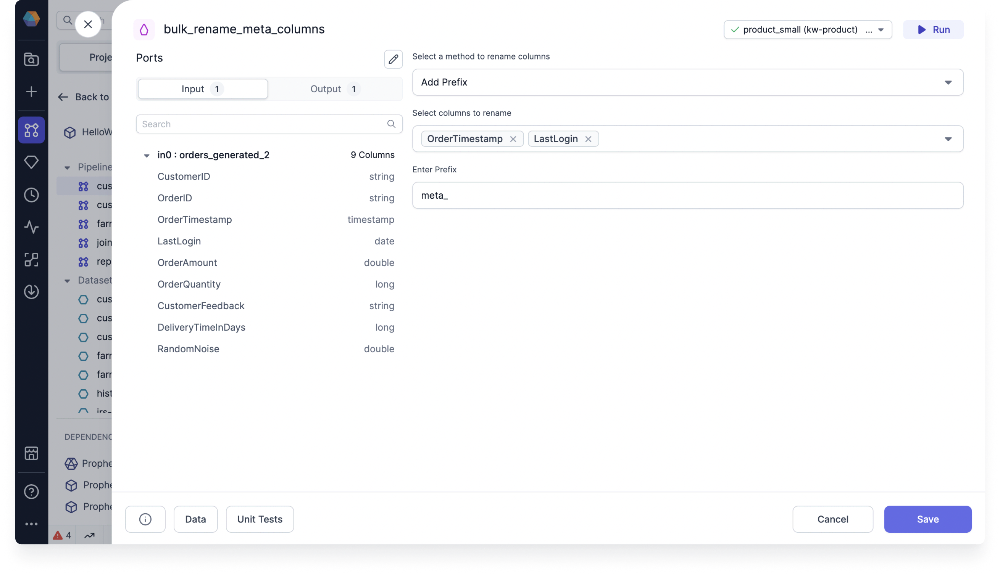

import Requirements from '@site/src/components/gem-requirements';

<Requirements
  python_package_name="ProphecySparkBasicsPython"
  python_package_version="0.2.11+"
  scala_package_name="ProphecySparkBasicsScala"
  scala_package_version="0.1.9+"
  scala_lib="7.1.97"
  python_lib="1.8.19"
  uc_single="14.3+"
  uc_shared="Not Supported"
  livy="3.0.1+"
/>

Use the BulkColumnRename gem to rename multiple columns in your dataset in a systematic way.

## Parameters

| Parameter         | Description                                                                              |
| ----------------- | ---------------------------------------------------------------------------------------- |
| Columns to rename | Select one or more columns to rename from the dropdown.                                  |
| Method            | Choose to add a prefix, add a suffix, or use a custom expression to change column names. |

Based on the method you select, you will see an option to enter the prefix, suffix, or expression of your choice.

## Examples

### Add a prefix

One example is to add the prefix `meta_` to tag columns that contain metadata.



### Use a custom expression

You can accomplish the same or more complex changes using a custom expression like `concat('meta_', column_name)`.

## Generated code

````mdx-code-block
import Tabs from '@theme/Tabs';
import TabItem from '@theme/TabItem';

<Tabs>

<TabItem value="py" label="Python">

```py
def bulk_rename_customer_id(spark: SparkSession, in0: DataFrame) -> DataFrame:
    from prophecy.utils.transpiler.dataframe_fcns import evaluate_expression

    return evaluate_expression(
        in0,
        userExpression = "concat('int_', column_name)",
        selectedColumnNames = ["customer_id"],
        sparkSession = spark
    )
```

</TabItem>
<TabItem value="scala" label="Scala">

```scala
object bulk_column_rename {
  def apply(context: Context, in: DataFrame): DataFrame = {
    import org.apache.spark.sql.ProphecyDataFrame
    ProphecyDataFrame
      .extendedDataFrame(in)
      .evaluate_expression("concat('c_',column_name)",
                           List(" code"),
                           context.spark
      )
  }
}
```

</TabItem>
</Tabs>

````
