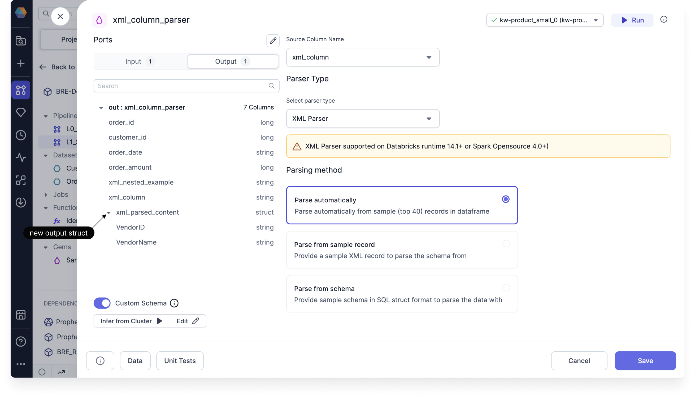

<h3>Spark Gem</h3>

The ColumnParser lets you parse XML or JSON that is included in a column of your table.

## Parameters

| Parameter          | Description                                                             |
| ------------------ | ----------------------------------------------------------------------- |
| Source Column Name | The name of the column that contains the XML or JSON records.           |
| Parser Type        | The format that you want to be parsed (XML or JSON).                    |
| Parsing Method     | The method that Prophecy will use to generate the schema of the output. |

When you select a parsing method, you have three options:

- **Parse automatically.** Prophecy infers the schema by reading the first 40 records.
- **Parse from sample record.** Prophecy uses the schema that you provide in the sample record.
- **Parse from schema.** Prophecy uses the schema that you provide in the form of a schema struct.

## Output

The schema of the ColumnParser gem output includes the parsed content as a **struct** data type, in addition to all of the input columns.

