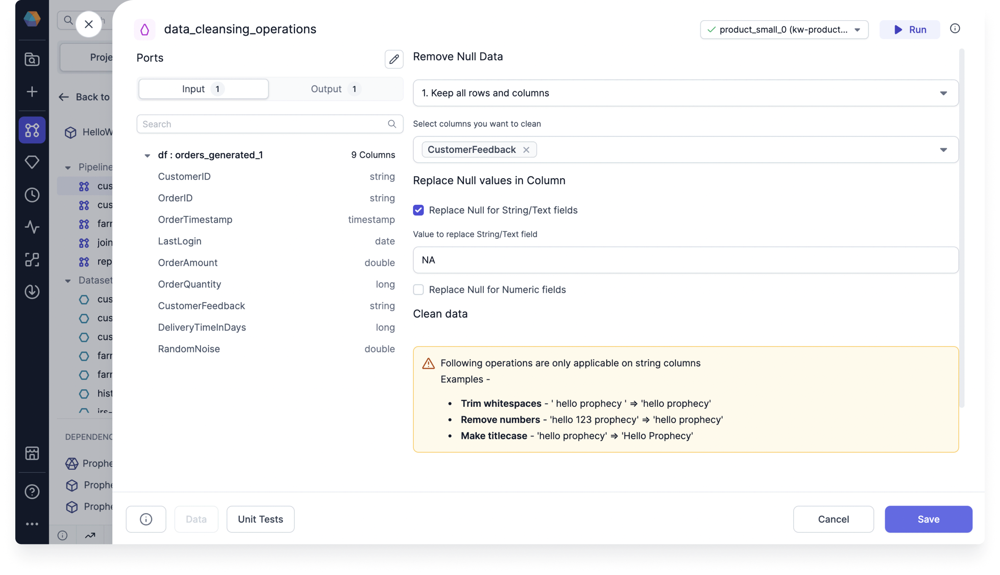

Use the DataCleansing Gem to standardize data formats and address missing or null values in the data.

## Parameters

| Parameter                        | Description                                                     |
| -------------------------------- | --------------------------------------------------------------- |
| Select columns you want to clean | The set of columns on which to perform cleaning transformations |
| Remove null data                 | The method used to remove null data                             |
| Replace null values in column    | The method used to replace null values                          |
| Clean data                       | Different ways to standardize the format of data in columns     |

## Example

Assume you have a table that includes customer feedback on individual orders. In this scenario, some customers may not provide feedback, resulting in null values in the data. You can use the DataCleansing Gem to replace null values with the string `NA`.

