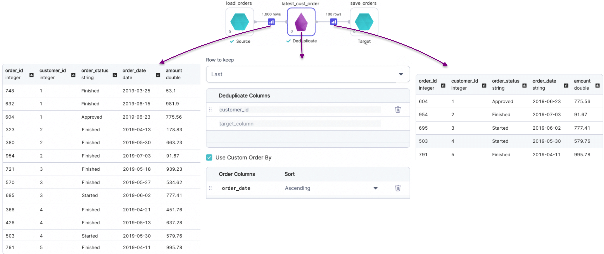

import Requirements from '@site/src/components/gem-requirements';

<Requirements
  python_package_name="ProphecySparkBasicsPython"
  python_package_version="0.0.1+"
  scala_package_name="ProphecySparkBasicsScala"
  scala_package_version="0.0.1+"
  scala_lib=""
  python_lib=""
  uc_single="14.3+"
  uc_shared="14.3+"
  livy="3.0.1"
/>

Removes rows with duplicate values of specified columns.

## Parameters

| Parameter           | Description                                                                                                                                                                                                                                                                                                                                                                                                                                              |
| ------------------- | -------------------------------------------------------------------------------------------------------------------------------------------------------------------------------------------------------------------------------------------------------------------------------------------------------------------------------------------------------------------------------------------------------------------------------------------------------- |
| DataFrame           | Input DataFrame                                                                                                                                                                                                                                                                                                                                                                                                                                          |
| Row to keep         | <ul style={{margin:0, padding:"0 1rem"}}><li>Any (Default): Keeps any one row among duplicates. Uses underlying `dropDuplicates` construct. </li><li>First: Keeps first occurrence of the duplicate row. </li><li>Last: Keeps last occurrence of the duplicate row.</li><li>Unique Only: Keeps rows that don't have duplicates. </li><li>Distinct Rows: Keeps all distinct rows. This is equivalent to performing a `df.distinct()` operation.</li></ul> |
| Deduplicate columns | Columns to consider while removing duplicate rows (not required for `Distinct Rows`)                                                                                                                                                                                                                                                                                                                                                                     |
| Order columns       | Columns to sort DataFrame on before de-duping in case of `First` and `Last` rows to keep                                                                                                                                                                                                                                                                                                                                                                 |

## Examples

### Rows to keep: `Any`


````mdx-code-block
import Tabs from '@theme/Tabs';
import TabItem from '@theme/TabItem';

<Tabs>

<TabItem value="py" label="Python">

```py
def dedup(spark: SparkSession, in0: DataFrame) -> DataFrame:
    return in0.dropDuplicates(["tran_id"])
```

</TabItem>
<TabItem value="scala" label="Scala">

```scala
object dedup {
  def apply(spark: SparkSession, in: DataFrame): DataFrame = {
    in.dropDuplicates(List("tran_id"))
  }
}
```

</TabItem>
</Tabs>

````

---

### Rows to keep: `First`


````mdx-code-block


<Tabs>

<TabItem value="py" label="Python">

```py
def earliest_cust_order(spark: SparkSession, in0: DataFrame) -> DataFrame:
    return in0\
        .withColumn(
          "row_number",
          row_number()\
            .over(Window\
            .partitionBy("customer_id")\
            .orderBy(col("order_dt").asc())
        )\
        .filter(col("row_number") == lit(1))\
        .drop("row_number")
```

</TabItem>
<TabItem value="scala" label="Scala">

```scala
object earliest_cust_order {
  def apply(spark: SparkSession, in: DataFrame): DataFrame = {
    import org.apache.spark.sql.expressions.Window
    in.withColumn(
        "row_number",
        row_number().over(
          Window
            .partitionBy("customer_id")
            .orderBy(col("order_date").asc)
        )
      )
      .filter(col("row_number") === lit(1))
      .drop("row_number")
  }
}
```

</TabItem>
</Tabs>

````

---

### Rows to keep: `Last`



````mdx-code-block


<Tabs>

<TabItem value="py" label="Python">

```py
def latest_cust_order(spark: SparkSession, in0: DataFrame) -> DataFrame:
    return in0\
        .withColumn(
          "row_number",
          row_number()\
            .over(Window\
            .partitionBy("customer_id")\
            .orderBy(col("order_dt").asc())
        )\
        .withColumn(
          "count",
          count("*")\
            .over(Window\
            .partitionBy("customer_id")
        )\
        .filter(col("row_number") == col("count"))\
        .drop("row_number")\
        .drop("count")
```

</TabItem>
<TabItem value="scala" label="Scala">

```scala
object latest_cust_order {
  def apply(spark: SparkSession, in: DataFrame): DataFrame = {
    import org.apache.spark.sql.expressions.Window
    in.withColumn(
        "row_number",
        row_number().over(
          Window
            .partitionBy("customer_id")
            .orderBy(col("order_date").asc)
        )
      )
      .withColumn(
        "count",
        count("*").over(
          Window
            .partitionBy("customer_id")
        )
      )
      .filter(col("row_number") === col("count"))
      .drop("row_number")
      .drop("count")
  }
}
```

</TabItem>
</Tabs>

````

### Rows to keep: `Unique Only`


````mdx-code-block


<Tabs>

<TabItem value="py" label="Python">

```py
def single_order_customers(spark: SparkSession, in0: DataFrame) -> DataFrame:
    return in0\
        .withColumn(
          "count",
          count("*")\
            .over(Window\
            .partitionBy("customer_id")
        )\
        .filter(col("count") == lit(1))\
        .drop("count")
```

</TabItem>
<TabItem value="scala" label="Scala">

```scala
object single_order_customers {
  def apply(spark: SparkSession, in: DataFrame): DataFrame = {
    import org.apache.spark.sql.expressions.Window
    in.withColumn(
        "count",
        count("*").over(
          Window
            .partitionBy("customer_id")
        )
      )
      .filter(col("count") === lit(1))
      .drop("count")
  }

}
```

</TabItem>
</Tabs>

````

### Rows to keep: `Distinct Rows`


````mdx-code-block


<Tabs>

<TabItem value="py" label="Python">

```py
def single_order_customers(spark: SparkSession, in0: DataFrame) -> DataFrame:
    return in0.distinct()
```

</TabItem>
<TabItem value="scala" label="Scala">

```scala
object single_order_customers {
  def apply(spark: SparkSession, in: DataFrame): DataFrame = {
    in.distinct()
  }

}
```

</TabItem>
</Tabs>

````
