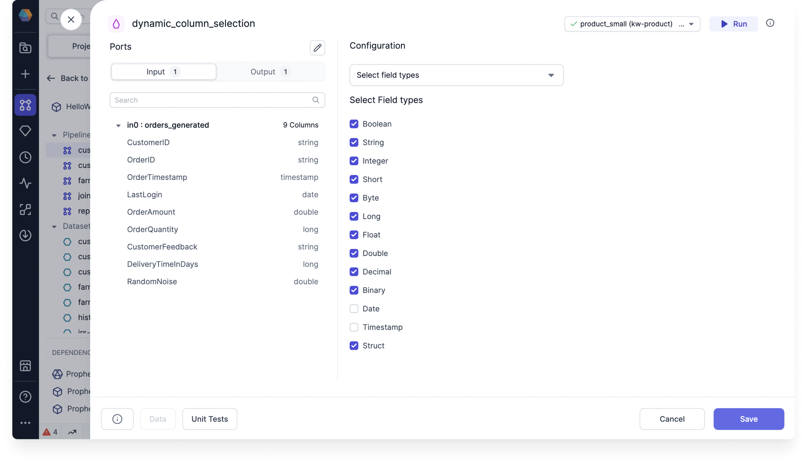

<h3>Spark Gem</h3>

Use the DynamicSelect Gem to dynamically filter columns of your Dataset based on a set of conditions.

## Configuration

There are two ways to configure the DynamicSelect.

| Configuration         | Description                                                                                   |
| --------------------- | --------------------------------------------------------------------------------------------- |
| Select field types    | Choose one or more types of columns to keep in the Dataset, such as string, decimal, or date. |
| Select via expression | Create an expression that limits the type of columns to keep in the Dataset.                  |

## Examples

You’ll use DynamicSelect when you want to avoid hard-coding your choice of columns. In other words, rather than define each column to keep in your Pipeline, you let the system automatically choose the columns based on certain conditions or rules.

### Remove date columns using field type

Assume you would like to remove irrelevant date and timestamp columns from your Dataset. You can do so with the **Select field types** method by selecting all field types to maintain, except for date and timestamp.

### Remove date columns with an expression

Using the same example, you can accomplish the same task with the **Select via expression** method by inputting the the expression `column_type NOT IN ('date', 'timestamp')`.
