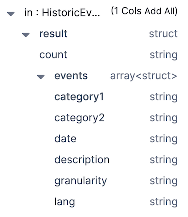
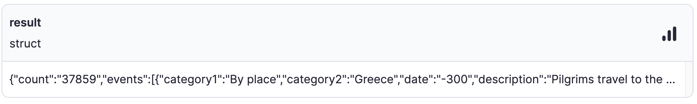
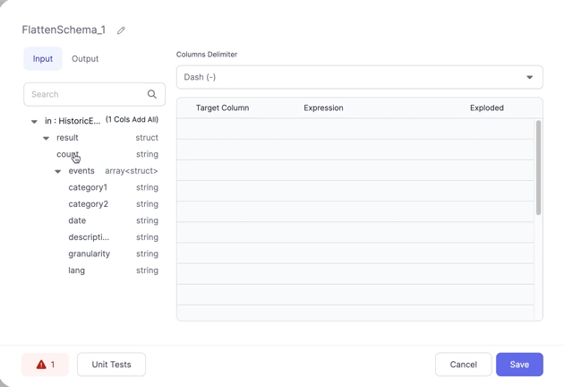
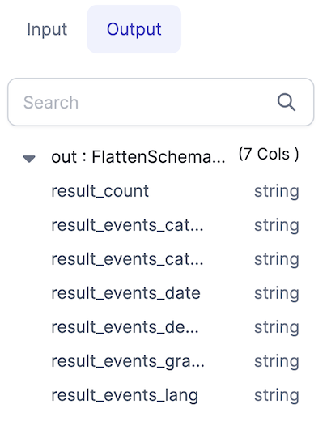
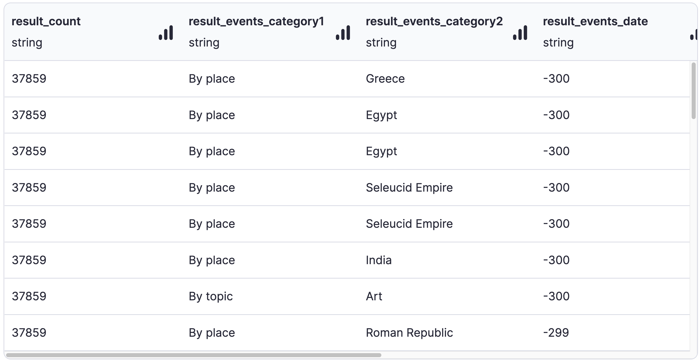

SPARK GEM  

When processing raw data it can be useful to flatten complex data types like structures and arrays into simpler, flatter schemas.

## The Input

FlattenSchema works on DataFrames that have nested columns that you'd like to extract into a flat schema.

For example, with an input schema like so:

And the data looks like so:

We want to extract `count` from _result_ and all of the columns from _events_ into a flattened schema.

## The Expressions

Having added a FlattenSchema gem to your pipeline, all you need to do is click the column names you wish to extract and they'll be added to the **Expressions** section. Then, you can change the values in the **Target Column** to change the name of output columns.

The **Columns Delimiter** dropdown allows you to control how the names of the new columns are derived. Currently dashes and underscores are supported.

## The Output

If we check the **Output** tab in the gem, you'll see the schema that we've created using the selected columns.

And here's what the output data looks like:

No more nested structures!

:::info
For more advanced use cases, the Spark `explode` function is available to use in the [Reformat](./reformat.md) gem, [Custom SQL](../custom/sql-statement.md) gem, or anywhere else that accepts Spark expressions.
:::
