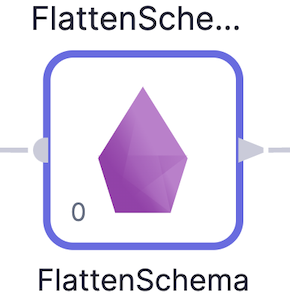

When processing raw data it can be useful to flatten complex data types like `Struct`s and `Array`s into simpler, flatter schemas.

## The Input

FlattenSchema works on DataFrames that have nested columns that you'd like to extract into a flat schema.

For example, with an input schema like so:

And the data looks like so:

We want to extract `count`, and all of the columns from the `struct`s in `events` into a flattened schema.

## The Expressions

Having added a `FlattenSchema` Gem to your Pipeline, all you need to do is click the column names you wish to extract and they'll be added to the `Expressions` section. Once added you can change the `Target Column` for a given row to change the name of the Column in the output.

The `Columns Delimiter` dropdown allows you to control how the names of the new columns are derived. Currently dashes and underscores are supported.

## The Output

If we check the `Output` tab in the Gem, you'll see the schema that we've created using the selected columns.

And here's what the output data looks like:

No more nested structures!

:::info
For more advanced use cases, the Spark `explode` function is available to use in the [Reformat](./reformat.md) Gem, [Custom SQL](../custom/sql-statement.md) Gem, or anywhere else that accepts Spark expressions.
:::
