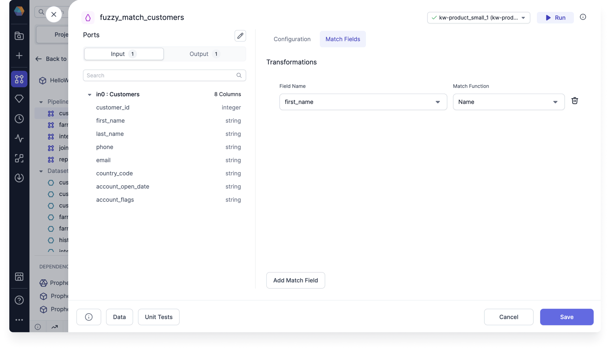
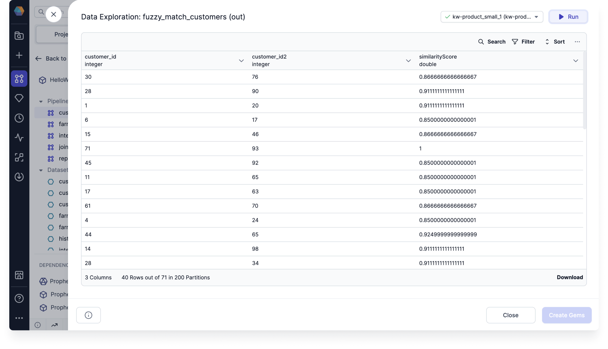
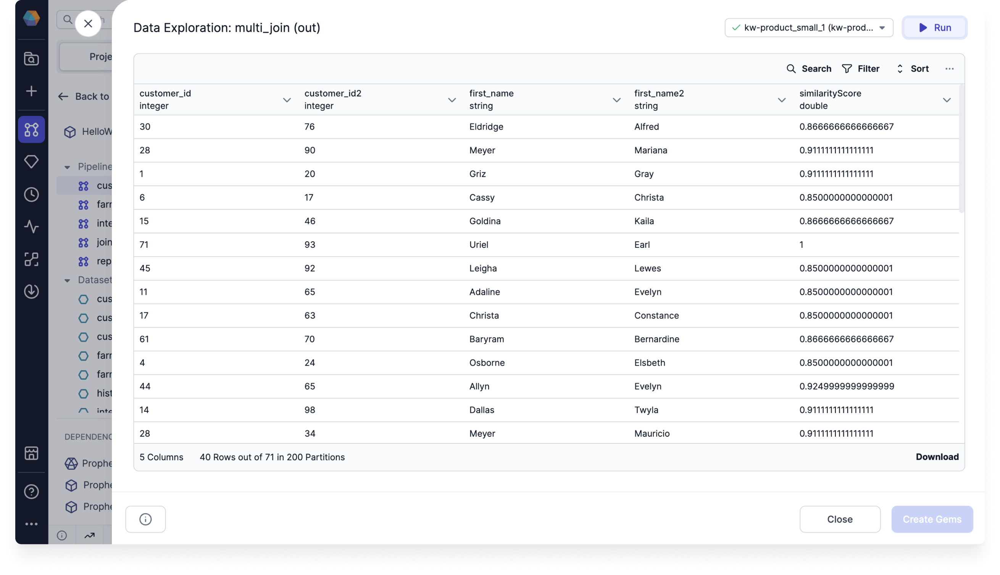

import Requirements from '@site/src/components/gem-requirements';

<Requirements
  python_package_name=""
  python_package_version=""
  scala_package_name=""
  scala_package_version=""
  scala_lib=""
  python_lib=""
  uc_single="14.3+"
  uc_shared="Not Supported"
  livy="Not Supported"
/>

Use the FuzzyMatch gem to identify non-identical duplicates in your data.

## Input and Output

| DataFrame | Description                                                                                   |
| --------- | --------------------------------------------------------------------------------------------- |
| **in0**   | Includes the DataFrame on which duplicates will be checked. FuzzyMatch only allows one input. |
| **out**   | Generates one record per fuzzy match.                                                         |

## Parameters

### Configuration

| Parameter                  | Description                                                                                                                                                                      |
| -------------------------- | -------------------------------------------------------------------------------------------------------------------------------------------------------------------------------- |
| Merge/Purge Mode           | Records are either compared from a single source (Purge) or across multiple sources (Merge). <br/> Merge mode assumes that multiple sources exist in the same DataFrame **in0**. |
| Source ID Field            | Unique identifier for each source when using **Merge** mode. <br/>This is necessary because the different sources exist in the same DataFrame **in0**.                           |
| Record ID Field            | Unique identifier for each record.                                                                                                                                               |
| Match threshold percentage | If the match score is less than the threshold, the record does not qualify as a match.                                                                                           |
| Include similarity score   | Checkbox to enable for an additional output column that includes the similarity score.                                                                                           |

### Match Fields

| Parameter      | Description                                               |
| -------------- | --------------------------------------------------------- |
| Field name     | Name of the column that you want to check for duplicates. |
| Match function | The method that generates the similarity score.           |

## Example

One common use case for the FuzzyMatch gem is to match similarly spelled names. This can be useful for identifying accidentally misspelled names.

1. Create a FuzzyMatch gem and use the **customer_id** as the Record ID. Then, add a match field for the **first_name** column.

   

2. Run the gem and see that the output includes the Record IDs of the records with fuzzy matches.

   

3. Join the output with the original dataset to view the matched names.

   

## Example code

:::tip
To see the compiled code of your project, [switch to the Code view](/engineers/pipelines#project-editor) in the project header.
:::

````mdx-code-block
import Tabs from '@theme/Tabs';
import TabItem from '@theme/TabItem';

<Tabs>
<TabItem value="py" label="Python">

```py
def fuzzy_match_customers(spark: SparkSession, in0: DataFrame) -> DataFrame:
    from prophecy.utils.transpiler.dataframe_fcns import fuzzyPurgeMode

    return fuzzyPurgeMode(
        in0,
        spark,
        recordId = "customer_id",
        matchFields = {"first_name" : "name"},
        threshold = 0.8,
        includeSimilarityScore = True
    )
```

</TabItem>
</Tabs>
````
