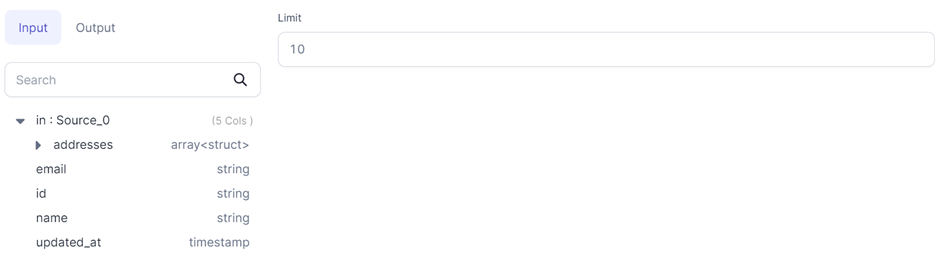

<span class="badge">SPARK GEM</span><br /><br />

Limits the number of rows in the output.

## Parameters

| Parameter | Description                                                              |
| :-------- | :----------------------------------------------------------------------- |
| DataFrame | Input DataFrame                                                          |
| Limit     | Number of rows required in output. Allowed range: [0, 2<sup>31</sup> -1] |

## Limit to 10 rows

If you want to limit your output to 10 rows, you can input `10` in the Limit gem.



:::note
[Data samples](docs/Spark/execution/interactive-execution.md) generated before the Limit gem might also be limited. This is because Spark tries to push the limit down to earlier stages of execution to minimize data processing. This means Spark may reduce the number of rows fetched from the source or processed in earlier transformations.
:::

## Code

````mdx-code-block
import Tabs from '@theme/Tabs';
import TabItem from '@theme/TabItem';

<Tabs>

<TabItem value="py" label="Python">

```py
def limit(spark: SparkSession, in0: DataFrame) -> DataFrame:
    return in0.limit(10)

```

</TabItem>
<TabItem value="scala" label="Scala">

```scala
object limit {
  def apply(spark: SparkSession, in: DataFrame): DataFrame =
    in.limit(10)
}
```

</TabItem>
</Tabs>

````
