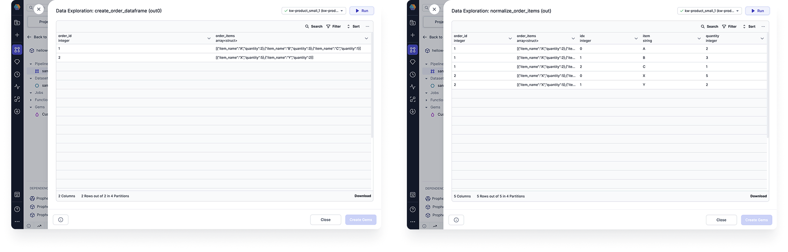
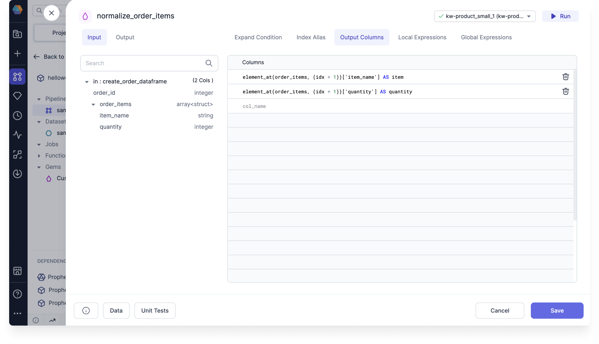

<h3>Spark Gem</h3>

Use the Normalize gem to generate multiple output records from each of its input records. This is useful if some records have multiple values in one field, like when a column is populated with arrays.

The following image shows an example table before and after normalization.

## Parameters

### Expand Condition

| Parameter           | Description                                                                                       |
| ------------------- | ------------------------------------------------------------------------------------------------- |
| Length Expression   | Specifies the number of iterations for each record. This can be an integer or an expression.      |
| Finished Expression | Specifies the number of iterations for each record. Example SQL: `explode(array(0, 1, 2)) AS idx` |
| Finished Condition  | Excludes records from the output table. Example SQL: `idx > size(order_items) - 1`                |

You can either use the **Length Expression** or the **Finished Expression and Finished Condition**. You cannot use all of the parameters simultaneously.

### Index Alias

| Parameter | Description                                                                                                                                                                                        |
| --------- | -------------------------------------------------------------------------------------------------------------------------------------------------------------------------------------------------- |
| Alias     | Defines the name of the index. You can use this alias inside your gem expressions. This will also be the name of the additional output column that shows the index at which a record is generated. |

The index is initialized at `0` and incremented per iteration.

### Output Columns

| Parameter | Description                                                                                                                    |
| --------- | ------------------------------------------------------------------------------------------------------------------------------ |
| Columns   | Lists the columns that will appear in the output table. Example SQL: `element_at(order_items, (idx + 1))['item_name'] AS item` |

In most cases, this is where you will define how the information should be distributed between the new records.

### Local and Global Expressions

These expressions are utilized by the Prophecy transpiler. You will not need to add any expressions yourself.
