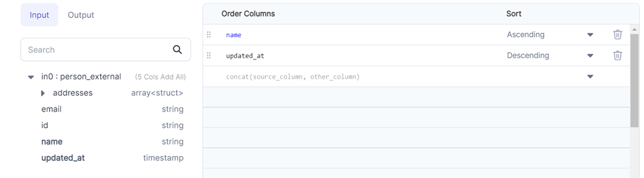

import Requirements from '@site/src/components/gem-requirements';

<Requirements
  python_package_name="ProphecySparkBasicsPython"
  python_package_version="0.0.1+"
  scala_package_name="ProphecySparkBasicsScala"
  scala_package_version="0.0.1+"
  scala_lib=""
  python_lib=""
  uc_single="14.3+"
  uc_shared="14.3+"
  livy="3.0.1+"
/>

Sorts a DataFrame on one or more columns in ascending or descending order.

## Parameters

| Parameter     | Description                                | Required |
| ------------- | ------------------------------------------ | -------- |
| DataFrame     | Input DataFrame to be sorted               | True     |
| Order columns | Columns to sort DataFrame by               | True     |
| Sort          | Order of sorting - ascending or descending | True     |

## Example



## Spark Code

````mdx-code-block
import Tabs from '@theme/Tabs';
import TabItem from '@theme/TabItem';

<Tabs>

<TabItem value="py" label="Python">

```py
def Sort(spark: SparkSession, in0: DataFrame) -> DataFrame:
    return in0.orderBy(col("name").asc(), col("updated_at").desc())
```

</TabItem>
<TabItem value="scala" label="Scala">

```scala
object Sort {
  def apply(spark: SparkSession, in: DataFrame): DataFrame =
    in.orderBy(col("updated_at").desc, col("name").asc)
}
```

</TabItem>
</Tabs>


````
