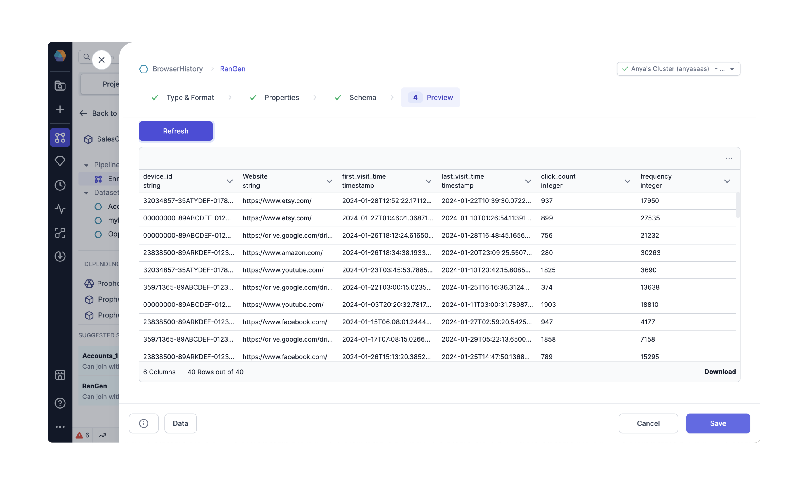
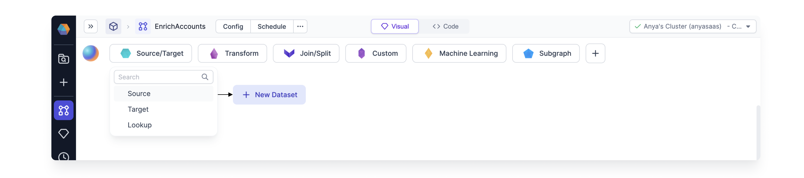
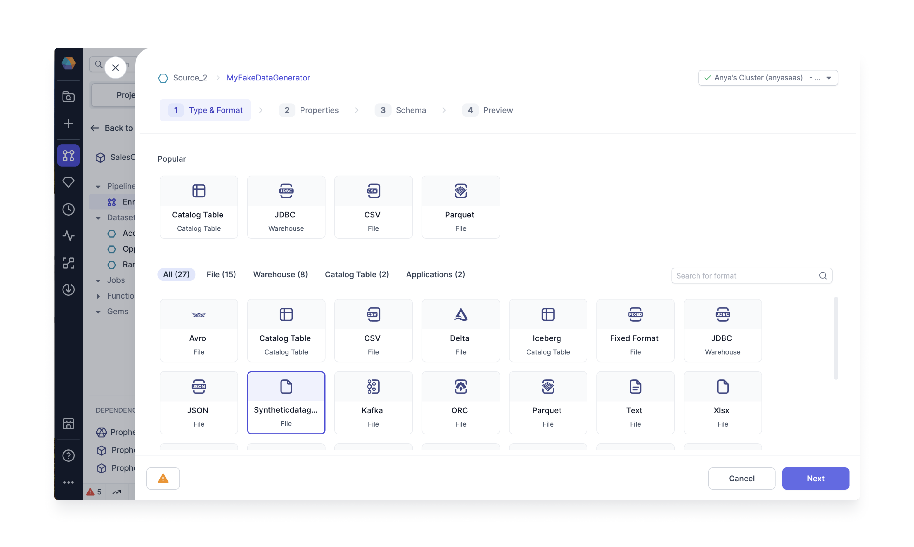
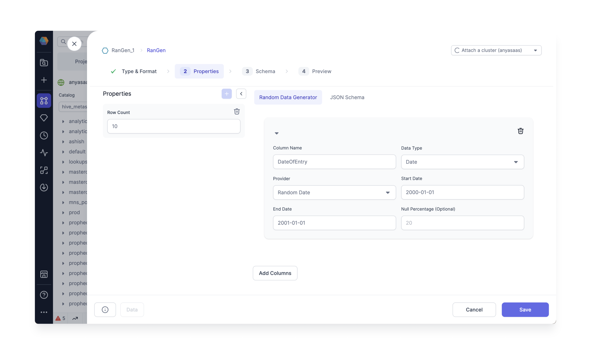
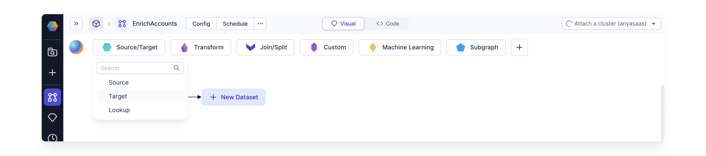
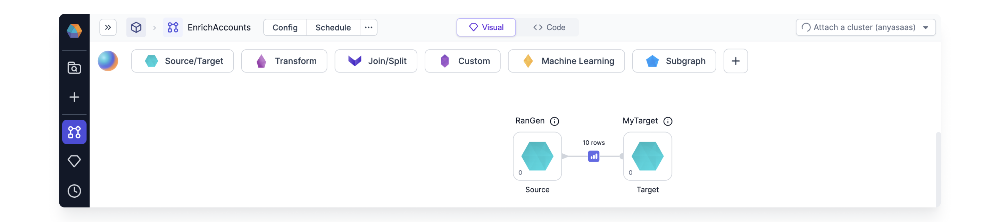

Generate synthetic data with this special kind of Source Gem.

Generating mock data is crucial when building data Pipelines to simulate real-world scenarios for testing, validating, and optimizing Pipeline performance before using actual production data. It helps ensure the Pipeline handles various data formats, structures, and edge cases effectively, minimizing potential issues in a live environment.

A wide range of synthetic data can be created using any column name and an array of datatypes. For example, generate browser history which tracks fictitious devices and the details on when that device visits a particular website with a particular click count and frequency.

Follow the steps below to generate your own mock data using the Synthetic Data Generator Gem.

## Create the Gem

Create a new Dataset and select the Type as Synthetic Data Generator. Note we are not specifying a storage location yet; we will [store the data](#store-the-data) in a separate Gem.  

### Properties: Specify Data Structure

What type of data do you need to generated? Specify the data structure using Random Data Providers. Prophecy offers a selection of [Random Data Providers](./providers) including integers, booleans, and elements from a list.

### Infer the Schema

Changes to the columns in the Properties tab are incorporated by inferring the schema in the Schema tab.

### Preview the data

This Gem returns a DataFrame with randomly generated values. Preview the first few records to verify the schema is correct. Save the Gem.

## Store the data

The newly generated data from the Synthetic Data Generator Gem is not saved by default. Store the data using the Target Gem.

Create the target Gem.

Connect the Synthetic Data Generator SOURCE Gem to the Target Gem.

Be sure to configure the write mode for the target Gem. This is **very important** because the Synthetic Data Generator Gem is **not** idempotent. There is a **new seed** each time the Gem is run.

:::caution
The Synthetic Data Generator only generates the data. If you want to store the data just connect the output to a target Gem and configure the location, write properties etc. In particular, consider the data is generated again for each run. The target write mode can be error, overwrite, append, or ignore as desired.
:::
