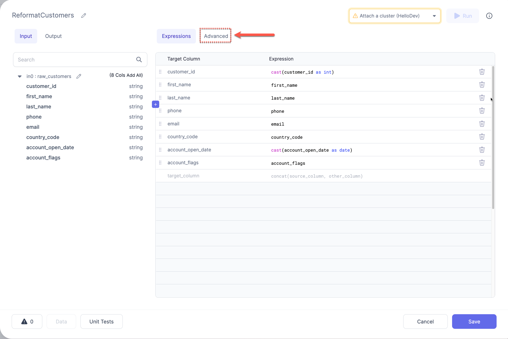
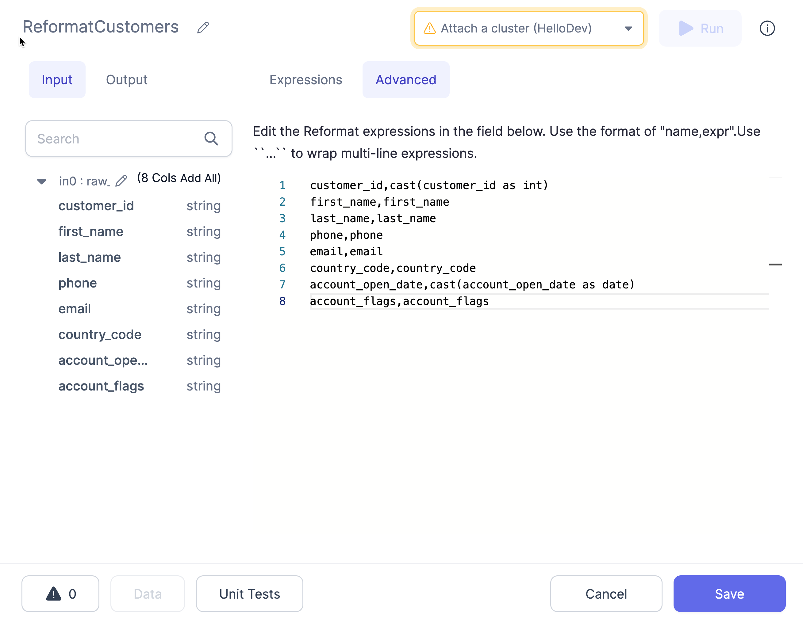

<h3><span class="badge rounded-pill text-bg-light">Spark Gem</span></h3>

Transforms one or more column names or values by using expressions and/or functions. It's useful when we need to extract only the required columns or make changes column-wise.

## Parameters

| Parameter     | Description                                   | Required                                 |
| :------------ | :-------------------------------------------- | :--------------------------------------- |
| DataFrame     | Input DataFrame on which changes are required | True                                     |
| Target column | Output column name                            | False                                    |
| Expression    | Expression to compute target column           | Required if a `Target column` is present |

:::info
If no columns are selected, then all columns are passed through to the output
:::

## Example


## Spark Code

Reformat converts to a SQL `Select` or in relational terms into a projection, unlike `SchemaTransform` Gem which uses underlying `withColumn` construct

````mdx-code-block
import Tabs from '@theme/Tabs';
import TabItem from '@theme/TabItem';

<Tabs>

<TabItem value="py" label="Python">

```py
def Reformat(spark: SparkSession, in0: DataFrame) -> DataFrame:
    return in0.select(
        col("id"),
        col("email").alias("email_address"),
        col("name"),
        col("updated_at"),
        concat_ws("$$$", col("address_line1"), col("address_line2"), col("postal_code"))
            .alias("address_string")
    )
```

</TabItem>
<TabItem value="scala" label="Scala">

```scala
object Reformat {

  def apply(spark: SparkSession, in: DataFrame): DataFrame =
    in.select(
      col("id"),
      col("email").as("email_address"),
      col("name"),
      col("updated_at"),
      expr("concat_ws('$$$', address_line1, address_line2, postal_code)").as("address_string")
    )
 }

```

</TabItem>
</Tabs>

````

## Advanced Import

The Advanced Import feature allows you to bulk import statements that are structured similarly to CSV/TSV files. This can be useful if you have your expressions/transformation logic in another format and just want to quickly configure a `Reformat` Gem based on this logic.

### Using Advanced Import

1. Click the `Advanced` button in the `Reformat UI



2. Enter the expressions into the text area using the format as described below:



3. Use the button at the top (labeled `Expressions`) to switch back to the expressions view. This will translate the expressions from the CSV format to the table format and will show any errors detected.

### Format

The format of these expressions is `target_name,target_expr`, where `target_name` is the desired new column name and `target_expr` is the Spark expression that will be used to generate the new column.

:::caution

For `target_expr` values that contain a comma `,` or span multiple lines, you must surround them by ` `` ` on either side. For example:

```
customer_id,customer_id
full_name,``concat(first_name, ' ', last_name)``
```

:::
