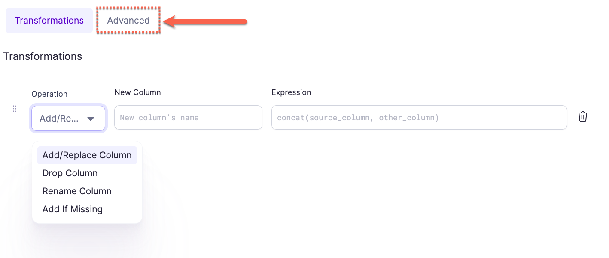
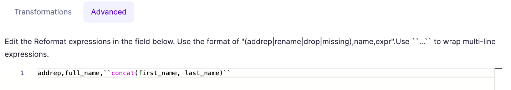

import Requirements from "../\_gem-requirements.mdx";

<h3><span class="badge">Spark Gem</span></h3>

SchemaTransform is used to add, edit, rename or drop columns from the incoming DataFrame.

:::info
Unlike Reformat which is a set operation where all the transforms are applied in parallel, transformations here are applied _in order_.
Reformat is a SQL `select` and is preferable when making many changes.
:::

## Requirements

<Requirements
  packagename="ProphecySparkBasicsPython"
  packageversion="0.0.1"
  scalalib=""
  pythonlib=""
  packageversion143="Supported"
  packageversion154="Supported"
  additional_requirements=""
/>

## Parameters

| Parameter       | Description                                                                | Required                                     |
| :-------------- | :------------------------------------------------------------------------- | :------------------------------------------- |
| DataFrame       | Input DataFrame                                                            | True                                         |
| Operation       | `Add/Replace Column`, `Rename Column` and `Drop Column`                    | Required if a transformation is added        |
| New Column      | Output column name (when Add/Replace operation is selected)                | Required if `Add/Replace Column` is selected |
| Expression      | Expression to generate new column (when Add/Replace operation is selected) | Required if `Add/Replace Column` is selected |
| Old Column Name | Column to be renamed (when Rename operation is selected)                   | Required if `Rename Column` is selected      |
| New Column Name | Output column name (when Rename operation is selected)                     | Required if `Rename Column` is selected      |
| Column to drop  | Column to be dropped (when Drop operation is selected)                     | Required if `Drop Column` is selected        |

## Operation types

| Operation Type | Description                                                                                                                                                                                                       |
| -------------- | ----------------------------------------------------------------------------------------------------------------------------------------------------------------------------------------------------------------- |
| Add/Replace    | Add a new column or replace an existing one based on an expression                                                                                                                                                |
| Drop           | Removes a single column from the next stages of the pipeline. This is useful if you need 9 out of 10 columns, for example.                                                                                        |
| Rename         | Renames an existing column                                                                                                                                                                                        |
| Add if Missing | Provide a default value for a column if it's missing from the source. For example, if reading from a CSV file daily and want to ensure a column has a value even if it's not in the source files use this option. |

## Example


## Spark Code

````mdx-code-block
import Tabs from '@theme/Tabs';
import TabItem from '@theme/TabItem';

<Tabs>

<TabItem value="py" label="Python">

```py
def transform(spark: SparkSession, in0: DataFrame) -> DataFrame:
    return in0\
        .withColumn("business_date", to_date(lit("2022-05-05"), "yyyy-MM-dd"))\
        .withColumnRenamed("bonus_rate", "bonus")\
        .drop("slug")

```

</TabItem>
<TabItem value="scala" label="Scala">

```scala
object transform {
  def apply(spark: SparkSession, in: DataFrame): DataFrame =
    in.withColumn("business_date", to_date(lit("2022-05-05"), "yyyy-MM-dd"))
      .withColumnRenamed("bonus_rate", "bonus")
      .drop("slug")
}
```

</TabItem>
</Tabs>

````

## Advanced Import

The Advanced Import feature allows you to bulk import statements that are structured similarly to CSV/TSV files. This can be useful if you have your expressions/transformation logic in another format and just want to quickly configure a SchemaTransform gem based on existing logic.

### Using Advanced Import

1. Click the **Advanced** button in the SchemaTransform gem UI



2. Enter the expressions into the text area using the format as described below:



3. Use the button at the top (labeled **Expressions**) to switch back to the expressions view. This will translate the expressions from the CSV format to the table format and will show any errors detected.

### Format

The format of these expressions is `op_type,target_name,target_expr`, where `op_type` is the type of operation (see below); `target_name` is the desired new column name and `target_expr` is the Spark expression that will be used to generate the new column. Each `op_type` has a different number of extra columns that have to be provided, see below for more details.

:::caution

For `target_expr` values that contain a comma `,` or span multiple lines, you must surround them by ` `` ` on either side. For example:

```
addrep,customer_id,customer_id
addrep,full_name,``concat(first_name, ' ', last_name)``
```

:::

### Advanced Import Operation types

| Operation Type | Advanced Import name | :Arguments: | Example                           |
| -------------- | -------------------- | ----------- | --------------------------------- |
| Add/Replace    | `addrep`             | 2           | `addrep,foo,CAST(NULL as int)`    |
| Drop           | `drop`               | 1           | `drop bar`                        |
| Rename         | `rename`             | 2           | `rename,foo,bar`                  |
| Add if missing | `missing`            | 2           | `missing,foo,current_timestamp()` |
