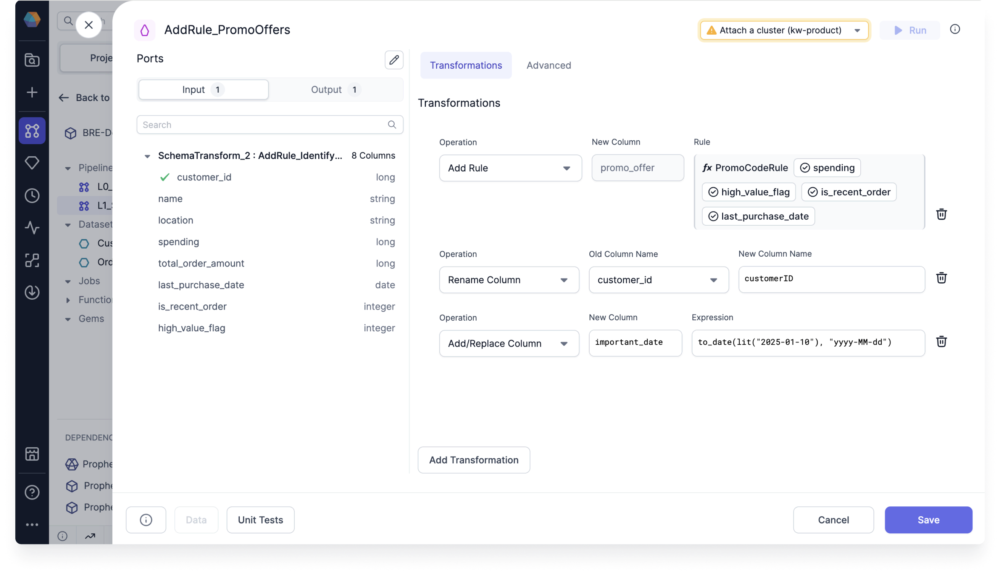

import Requirements from '@site/src/components/gem-requirements';

<Requirements
  python_package_name="ProphecySparkBasicsPython"
  python_package_version="0.0.1+"
  scala_package_name="ProphecySparkBasicsScala"
  scala_package_version="0.0.1+"
  scala_lib=""
  python_lib=""
  uc_single="14.3+"
  uc_shared="14.3+"
  livy="3.0.1+"
/>

Use the SchemaTransform gem to apply transformations to columns from the incoming DataFrame. This page describes the different transformations—or _operations_—that you can use in this gem.



:::info
Unlike Reformat which is a set operation where all the transforms are applied in parallel, transformations here are applied _in order_.
Reformat is a SQL `select` and is preferable when making many changes.
:::

## Operations

### Add/Replace Expression

Add a new column or replace an existing one based on an expression.

| Parameter  | Description                                         |
| ---------- | --------------------------------------------------- |
| New Column | Output column name                                  |
| Expression | SQL expression to generate values in the new column |

### Drop Column

Remove a column from next stage of the Pipeline.

| Parameter      | Description          |
| -------------- | -------------------- |
| Column to drop | Column to be dropped |

### Rename Column

Rename an existing column downstream in the Pipeline.

| Parameter       | Description          |
| --------------- | -------------------- |
| Old Column Name | Column to be renamed |
| New Column Name | Output column name   |

### Add If Missing

Provide a default value for a column if it is missing from the source.

| Parameter                  | Description                                |
| -------------------------- | ------------------------------------------ |
| Source Column Name         | Column that contains missing values        |
| Default Value (if missing) | The value that will replace missing values |

### Add Rule

Use a business rule in your Pipeline. Visit the [Business rules engine](docs/Spark/functions/business-rules-engine/business-rules-engine.md) page to learn about business rules.

| Parameter  | Description                                                                        |
| ---------- | ---------------------------------------------------------------------------------- |
| New Column | The column that the business rule will apply to                                    |
| Rule       | The business rule that contains the logic that will populate the new column values |

## Spark Code

````mdx-code-block
import Tabs from '@theme/Tabs';
import TabItem from '@theme/TabItem';

<Tabs>

<TabItem value="py" label="Python">

```py
def transform(spark: SparkSession, in0: DataFrame) -> DataFrame:
    return in0\
        .withColumn("business_date", to_date(lit("2022-05-05"), "yyyy-MM-dd"))\
        .withColumnRenamed("bonus_rate", "bonus")\
        .drop("slug")

```

</TabItem>
<TabItem value="scala" label="Scala">

```scala
object transform {
  def apply(spark: SparkSession, in: DataFrame): DataFrame =
    in.withColumn("business_date", to_date(lit("2022-05-05"), "yyyy-MM-dd"))
      .withColumnRenamed("bonus_rate", "bonus")
      .drop("slug")
}
```

</TabItem>
</Tabs>

````

## Advanced Import

The Advanced Import feature allows you to bulk import statements that are structured similarly to CSV/TSV files. This can be useful if you have your expressions/transformation logic in another format and just want to quickly configure a SchemaTransform gem based on existing logic.

### Using Advanced Import

1. Click the **Advanced** tab in the SchemaTransform gem.
2. Enter the expressions into the text area.


### Format

The format of these expressions is `op_type,target_name,target_expr`, where `op_type` is the type of operation (see below); `target_name` is the desired new column name and `target_expr` is the Spark expression that will be used to generate the new column. Each `op_type` has a different number of extra columns that have to be provided, see below for more details.

:::caution

For `target_expr` values that contain a comma `,` or span multiple lines, you must surround them by ` `` ` on either side. For example:

```
addrep,customer_id,customer_id
addrep,full_name,``concat(first_name, ' ', last_name)``
```

:::

### Advanced Import Operation types

| Operation Type | Advanced Import name | :Arguments: | Example                           |
| -------------- | -------------------- | ----------- | --------------------------------- |
| Add/Replace    | `addrep`             | 2           | `addrep,foo,CAST(NULL as int)`    |
| Drop           | `drop`               | 1           | `drop bar`                        |
| Rename         | `rename`             | 2           | `rename,foo,bar`                  |
| Add if missing | `missing`            | 2           | `missing,foo,current_timestamp()` |
| Add rule       | `addrule`            | 1           | `addrule, PromoCodeRule()`        |
