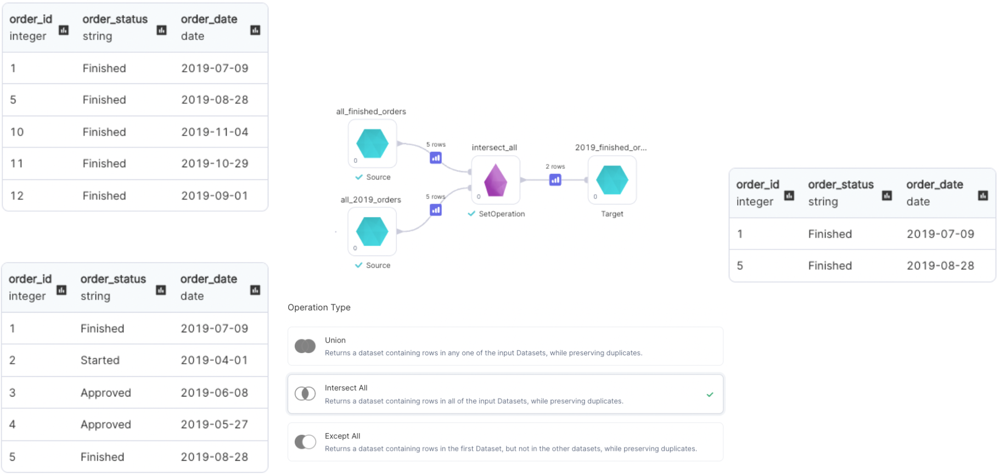

import Requirements from '@site/src/components/gem-requirements';

<Requirements
  python_package_name="ProphecySparkBasicsPython"
  python_package_version="0.0.1+"
  scala_package_name="ProphecySparkBasicsScala"
  scala_package_version="0.0.1+"
  scala_lib=""
  python_lib=""
  uc_single="14.3+"
  uc_shared="14.3+"
  livy="3.0.1+"
/>

Use the SetOperation gem to perform addition or subtraction of rows from DataFrames with identical schemas and different data.

## Parameters

| Parameter      | Description                                                                                                                                                                                                                                                                                                                                                                                                                                |
| :------------- | :----------------------------------------------------------------------------------------------------------------------------------------------------------------------------------------------------------------------------------------------------------------------------------------------------------------------------------------------------------------------------------------------------------------------------------------- |
| DataFrame 1    | First input DataFrame                                                                                                                                                                                                                                                                                                                                                                                                                      |
| DataFrame 2    | Second input DataFrame                                                                                                                                                                                                                                                                                                                                                                                                                     |
| DataFrame N    | Nth input DataFrame                                                                                                                                                                                                                                                                                                                                                                                                                        |
| Operation type | <ul style={{margin:0, padding:"0 1rem"}}><li> Union: Returns a DataFrame containing rows in any one of the input DataFrames, while preserving duplicates.</li><li>Intersect All: Returns a DataFrame containing rows in all of the input DataFrames, while preserving duplicates.</li><li>Except All: Returns a DataFrames containing rows in the first DataFrame, but not in the other DataFrames, while preserving duplicates.</li></ul> |

To add more input DataFrames, you can click the `+` icon on the left sidebar.


## Examples

### Operation Type: `Union`


````mdx-code-block
import Tabs from '@theme/Tabs';
import TabItem from '@theme/TabItem';

<Tabs>

<TabItem value="py" label="Python">

```py
def union(spark: SparkSession, in0: DataFrame, in1: DataFrame, ) -> DataFrame:
    return in0.unionAll(in1)
```

</TabItem>
<TabItem value="scala" label="Scala">

```scala
object union {
  def apply(spark: SparkSession, in0: DataFrame, in1: DataFrame): DataFrame =
    in0.unionAll(in1)
}
```

</TabItem>
</Tabs>

````

### Operation Type: `Intersect All`



````mdx-code-block


<Tabs>

<TabItem value="py" label="Python">

```py
def intersectAll(spark: SparkSession, in0: DataFrame, in1: DataFrame, ) -> DataFrame:
    return in0.intersectAll(in1)
```

</TabItem>
<TabItem value="scala" label="Scala">

```scala
object intersectAll {
  def apply(spark: SparkSession, in0: DataFrame, in1: DataFrame): DataFrame =
    in0.intersectAll(in1)
}
```

</TabItem>
</Tabs>

````

### Operation Type: `Except All`


````mdx-code-block


<Tabs>

<TabItem value="py" label="Python">

```py
def exceptAll(spark: SparkSession, in0: DataFrame, in1: DataFrame, ) -> DataFrame:
    return in0.exceptAll(in1)
```

</TabItem>
<TabItem value="scala" label="Scala">

```scala
object exceptAll {
  def apply(spark: SparkSession, in0: DataFrame, in1: DataFrame): DataFrame =
    in0.exceptAll(in1)
}
```

</TabItem>
</Tabs>

````
