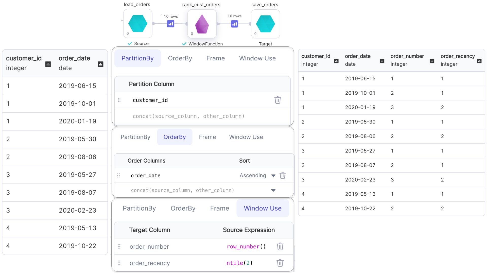
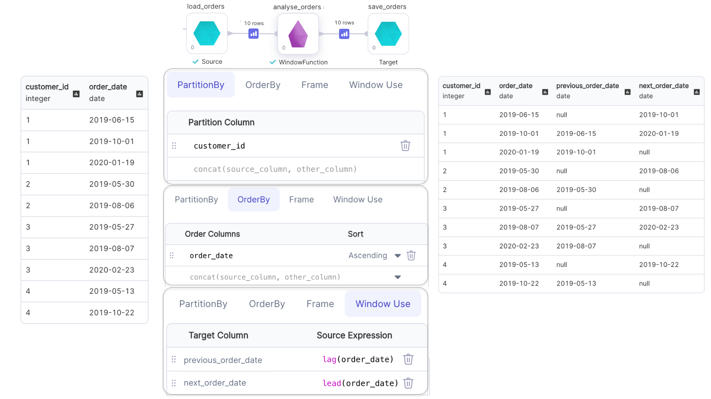

import Requirements from "../\_gem-requirements.mdx";

<h3><span class="badge">Spark Gem</span></h3>

<Requirements packagename="ProphecySparkBasicPython"
  packageversion="0.0.1"
  scalalib=""
  pythonlib=""
  packageversion122="Supported 0.0.1+"
  packageversion143="Supported 0.0.1+"
  packageversion154="Supported 0.0.1+"
/>

The WindowFunction lets you define a **WindowSpec** and apply window functions on a DataFrame.

### Parameters

| Parameter         | Description                                                                                 | Required                                                                                                  |
| ----------------- | ------------------------------------------------------------------------------------------- | --------------------------------------------------------------------------------------------------------- |
| DataFrame         | Input DataFrame                                                                             | True                                                                                                      |
| Target column     | Output Column name                                                                          | True                                                                                                      |
| Source expression | Window function expression to perform over the created Window                               | True                                                                                                      |
| Order columns     | Columns to order by in Window. Must be a numeric type column if a `Range Frame` is selected | Required when `Source expression` has a Ranking/Analytical function **OR** when `Range Frame` is selected |
| Partition column  | Column to partition by in Window                                                            | False                                                                                                     |
| Row frame         | Row based frame boundary to apply on Window                                                 | False                                                                                                     |
| Range frame       | Range based frame boundary to apply on Window                                               | False                                                                                                     |

:::info
When `Order Columns` are not defined, an unbounded window frame `(rowFrame, unboundedPreceding, unboundedFollowing)` is used by default.
:::
:::info
When `Order Columns` are defined, a growing window frame `(rangeFrame, unboundedPreceding, currentRow)` is used by default.
:::

### Examples

---

#### Ranking Functions with Window

Examples of ranking functions are: `row_number()`, `rank()`, `dense_rank()` and `ntile()`
:::info
Only the default window frame `(rowFrame, unboundedPreceding, currentRow)` can be used with Ranking functions
:::



````mdx-code-block
import Tabs from '@theme/Tabs';
import TabItem from '@theme/TabItem';

<Tabs>

<TabItem value="py" label="Python">

```py
def rank_cust_orders(spark: SparkSession, in0: DataFrame) -> DataFrame:
    return in0\
        .withColumn(
            "order_number",
            row_number().over(
                Window.partitionBy(col("customer_id")).orderBy(col("order_date").asc())
            )
        )\
        .withColumn(
            "order_recency",
             ntile(2).over(
                 Window.partitionBy(col("customer_id")).orderBy(col("order_date").asc())
             )
         )
```

</TabItem>
<TabItem value="scala" label="Scala">

```scala
object rank_cust_orders {

  def apply(spark: SparkSession, in1: DataFrame): DataFrame = {
    import org.apache.spark.sql.expressions.{Window, WindowSpec}
    in1
      .withColumn(
        "order_number",
        row_number().over(
          Window.partitionBy(col("customer_id")).orderBy(col("order_date").asc)
        )
      )
      .withColumn(
        "order_recency",
        ntile(2).over(
          Window.partitionBy(col("customer_id")).orderBy(col("order_date").asc)
        )
      )
  }
}
```

</TabItem>
</Tabs>

````

---

#### Analytical Functions with Window

Examples of analytical functions are: `lead()`, `lag()`, `cume_dist()`, etc.
:::info
Window frame for `lead()` and `lag()` can not be specified.
:::
:::info
Only the default window frame `(rangeFrame, unboundedPreceding, currentRow)` can be used with `cume_dist()`
:::


````mdx-code-block

<Tabs>

<TabItem value="py" label="Python">

```py
def analyse_orders(spark: SparkSession, in0: DataFrame) -> DataFrame:
    return in0\
        .withColumn(
          "previous_order_date",
          lag(col("order_date")).over(
            Window.partitionBy(col("customer_id")).orderBy(col("order_id").asc())
          )
        )\
        .withColumn(
            "next_order_date",
            lead(col("order_date")).over(
                Window.partitionBy(col("customer_id")).orderBy(col("order_id").asc())
            )
        )
```

</TabItem>
<TabItem value="scala" label="Scala">

```scala
object analyse_orders {
  def apply(spark: SparkSession, in1: DataFrame): DataFrame = {
    import org.apache.spark.sql.expressions.{Window, WindowSpec}
    in1
      .withColumn(
        "previous_order_date",
        lag(col("order_date")).over(
          Window.partitionBy(col("customer_id")).orderBy(col("order_date").asc)
        )
      )
      .withColumn(
        "next_order_date",
        lead(col("order_date")).over(
          Window.partitionBy(col("customer_id")).orderBy(col("order_date").asc)
        )
      )
  }
}
```

</TabItem>
</Tabs>

````

#### Aggregate Functions with Window

Examples of analytical functions are: `min()`, `max()`, `avg()`, etc.


````mdx-code-block

<Tabs>

<TabItem value="py" label="Python">

```py
def agg_orders(spark: SparkSession, in0: DataFrame) -> DataFrame:
    return in0\
        .withColumn(
          "running_avg_spend",
          avg(col("amount"))\
            .over(Window.partitionBy(col("customer_id"))\
                    .rowsBetween(Window.unboundedPreceding, Window.currentRow))
        )\
        .withColumn("running_max_spend", max(col("amount"))\
        .over(Window.partitionBy(col("customer_id"))\
                .rowsBetween(Window.unboundedPreceding, Window.currentRow)))
```

</TabItem>
<TabItem value="scala" label="Scala">

```scala
object agg_orders {
  def apply(spark: SparkSession, in1: DataFrame): DataFrame = {
    import org.apache.spark.sql.expressions.{Window, WindowSpec}
    in1
      .withColumn("running_avg_spend",
                  avg(col("amount")).over(
                    Window
                      .partitionBy(col("customer_id"))
                      .rowsBetween(Window.unboundedPreceding, Window.currentRow)
                  )
      )
      .withColumn("running_max_spend",
                  max(col("amount")).over(
                    Window
                      .partitionBy(col("customer_id"))
                      .rowsBetween(Window.unboundedPreceding, Window.currentRow)
                  )
      )
  }
}
```

</TabItem>
</Tabs>

````
