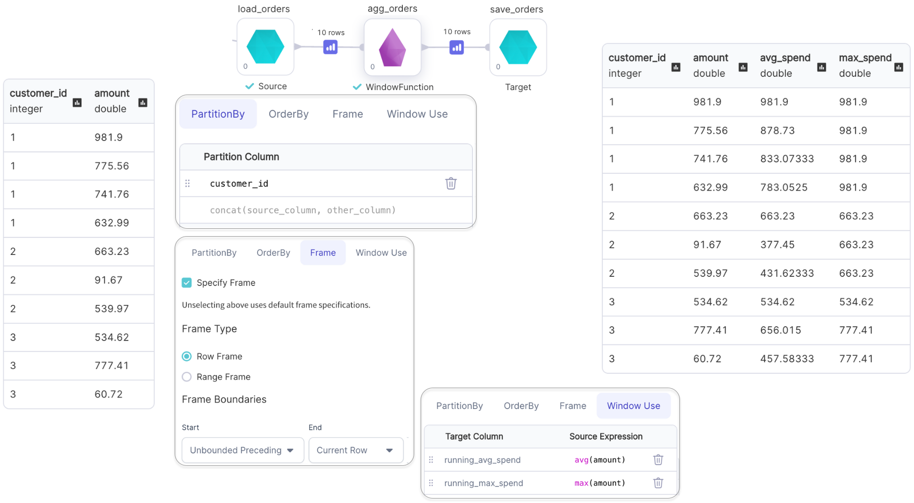

import Requirements from '@site/src/components/gem-requirements';

<Requirements
  python_package_name="ProphecySparkBasicsPython"
  python_package_version="0.0.1+"
  scala_package_name="ProphecySparkBasicsScala"
  scala_package_version="0.0.1+"
  scala_lib=""
  python_lib=""
  uc_single="14.3+"
  uc_shared="14.3+"
  livy="3.0.1+"
/>

The WindowFunction gem lets you apply window functions on a DataFrame.

## Parameters

Explore the following sections to understand how to configure the WindowFunction gem.

### Partition By

| Parameter        | Description                                            | Required |
| ---------------- | ------------------------------------------------------ | -------- |
| Partition column | Column to partition the data by in the Window function | False    |

### OrderBy

| Parameter     | Description                                 | Required                            |
| ------------- | ------------------------------------------- | ----------------------------------- |
| Order columns | Columns to order the data by in the window. | False                               |
| Sort          | Sort in ascending or descending order.      | Required if order column is defined |

:::info
Order columns are required when the source expression in the WindowUse tab uses **ranking** or **analytical** functions. Numeric columns are required when **range frame** is the selected window frame type.
:::

### Frame

| Parameter   | Description                                       | Required |
| ----------- | ------------------------------------------------- | -------- |
| Row frame   | Row-based frame boundary to apply on the Window   | False    |
| Range frame | Range-based frame boundary to apply on the Window | False    |

#### Row Frame

The **Row Frame** option defines the window size based on the number of rows before and after the current row.

You configure the frame by setting a **Start** and an **End** boundary. The boundaries can be:

- Unbounded Preceding: Includes all rows before the current row.
- Unbounded Following: Includes all rows after the current row.
- Current Row: Starts or ends at the current row.
- Row Number: A specific number of rows before or after the current row.

#### Range Frame

The Range Frame defines the window using values in the Order By column.

You configure the frame by setting a **Start** and an **End** boundary. The boundaries can be:

- Unbounded Preceding: Includes all rows before the current row.
- Unbounded Following: Includes all rows after the current row.
- Current Row: Starts or ends at the current row.
- Range Value: A numeric or interval value defining how far before or after the current row to look.

Because the Range Frame depends on actual data values (not row positions), the number of rows in the window may vary for each record. For example, some window frames may include only one match within 5 days, while others may include ten.

### WindowUse

| Parameter         | Description                                                                             | Required |
| ----------------- | --------------------------------------------------------------------------------------- | -------- |
| Target Column     | Name of the column that will contain the values returned from the source expression(s). | True     |
| Source expression | Window function expression to apply over the window frame.                              | True     |

## Examples

### Ranking Functions with Window

Examples of ranking functions are: `row_number()`, `rank()`, `dense_rank()` and `ntile()`.

| Tab         | Parameter          | Value                           |
| ----------- | ------------------ | ------------------------------- |
| PartitionBy | PartitionColumn    | `customer_id`                   |
| OrderBy     | Order Columns      | `order_date` in ascending order |
| WindowUse   | Source Expressions | `row_number()` and `ntile(2)`   |

:::info
Only the default window frame `(rowFrame, unboundedPreceding, currentRow)` can be used with ranking functions.
:::

````mdx-code-block
import Tabs from '@theme/Tabs';
import TabItem from '@theme/TabItem';

<Tabs>

<TabItem value="py" label="Python">

```py
def rank_cust_orders(spark: SparkSession, in0: DataFrame) -> DataFrame:
    return in0\
        .withColumn(
            "order_number",
            row_number().over(
                Window.partitionBy(col("customer_id")).orderBy(col("order_date").asc())
            )
        )\
        .withColumn(
            "order_recency",
             ntile(2).over(
                 Window.partitionBy(col("customer_id")).orderBy(col("order_date").asc())
             )
         )
```

</TabItem>
<TabItem value="scala" label="Scala">

```scala
object rank_cust_orders {

  def apply(spark: SparkSession, in1: DataFrame): DataFrame = {
    import org.apache.spark.sql.expressions.{Window, WindowSpec}
    in1
      .withColumn(
        "order_number",
        row_number().over(
          Window.partitionBy(col("customer_id")).orderBy(col("order_date").asc)
        )
      )
      .withColumn(
        "order_recency",
        ntile(2).over(
          Window.partitionBy(col("customer_id")).orderBy(col("order_date").asc)
        )
      )
  }
}
```

</TabItem>
</Tabs>

````

### Analytical Functions with Window

Examples of analytical functions are: `lead()`, `lag()`, `cume_dist()`, etc.

- Window frame for `lead()` and `lag()` can not be specified.
- Only the default window frame `(rangeFrame, unboundedPreceding, currentRow)` can be used with `cume_dist()`.

<br />


````mdx-code-block

<Tabs>

<TabItem value="py" label="Python">

```py
def analyse_orders(spark: SparkSession, in0: DataFrame) -> DataFrame:
    return in0\
        .withColumn(
          "previous_order_date",
          lag(col("order_date")).over(
            Window.partitionBy(col("customer_id")).orderBy(col("order_id").asc())
          )
        )\
        .withColumn(
            "next_order_date",
            lead(col("order_date")).over(
                Window.partitionBy(col("customer_id")).orderBy(col("order_id").asc())
            )
        )
```

</TabItem>
<TabItem value="scala" label="Scala">

```scala
object analyse_orders {
  def apply(spark: SparkSession, in1: DataFrame): DataFrame = {
    import org.apache.spark.sql.expressions.{Window, WindowSpec}
    in1
      .withColumn(
        "previous_order_date",
        lag(col("order_date")).over(
          Window.partitionBy(col("customer_id")).orderBy(col("order_date").asc)
        )
      )
      .withColumn(
        "next_order_date",
        lead(col("order_date")).over(
          Window.partitionBy(col("customer_id")).orderBy(col("order_date").asc)
        )
      )
  }
}
```

</TabItem>
</Tabs>

````

### Aggregate Functions with Window

Examples of aggregate functions are: `min()`, `max()`, `avg()`, etc.



````mdx-code-block

<Tabs>

<TabItem value="py" label="Python">

```py
def agg_orders(spark: SparkSession, in0: DataFrame) -> DataFrame:
    return in0\
        .withColumn(
          "running_avg_spend",
          avg(col("amount"))\
            .over(Window.partitionBy(col("customer_id"))\
                    .rowsBetween(Window.unboundedPreceding, Window.currentRow))
        )\
        .withColumn("running_max_spend", max(col("amount"))\
        .over(Window.partitionBy(col("customer_id"))\
                .rowsBetween(Window.unboundedPreceding, Window.currentRow)))
```

</TabItem>
<TabItem value="scala" label="Scala">

```scala
object agg_orders {
  def apply(spark: SparkSession, in1: DataFrame): DataFrame = {
    import org.apache.spark.sql.expressions.{Window, WindowSpec}
    in1
      .withColumn("running_avg_spend",
                  avg(col("amount")).over(
                    Window
                      .partitionBy(col("customer_id"))
                      .rowsBetween(Window.unboundedPreceding, Window.currentRow)
                  )
      )
      .withColumn("running_max_spend",
                  max(col("amount")).over(
                    Window
                      .partitionBy(col("customer_id"))
                      .rowsBetween(Window.unboundedPreceding, Window.currentRow)
                  )
      )
  }
}
```

</TabItem>
</Tabs>

````
