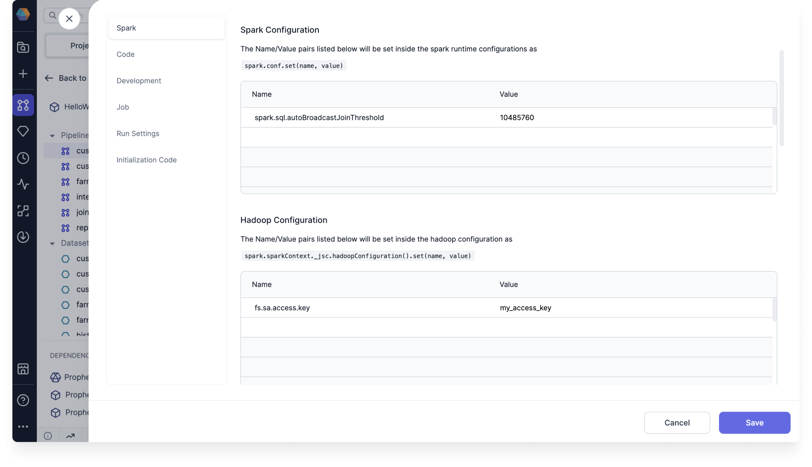

Review the various settings available for each pipeline, including Spark settings, code customization, development preferences, job sampling, run settings, and initialization code.

## Spark

In the Spark section, you can view the Spark version and mode for this pipeline. You can also add Spark and Hadoop configurations.

- For Spark, name-value pairs will be set inside the Spark runtime configurations as `spark.conf.set(name, value)`.
- For Hadoop, name-value pairs will be set inside the Hadoop configuration as `spark.sparkContext.hadoopConfiguration.set(name, value)`.

## Code

In the Code section, you can view the pipeline language, code mode, and build system. Other settings are listed below.

- **Package Name:** The name of the package if the project is published to the [Package Hub](docs/extensibility/package-hub/package-hub.md).
- **Config Package Name:** The name of the config package.
- **Custom Application Name:** The name of the custom application.
- **Allow Configuration Updates (Scala only):** When enabled, you can override configuration values using a script. For example, if you add a Script gem to the pipeline, you can write something like `Config.current_date_var = "2024"` to set the value of that variable.
- **Enable pipeline monitoring:** The option to turn pipeline monitoring on or off.
- **Enable jinja based configuration:** The option to turn [jinja-based](docs/Spark/configuration.md#syntax) configuration on or off.

## Development

In the Development section, you can choose the visual language of the [configuration](docs/Spark/configuration.md).

## Job

In the Job section, you can choose how data is sampled during job runs. If you enable job data sampling, you must choose a sampling mode.

## Run Settings

In the Run Settings section, control how your pipeline runs.

- **Limit Input Records:** When enabled, this limits the number of rows being operated on, makes development time faster, and reduces computation cost.

  :::note
  Depending on how your pipeline is constructed, you might run into some issues when limiting records. If the number of records is too small, you might accidentally exclude records that, for example, match a join condition. This would result in an empty output.
  :::

- **Enable Data Sampling:** Data sampling is enabled by default so you can view interim data samples while developing your pipeline. There are a few data sampling modes to choose from.
- **Configuration:** This setting determines which [configuration](docs/Spark/configuration.md) will be used during a pipeline run.

## Initialization Code

If you have a **UDF initialization code**, you can add it here.
