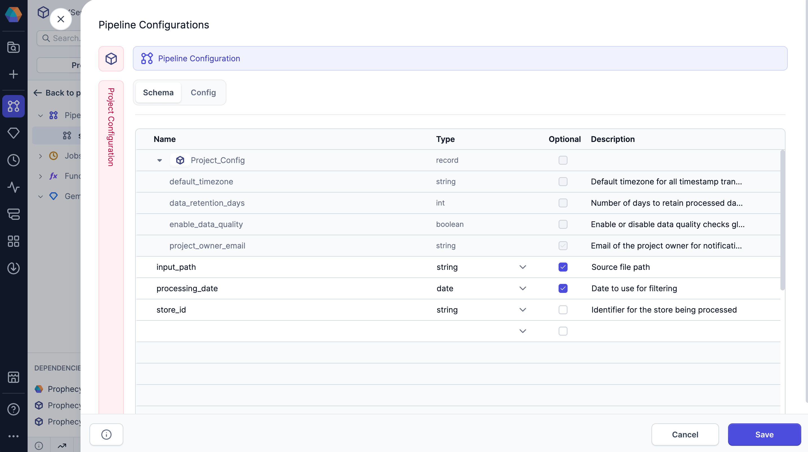

A configuration is a set of predefined variables and values that control how a data pipeline behaves during execution. By using configurations, you can dynamically adapt a pipeline to different environments or scenarios without modifying the pipeline itself.

## Configuration hierarchy

Configurations are hierarchical and can be defined at the following levels:

- **Project**: Shared across all pipelines in a project.
- **Pipeline**: Overrides or extends project-level variables for a specific pipeline.
- **Subgraph**: Local to a subgraph, with options to inherit from parent pipelines.
- **Job**: Specifies the configuration to use when running pipelines in production.

## Project and pipeline configurations

Each pipeline has access to two types of configurations:

- **Project configuration**: Defines global variables that are shared across all pipelines in the project.
- **Pipeline configuration**: Defines variables specific to the current pipeline and can override project-level values.

To view or edit these configurations, click the **Config** button in the pipeline header. Each configuration includes two tabs:

- [Schema](#schema-tab): Define the structure and data types for your configuration variables.
- [Config](#config-tab): Set the values for each variable and create configuration instances for different environments.

:::note
You can access the project configuration from any pipeline.
:::



### Schema tab

In the Schema tab, you define the variables you want to use. The following table lists the information to define each variable.

| Parameter   | Description                                                                                                |
| ----------- | ---------------------------------------------------------------------------------------------------------- |
| Name        | The unique identifier for the variable.                                                                    |
| Type        | The data type assigned to the variable. Supported types are listed below.                                  |
| Optional    | Indicates whether the variable is optional. If unchecked, you must provide a default value for the config. |
| Description | An optional text field to provide additional context or details about the variable.                        |

<details>
<summary>Expand to see the list of supported data types</summary>

Prophecy supports the following data types for configs.

| Data type          | Description                                                                                                     |
| ------------------ | --------------------------------------------------------------------------------------------------------------- |
| `string`           | A plain text value, entered via a single-line text input.                                                       |
| `boolean`          | A true or false value, selected from a dropdown.                                                                |
| `date`             | A calendar date in `dd-mm-yyyy` format, chosen using a date picker.                                             |
| `timestamp`        | A specific date and time in `dd-mm-yyyyTHH:MM:SSZ+z` format (with time zone), selected using a datetime picker. |
| `double`           | A 64-bit floating-point number entered in a numeric field.                                                      |
| `float`            | A 32-bit floating-point number entered in a numeric field.                                                      |
| `int`              | A 32-bit integer entered in a numeric field.                                                                    |
| `long`             | A 64-bit integer entered in a numeric field.                                                                    |
| `short`            | A 16-bit integer entered in a numeric field.                                                                    |
| `array`            | A list of values of the same type, added one by one in a multi-value input field.                               |
| `record`           | A structured object with multiple named fields, configured through a nested group of inputs.                    |
| `secret`           | A sensitive string (like a password or token), selected from your fabric's list of pre-configured secrets.      |
| `spark_expression` | A Spark SQL expression, written in a code editor with syntax highlighting.                                      |

</details>

### Config tab

The Config tab allows you to set values for the variables defined in your schema and create multiple configuration instances for different environments or use cases. Each configuration instance maintains its own set of values while inheriting the same schema structure.

#### Configuration instances

At the top of the Config tab, use the dropdown menu to switch between configuration instances. Every project and pipeline includes a `default` configuration that provides default values for all defined variables. You can create additional instances (such as `prod` for production) with alternate values, while reusing the same schema.

To create a new configuration instance:

1. Open the config dropdown.
1. Click **New Configuration**.
1. In the **Instance Name** field, name your instance.
1. Click **Create**.
1. Add new values or maintain the default values from the `default` config.
1. Click **Save** to save the new values in the config.

#### Set configuration values

In the Config tab, you'll also see a form with all the variables you defined in the Schema tab. Each variable appears as an input field that matches its data type, for example:

- Text fields for string variables
- Numeric inputs for integer, float, and other numeric types
- Dropdowns for boolean values
- Date/time pickers for temporal data types

If a variable in the schema is not optional, you must add a default value in the Config tab.

#### Override project-level configs

Pipelines inherit configuration values from the project-level `default` configuration. To change these values for a specific pipeline, create a new configuration instance for that pipeline. Within this instance, you can override any inherited values as needed. The `default` pipeline configuration always reflects the project-level default values.

## Use configuration variables

When you want to call configuration variables in your pipeline, reference them using Jinja syntax.

You can use the following syntax examples for accessing elements of array and record fields:

- For a string: `{{ config_name }}`
- For an array: `{{ config1.array_config[23] }}`
- For a record: `{{ record1.record2.field1 }}`

Jinja is enabled by default in new pipelines. You can disable Jinja support in **Pipeline Settings > Enable Jinja-based configuration**.

### Syntax for Source and Target gems

To use configuration variables for specifying file locations for Source and Target gems, use the following syntax: `${config_variable_name}`.

Jinja syntax is not supported for Source and Target gems.

### Syntax for different languages

Depending on the Visual Language configured in your [Pipeline Settings](/engineers/pipeline-settings), you can also use that language's syntax to call variables.

| Visual Language | Syntax               | Expression usage           |
| --------------- | -------------------- | -------------------------- |
| SQL             | `'$config_name'`     | `expr('$config_name')`     |
| Scala           | `Config.config_name` | `expr(Config.config_name)` |
| Python          | `Config.config_name` | `expr(Config.config_name)` |

## Runtime configuration

After defining your configuration schema and setting up configuration instances, you need to specify which configuration to use when your pipeline actually runs. This process differs depending on the type of pipeline execution.

### Interactive execution

For development and testing purposes, you can run pipelines interactively within the Prophecy interface. To control which configuration is used during these interactive runs:

1. Open the **Pipeline Settings** from the project editor.
1. Navigate to the **Run Settings** section.
1. Select the appropriate configuration from the list of existing configs.
1. **Save** your changes.

Interactive runs use the `default` config by default.


### Job execution

When deploying pipelines to production environments, you typically run them as scheduled jobs rather than interactive executions. To specify your configuration values for jobs:

1. Add a Pipeline gem to the job canvas.
1. Open the Pipeline gem.
1. For the **Pipeline to schedule** field, choose the appropriate pipeline.
1. In the **Schema** tab, review the schema that has been inherited from the project and pipeline configs.
1. Change the selected project and pipeline configs, or keep the default.
1. If required, switch to the **Config** tab to override inherited values.


## Subgraph configurations

[Subgraphs](/engineers/subgraph) can have their own dedicated configurations that control behavior within the subgraph's scope. This allows you to create reusable pipeline components with their own configurable parameters. To add configs to a subgraph:

1. Open the subgraph.
1. Click **+ Config**.
1. In the **Schema** tab, review the config schema. This might already included inherited project configuration variables.
1. To overwrite pipeline configuration variable definitions, click **Copy Pipeline Configs** in this tab.
1. Open the **Config** tab.
1. Define and save a set of values as a config.
1. Change the selected project and pipeline configs, or keep the default.
1. **Save** your changes.


:::note
Upon creation, subgraph configurations will also be included in the pipeline configurations. Both the schema and config values for subgraphs can be edited from the pipeline configuration dialog.
:::

## Code

All configuration instances and values are automatically converted to code.

```mdx-code-block
import Tabs from '@theme/Tabs';
import TabItem from '@theme/TabItem';

<Tabs>

<TabItem value="scala" label="Scala configuration code">

1. Open `Config.scala` in the `<pipeline-path>/config` folder.
1. View the default configuration code.
1. Find additional configurations that are packaged as JSON files in the `resources/config` folder.


</TabItem>

<TabItem value="py" label="Python configuration code">

1. Open `Config.py` in the `<pipeline>/config` folder.
1. View the default configuration code.
1. Find additional configurations that are packaged as JSON files in the `configs/resources/config` folder.


</TabItem>

</Tabs>

```
