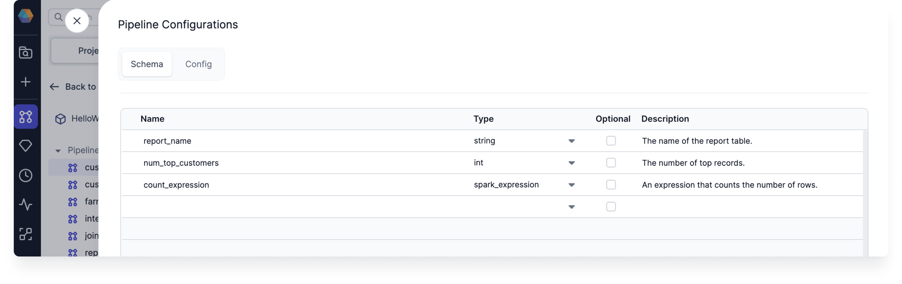
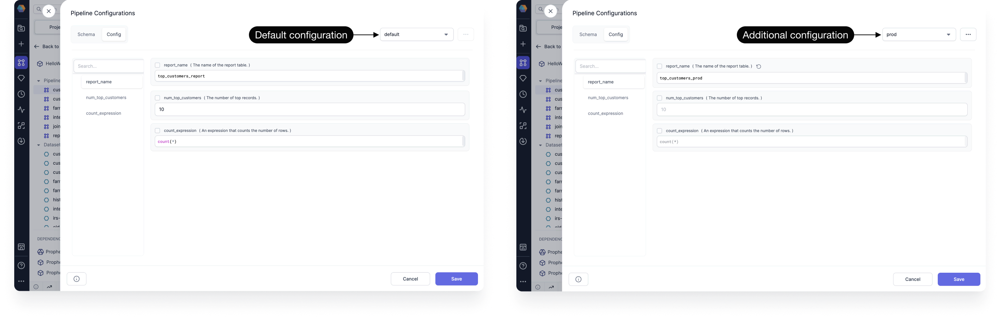
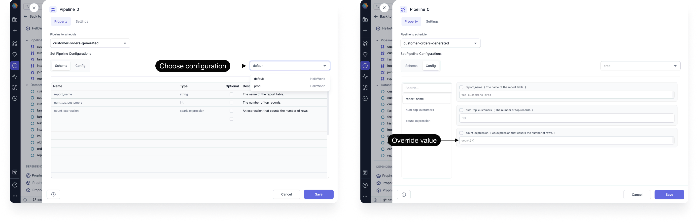
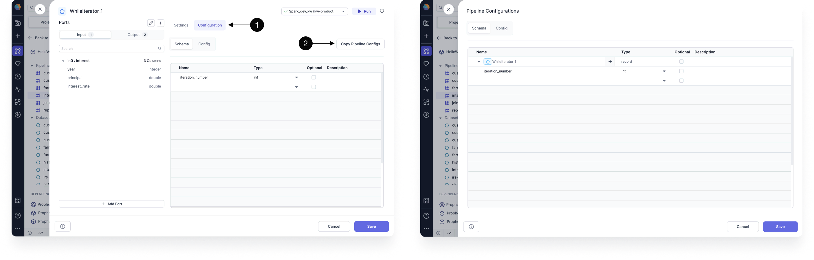
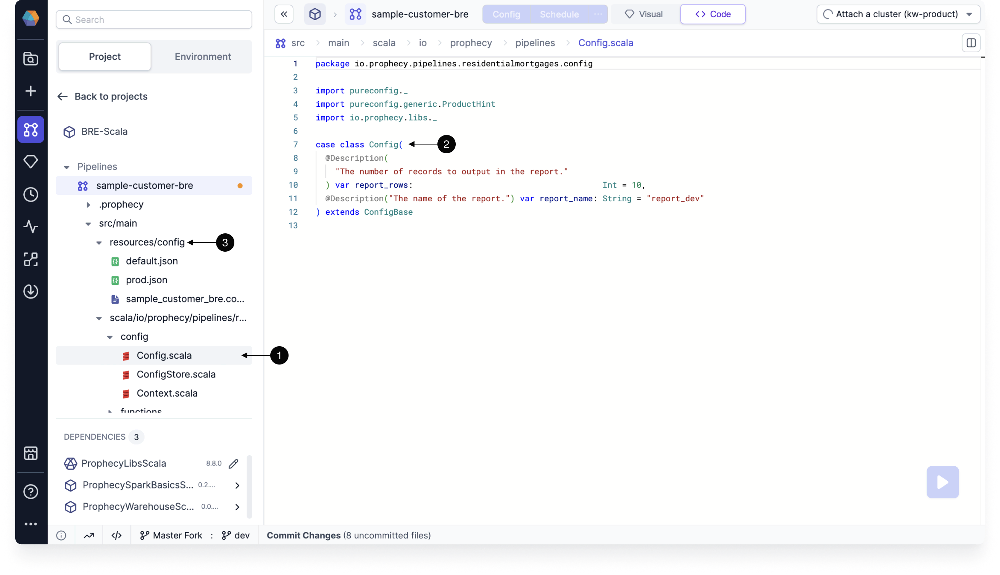
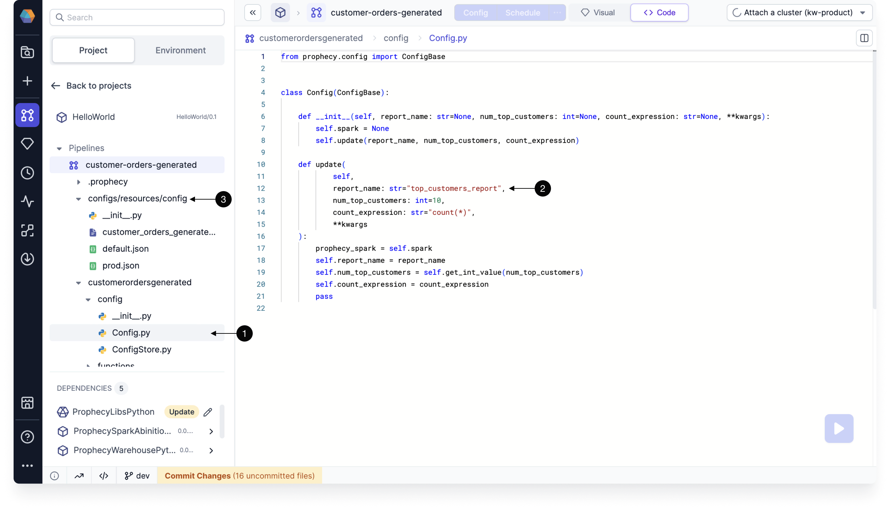

A configuration is a set of predefined variables and values that control how a data pipeline behaves during execution. By using configurations, you can dynamically adapt a pipeline to different environments (e.g., development, testing, production) without modifying the pipeline itself.

## Pipeline configurations

For each pipeline in the project editor, you'll see a **Config** option in the pipeline header. When you open it, you'll see two tabs: Schema and Config.

### Schema tab

The **Schema** tab is where you declare your variables. These variables will be accessible to any component in the respective pipeline.



| Parameter   | Description                                                                                                                                 |
| ----------- | ------------------------------------------------------------------------------------------------------------------------------------------- |
| Name        | The name of the variable.                                                                                                                   |
| Type        | The data type of the variable.                                                                                                              |
| Optional    | A checkbox to define if the variable is optional. When the checkbox is **not** selected, you **must** set a default value for the variable. |
| Description | An optional field where you can describe your variable.                                                                                     |

#### Data types

The data type that you chose in the Schema tab will determine how you will populate the field in the Config tab.

| Data type          | Description                                                                                                |
| ------------------ | ---------------------------------------------------------------------------------------------------------- |
| `string`           | A plain text value, entered via a single-line text input.                                                  |
| `boolean`          | A true or false value, selected from a dropdown.                                                           |
| `date`             | A calendar date, chosen using a date picker.                                                               |
| `timestamp`        | A specific date and time (with time zone), selected via a datetime picker.                                 |
| `double`           | A 64-bit floating-point number entered in a numeric field.                                                 |
| `float`            | A 32-bit floating-point number entered in a numeric field.                                                 |
| `int`              | A 32-bit integer entered in a numeric field.                                                               |
| `long`             | A 64-bit integer entered in a numeric field.                                                               |
| `short`            | A 16-bit integer entered in a numeric field.                                                               |
| `array`            | A list of values of the same type, added one by one in a multi-value input field.                          |
| `record`           | A structured object with multiple named fields, configured through a nested group of inputs.               |
| `secret`           | A sensitive string (like a password or token), selected from your fabric's list of pre-configured secrets. |
| `spark_expression` | A Spark SQL expression, written in a code editor with syntax highlighting.                                 |

### Config tab

The Config tab lets you set default values for your variables. You can create multiple configurations with different default values, which is useful when running your pipeline in different environments (like production and development).



### Syntax

When you want to call configuration variables in your pipeline, you can reference them using Jinja syntax. Jinja variable syntax looks like: `{{config_name}}`.

You can use the following syntax examples for accessing elements of array and record fields:

- For an array: `{{ config1.array_config[23] }}`
- For a record: `{{ record1.record2.field1 }}`

Jinja is enabled by default in new pipelines. To disable this setting, open the Pipeline Settings and turn off the **Enable jinja based configuration** toggle.

:::info

Depending on the Visual Language configured in your [Pipeline Settings](/engineers/pipeline-settings), you can also use that language's syntax to call variables.

| Visual Language | Syntax               | Expression usage           |
| --------------- | -------------------- | -------------------------- |
| SQL             | `'$config_name'`     | `expr('$config_name')`     |
| Scala           | `Config.config_name` | `expr(Config.config_name)` |
| Python          | `Config.config_name` | `expr(Config.config_name)` |

:::

## Runtime configuration

Once you have set up your configurations, you have to choose which configuration to use at runtime.

### Interactive execution

To choose the configuration for interactive runs, open the Pipeline Settings and scroll to the Run Settings section. There, you can change the selected configuration.


### Jobs

When you add a pipeline to your job, you can choose the configuration to use during the job. The configuration defaults can also be overridden here.



## Subgraph configurations

Configurations can also be set inside [subgraphs](/engineers/subgraph). These configurations will apply to execution that happens inside of the subgraph. While each type of subgraph might look different, the configuration settings should include:

1. An area to define configurations. It should have a similar appearance to the pipeline configuration UI.
1. An option to copy pipeline configurations.

Upon creation, subgraph configurations will also be included in the pipeline configurations.



## Code

All configuration instances and values are automatically converted to code.

```mdx-code-block
import Tabs from '@theme/Tabs';
import TabItem from '@theme/TabItem';

<Tabs>

<TabItem value="scala" label="Scala configuration code">

1. Open `Config.scala` in the `<pipeline-path>/config` folder.
1. View the default configuration code.
1. Find additional configurations that are packaged as JSON files in the `resources/config` folder.



</TabItem>

<TabItem value="py" label="Python configuration code">

1. Open `Config.py` in the `<pipeline>/config` folder.
1. View the default configuration code.
1. Find additional configurations that are packaged as JSON files in the `configs/resources/config` folder.



</TabItem>

</Tabs>

```
