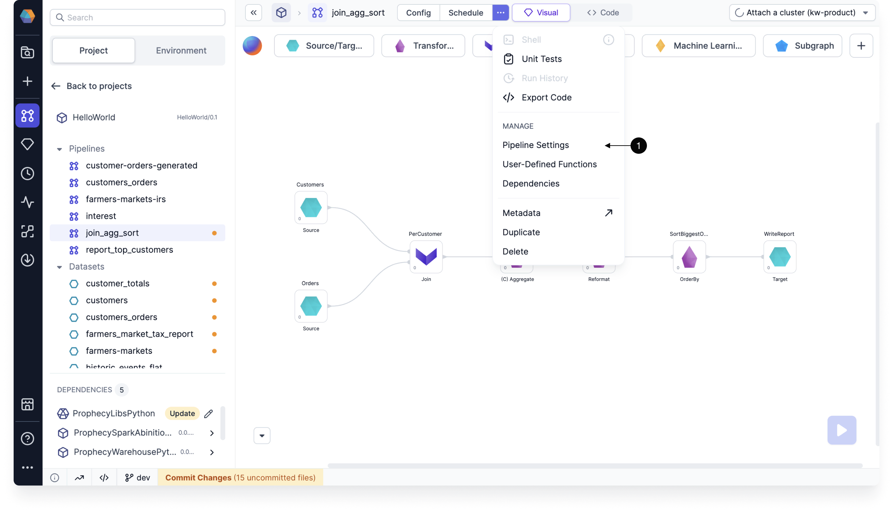

Review the various settings available for each pipeline, including Spark settings, code customization, development preferences, job sampling, run settings, and initialization code.

## Spark

| Setting              | Description                                                                                                                |
| -------------------- | -------------------------------------------------------------------------------------------------------------------------- |
| Spark version        | The Spark version associated with the pipeline.                                                                            |
| Mode                 | The pipeline's mode (either batch or streaming).                                                                           |
| Spark configuration  | Name-value pairs will be set inside the Spark runtime configurations as `spark.conf.set(name, value)`.                     |
| Hadoop configuration | Name-value pairs will be set inside the Hadoop configuration as `spark.sparkContext.hadoopConfiguration.set(name, value)`. |

## Code

| Setting                                  | Description                                                                                                                                                                                                                       |
| ---------------------------------------- | --------------------------------------------------------------------------------------------------------------------------------------------------------------------------------------------------------------------------------- |
| Package Name                             | The name of the package if the project is published to the <a href="../../extensibility/package-hub/">Package Hub</a>.                                                                                                            |
| Config Package Name                      | A unique name for the pipeline's configuration package. Only pipelines made before Prophecy 3.4.5.0 may need to have a custom config package name.                                                                           |
| Custom Application Name                  | The name of the Spark job that appears in the Spark interface.                                                                                                                                                                    |
| Allow Configuration Updates (Scala only) | When enabled, you can override configuration values using a script. For example, if you add a Script gem to the pipeline, you can write something like `Config.current_date_var = "2024"` to set the value of that variable. |
| Enable pipeline monitoring               | The option to turn pipeline monitoring on or off.                                                                                                                                                                                 |
| Enable jinja based configuration         | The option to turn <a href="../pipelines/configuration#syntax">jinja-based</a> configuration on or off.                                                                                                                           |

## Development

| Setting         | Description                                                                                                                                                                                                                                                                                                                      |
| --------------- | -------------------------------------------------------------------------------------------------------------------------------------------------------------------------------------------------------------------------------------------------------------------------------------------------------------------------------- |
| Visual Language | The programming language (SQL, Scala, or Python) used for expressions inside of gems. If you change the visual language while developing your pipeline, Prophecy will automatically convert expressions into the chosen language. The <a href="../expression-builder">Expression Builder</a> will adapt to the language as well. |

## Job

| Setting                | Description                                                  |
| ---------------------- | ------------------------------------------------------------ |
| Job Data Sampling      | A toggle to enable or disable data sampling during job runs. |
| Job Data Sampling Mode | The sampling mode used during job runs.                      |

## Run Settings

| Property            | Description                                                                                                                                                                                                                                                                                                                                                                                                                                                                                                                                                                                                           |
| ------------------- | --------------------------------------------------------------------------------------------------------------------------------------------------------------------------------------------------------------------------------------------------------------------------------------------------------------------------------------------------------------------------------------------------------------------------------------------------------------------------------------------------------------------------------------------------------------------------------------------------------------------- |
| Limit Input Records | When enabled, this limits the number of rows being operated on, makes development time faster, and reduces computation cost.    Depending on how your pipeline is constructed, you might run into some issues when limiting records. If the number of records is too small, you might accidentally exclude records that, for example, match a join condition. This would result in an empty output.                                                                                                                                                                                                         |
| Data Sampling       | Data sampling is enabled by default so you can view interim data samples while developing your pipeline. There are a few data sampling modes to choose from.    <ul style={{margin: 0}}> <li>All: Every interim is generated.</li> <li>Sources: Interims only generated after Source gems.</li> <li>Targets: Interims only generated before Target gems.</li> <li>IO: Interims only generated after Source gems or before Target gems (not between intermediate gems).</li> <li>Vanilla: Databricks-specific setting.</li> <li>Selective: Interims load a large data sample (up to 10,000 rows).</li> </ul> |
| Configuration       | This setting determines which <a href="../pipelines/configuration">configuration</a> will be used during a pipeline run.                                                                                                                                                                                                                                                                                                                                                                                                                                                                                              |

## Initialization Code

| Setting                 | Description                                                                                                                                             |
| ----------------------- | ------------------------------------------------------------------------------------------------------------------------------------------------------- |
| UDF initialization code | The code that is run before initializing any UDF method. In this field, you can define variables, add common classes, include common imports, and more. |

