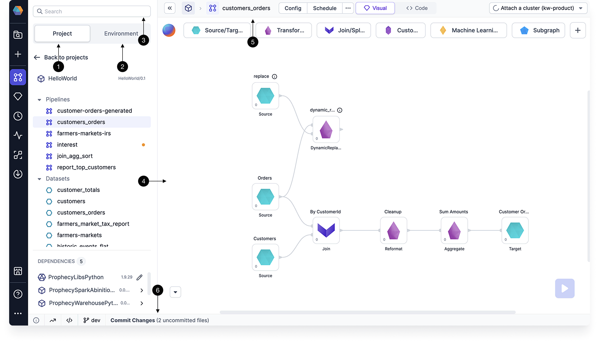
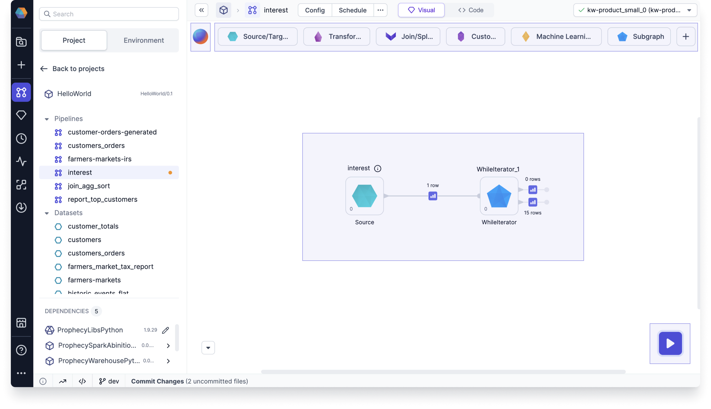
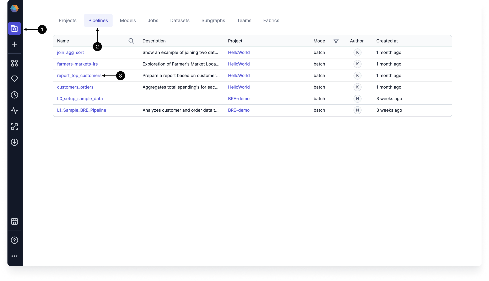

Pipelines are groups of data transformations that you can build from a **visual** or **code** interface. When using the visual interface, each component of a pipeline is automatically compiled into code that you can reuse and customize.

Under the hood, pipelines are based on Spark-native code. Pipelines are ideal for Spark environments like Databricks or EMR, particularly for tasks such as complex data ingestion (e.g., loading data from Salesforce or JDBC), handling advanced data transformations (e.g., working with complex data types), and supporting machine learning workflows.

## Creation

If you want to create a new pipeline, you can do so from the **Create Entity** page in the left sidebar. You can also create pipelines directly within the [Project Editor](/analysts/project-editor).

The following table describes the parameters for pipeline creation.

| Field       | Description                                                                                                                                       |
| ----------- | ------------------------------------------------------------------------------------------------------------------------------------------------- |
| Project     | The project to create the pipeline in. This controls access to the pipeline, groups pipelines together, and lets you use datasets in the project. |
| Branch      | The Git branch to use for pipeline development.                                                                                                   |
| Name        | The name of the pipeline.                                                                                                                         |
| Mode        | Whether the pipeline will be batch mode (collect and process data in scheduled intervals) or streaming (ingest and transmit data in real-time).   |
| Description | A field to describe the purpose of the pipeline.                                                                                                  |

## Project editor

When building your pipelines, it helps to be familiar with the project editor interface. The following table describes different areas of the project editor.

| Callout | Component           | Description                                                                                                                                                                                                       |
| ------- | ------------------- | ----------------------------------------------------------------------------------------------------------------------------------------------------------------------------------------------------------------- |
| 1       | Project tab         | A list in the left sidebar that shows all of the project components. When in code view, this project tab shows the file directory with the code components.                                                       |
| 2       | Environment browser | A list in the left sidebar that lets you browse different assets in your connected execution environment. For example, you can browse the Unity Catalog if you are attached to a Databricks fabric.               |
| 3       | Search              | A search that lets you find different components like gems in your project and pipelines.                                                                                                                         |
| 4       | Canvas              | The area in the center of the project where you build your pipelines visually.                                                                                                                                    |
| 5       | Header              | A menu that includes various configurations such as project settings, dependency management, cluster attachment, scheduling, and more. It also provides a toggle to switch between the Visual view and Code view. |
| 6       | Footer              | A menu that includes diagnostic information, execution metrics, execution code, and the Git workflow.                                                                                                             |

See these components marked in the image below.

### Canvas

Let's take a closer look at the pipeline canvas. The canvas includes:

- **Canvas**: space to add and connect gems.
- **Gem drawer**: toolbox that contains all available gems.
- **Run button**: click to [execute the pipeline interactively](/engineers/execution).
- **Copilot**: AI assistant to help build your pipeline.

## Metadata

To view a list of pipelines in Prophecy, navigate to the **Metadata** page from the left sidebar. For more granular metadata, click into a pipeline. Pipeline metadata can also be accessed from the header of the [Project Editor](/analysts/project-editor).

The table below describes the different tabs inside an individual pipeline's metadata.

| Tab       | Description                                                                                                        |
| --------- | ------------------------------------------------------------------------------------------------------------------ |
| Info      | A list of the input and output datasets of the pipeline. You can also edit the pipeline name and description here. |
| Relations | A list of jobs and subgraphs that include the pipeline.                                                            |
| Code      | The code that is stored in the Git repository for the pipeline.                                                    |
| Runs      | A history of pipeline runs per fabric.                                                                             |
