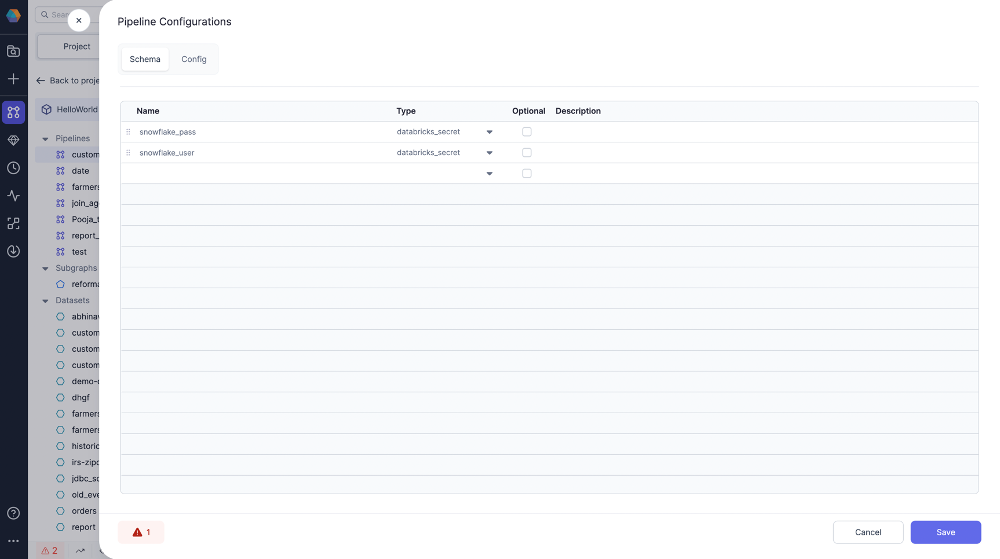
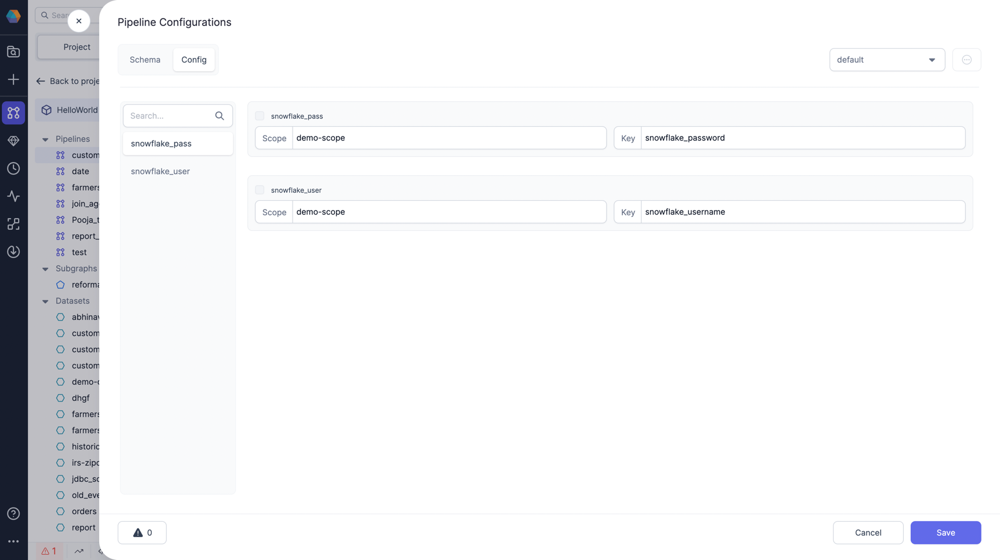
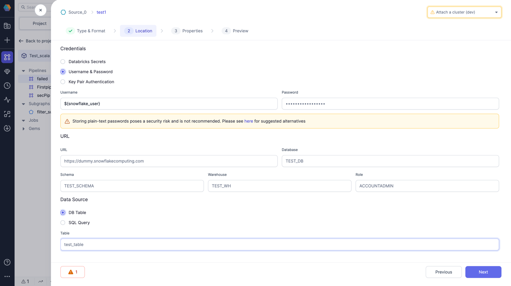

Secrets provide secure authentication for connecting to various data tools like Salesforce, REST APIs, and Snowflake by storing sensitive credentials in centralized secret providers rather than exposing them in code. Any time you need to enter credentials in a Prophecy pipeline, you will be prompted to insert a secret or insert a configuration.

Follow this guide to understand how to use configurations for secrets.

## Use cases

There are a few cases in which you might want to add secrets to pipeline configurations, rather than inserting the secrets directly into gems.

- You want different credentials to be used for different pipeline runs (for example, development vs. production runs).
- You use the secret in multiple gems in the pipeline. If your secret is in a pipeline config, then you can change the value once in the config and it will apply to all gems.

## Example

In this example, we demonstrate using Databricks secrets to configure Snowflake credentials to establish a connection to Snowflake within a gem.

1. **Create secrets in Databricks.** [Create your secret scope and keys in Databricks](https://docs.databricks.com/security/secrets/index.html). For this example, create a secret for your Snowflake username and a secret for the password. Assume we created scope `demo-scope` and added two secrets with key `snowflake-username` and `snowflake-password`.

2. **Create pipeline config to map to secrets.** Add configs of Type `databricks_secret` in [Pipeline Configs](/engineers/configurations). Let's say we call it `snowflake_user` and `snowflake_pass`.

   

3. **Provide values to the config created.** Now, lets add value for the created configs `snowflake_user` and `snowflake_pass` in the default config. You can also add multiple values in different configs. For value, add the scope and key you created for your secret in the first step and save it. It's now ready to be used in your gems.

   

4. **Add a Snowflake gem to your pipeline and use the config.** Use the Config with syntax as `${snowflake_user}` and `${snowflake_pass}` in the username and password field respectively and define all other required fields in the gem as is.

   
