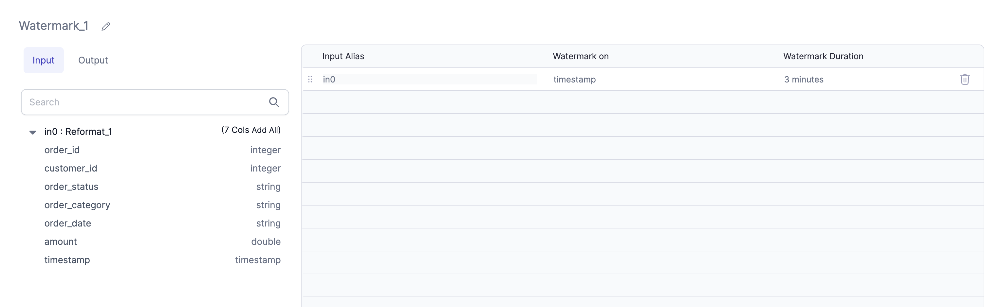

:::caution
Prophecy no longer provides support for streaming pipelines. Please switch to batch pipelines for continued support.
:::

## Transformation Gems

Transform gems that generate code but do not work within Streaming Applications include `OrderBy`, `Limit`, and `Window` (partitionBy).
Although `Window` would work with a watermarked column (explained below) as part of the partitioning, it is advised to use `window()` or `session_window()` from the `pyspark.sql.functions package` [(link)](https://spark.apache.org/docs/latest/api/python/reference/pyspark.sql/api/pyspark.sql.functions.session_window.html#:~:text=session_window,-pyspark.sql.functions&text=Generates%20session%20window%20given%20a,according%20to%20the%20given%20inputs.).

### Watermarking

Watermarking is a technique that enables aggregations on streaming data by limiting the state over which the aggregation is performed. In order to prevent out-of-memory errors, we have introduced support for watermarking. More information on watermarking is available in the Spark documentation [here](https://spark.apache.org/docs/latest/structured-streaming-programming-guide.html#window-operations-on-event-time)

We have added a Watermarking gem in the Transform Section that allows a user to add a Watermark to a DataFrame.

In this example, we add Watermarking to the `timestamp` column. A user may enter the column name or select one from the Schema Table on the left. The text box is editable. Finally, define the Watermark Duration.
It is recommended to use Watermarking on a Streaming DataFrame in case you're planning to use any of the following operations on it:

- [Aggregate](/engineers/aggregate)
- [Deduplicate](/engineers/deduplicate)
- [SQL Statement](/engineers/sql-statement)
- [Join](/engineers/join)
