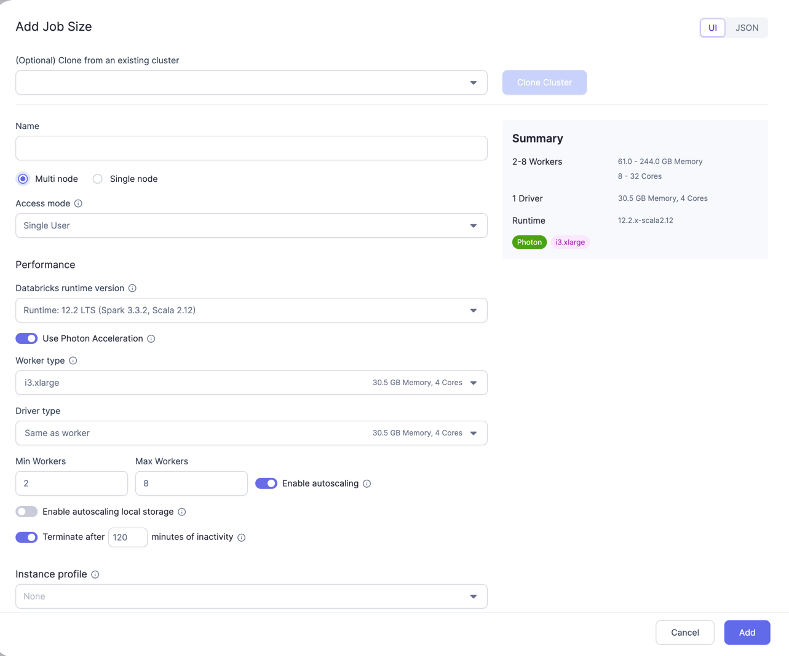

Create a Databricks fabric to connect Prophecy to your existing Databricks environment. Think of a fabric as connection to your [Databricks workspace](https://docs.databricks.com/workspace/index.html#navigate-the-workspace).
This fabric enables Prophecy to connect to existing Spark clusters (or create new ones), execute Spark pipelines, read and write data, etc - all according to each user's permissions defined by their personal access token.

Please refer to the video below for a step-by-step example.

<iframe src="https://user-images.githubusercontent.com/121796483/217735090-41853091-ef2e-4d60-bdf6-62fe31a7ee3b.mp4" title="Databricks Fabric" allow="autoplay;fullscreen" allowtransparency="true" frameborder="0" scrolling="no" class="wistia_embed" name="wistia_embed" msallowfullscreen width="100%" height="100%"></iframe>

## Fields

### Databricks credentials

Here you will provide your Databricks Workspace URL and [Personal Access Token](https://docs.databricks.com/dev-tools/api/latest/authentication.html#generate-a-personal-access-token) (PAT). The PAT must have permission to attach clusters. If you'd like to create clusters or read/write data from Prophecy, then these permissions should be enabled for the PAT as well. Keep in mind each user will need to use their own PAT in the fabric. Prophecy respects the permissions scoped to each user.

### Cluster details

Here you would need to provide the [Databricks Runtime version](https://docs.databricks.com/runtime/dbr.html#databricks-runtime), Executor and Drive Machine Types and Termination Timeout if any. These cluster details will be used when creating a cluster via Prophecy during Interactive development and for job clusters during Scheduled Databricks job runs.

:::caution
If you're interested in the Shared cluster mode, please note: Unity Catalog (UC) clusters in Shared access mode have [particular limitations](https://docs.databricks.com/en/compute/access-mode-limitations.html#shared-access-mode-limitations-on-unity-catalog) that prevent [these](./ucshared) Prophecy features from working as designed.
:::

### Job sizes

You can create job sizes here using which clusters can be spawned while testing through the Prophecy UI. Here you can provide Cluster mode, Databricks Runtime version, total number of the Executors, Core and Memory for them, etc. This provides all the options which are available on Databricks while spawning clusters through Databricks. We recommend using the smallest machines and smallest number of nodes appropriate for your use case.

In Json you can just copy-paste your compute Json from Databricks.

### Prophecy Library

These are some Scala and Python libraries written by Prophecy to provide additional functionalities on top of Spark. These would get automatically installed in your Spark execution environment when you attach to a cluster/create new cluster. These libraries are also publicly available on Maven central and Pypi respectively.

### Metadata connection

Optionally, enhance your fabric by creating a [Metadata Connection](/docs/administration/connections-and-secrets/metadata-connections.md), recommended for users with hundreds or thousands of tables housed in their data provider(s).

### Artifacts

Prophecy supports Databricks Volumes. When you run a Python or Scala pipeline via a job, you must bundle them as whl/jar artifacts. These artifacts must then be made accessible to the Databricks job in order to use them as a library installed on the cluster. You can designate a path to a Volume for uploading the whl/jar files under Artifacts.

## Databricks execution

To learn about Databricks execution, visit:

- [Execution on Databricks](/docs/Spark/execution/databricks-clusters-behaviors.md)
- [Interactive Execution](/docs/Spark/execution/interactive-execution.md)
- [Execution Metrics](/docs/Spark/execution/execution-metrics.md)
