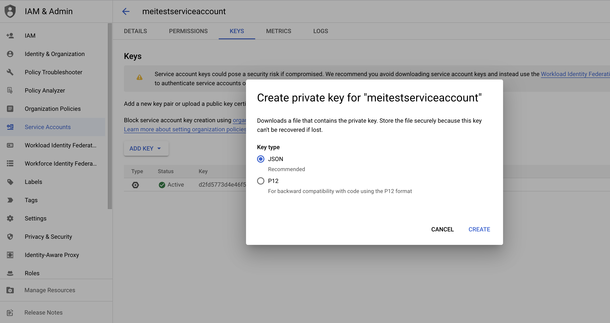
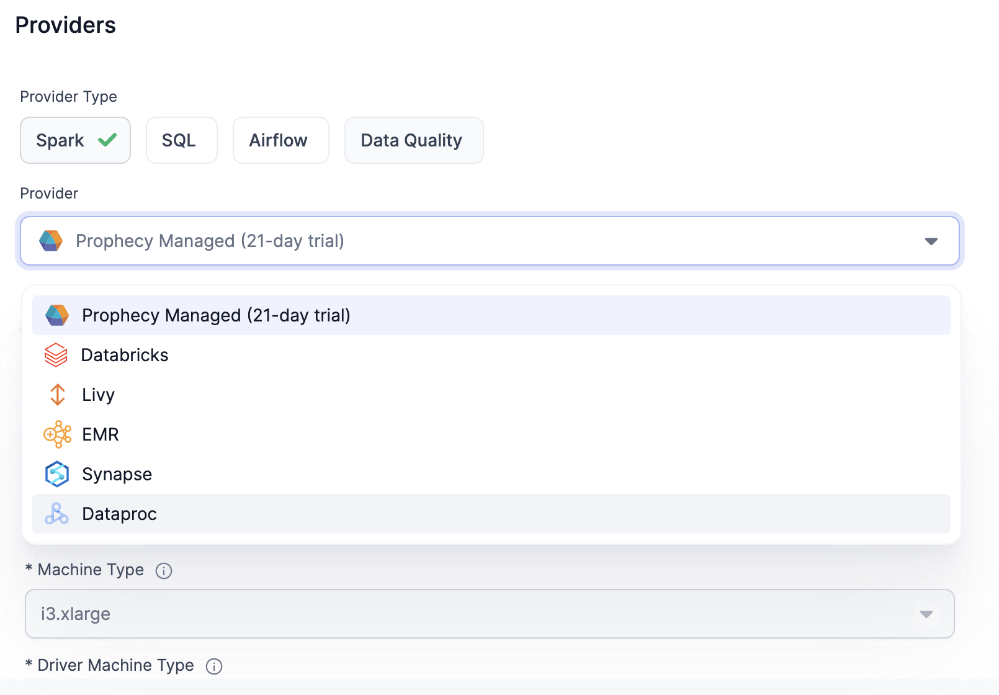
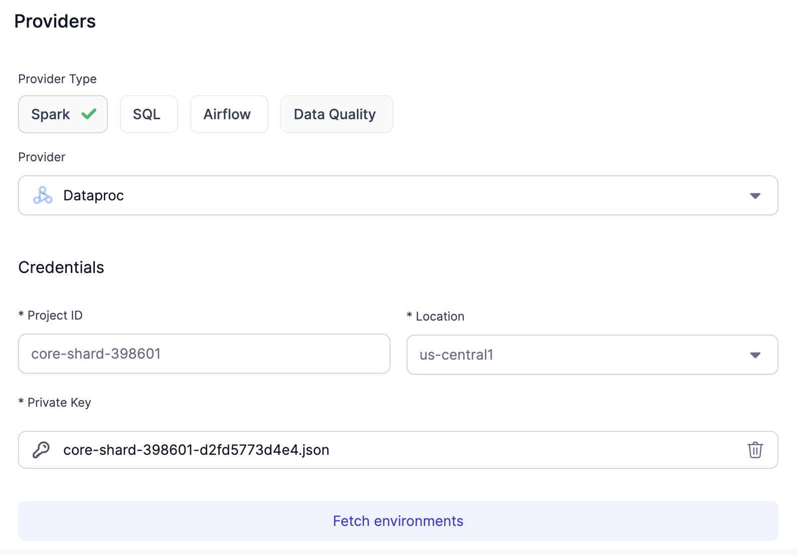
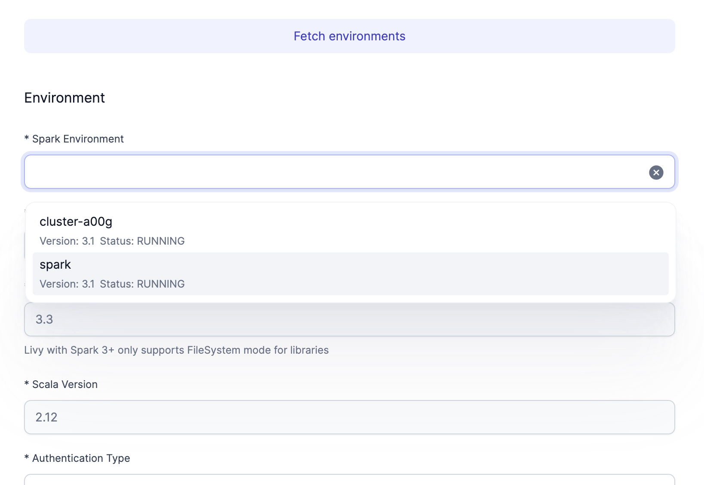
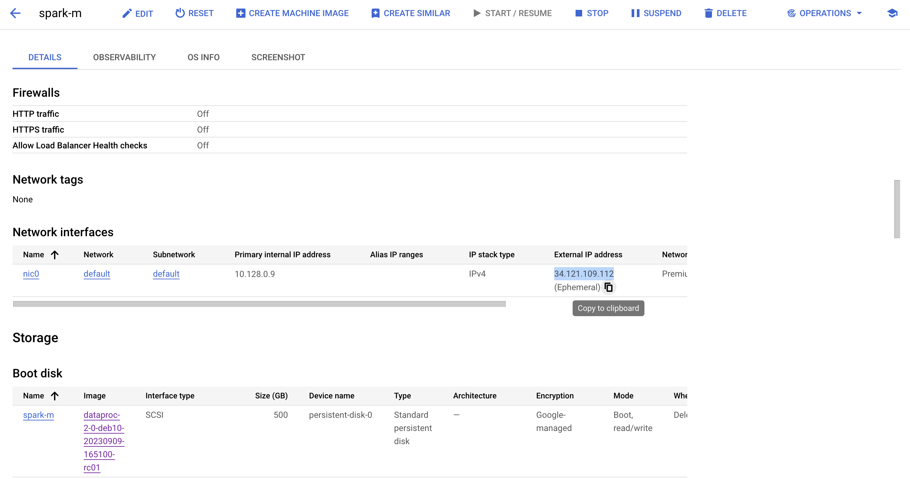
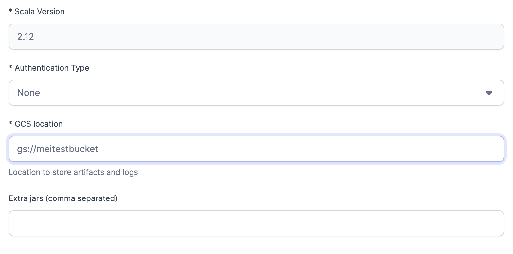
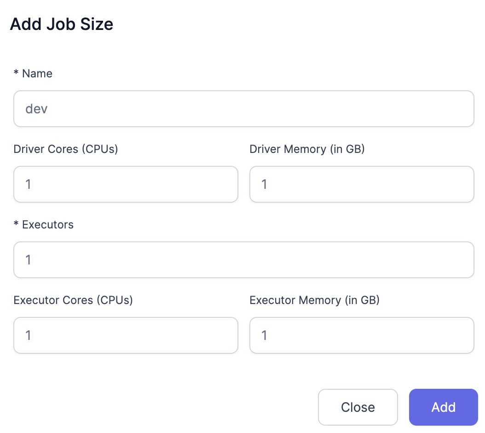
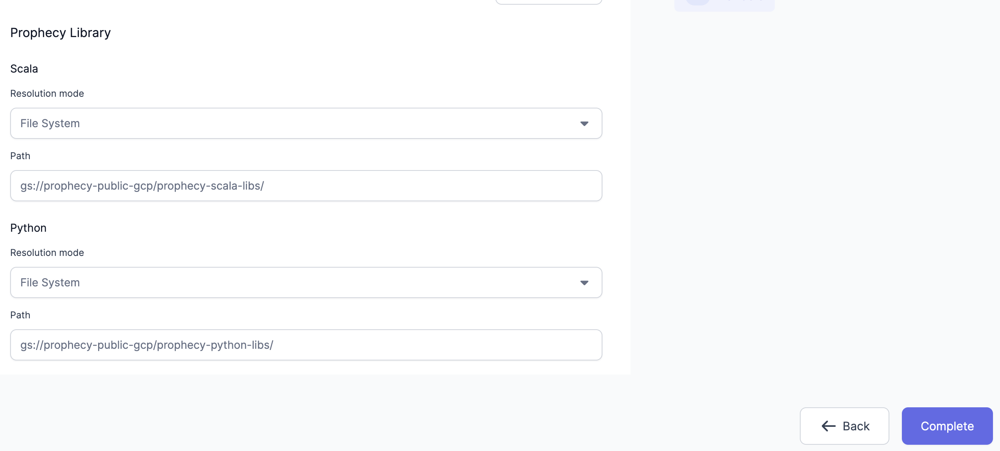

In the context of Spark execution engines, users have the flexibility to opt for Google Cloud Dataproc. This guide offers step-by-step instructions on creating a fabric that enables seamless connectivity to the Dataproc environment.

## Requirements

Livy must be installed on your cluster. Prophecy provides a script required to deploy a Dataproc cluster.

## Create a Dataproc Cluster

1. If you don't already have a private key, create a private key for the service account that you're using.

   

2. Ensure you have the following permissions configured.

   ```
   gcloud projects add-iam-policy-binding <project-name> \
   --member "<service-account-name>" \
   --role "roles/serviceusage.serviceUsageViewer"

   gcloud projects add-iam-policy-binding <project-name> \
   --member "<service-account-name>" \
   --role "roles/dataproc.worker"

   gcloud projects add-iam-policy-binding core-shard-398601 \
   --member "<service-account-name>" \
   --role "storage.objects.get"

   gcloud storage buckets add-iam-policy-binding gs://<bucket-name> \
   --member="<service-account-name>" --role=roles/storage.admin --project <project-name>
   ```

3. Associate secret key to service account.

   ```
   gcloud config set account meitestserviceaccount@core-shard-398601.iam.gserviceaccount.com \
   --key-file=<local-private-key-location>
   ```

4. Start a Dataproc cluster using `install-livy.sh`.

   ```
    gcloud dataproc clusters create <cluster-name> \
   --scopes <permission-scope> \
   --region <cluster-region> \
   --initialization-actions 'gs://prophecy-public-gcp/livy-installer-script/install-livy.sh' \
   --properties "hive:hive.metastore.warehouse.dir=<gs://bucket/datasets>" \
   --metadata "enable-cloud-sql-proxy-on-workers=false" \
   --bucket <cluster-data-bucket-name> \
   --region <region> \
   --zone <zone> \
   --single-node \
   --master-machine-type n2-standard-4 \
   --master-boot-disk-size 500 \
   --image-version 2.0-debian10 \
   --project <project-name> \
   --service-account="<service-account-name>" \
   --dataproc-metastore=projects/<project-name>/locations/<region>/services/<metastore-service-name>
   ```

## Create a Dataproc fabric

1. Create a fabric and select **Dataproc**.

   

2. Fill out your **Project Name** and **Region**, and upload the **Private Key**.

   

3. Click on **Fetch environments** and select the Dataproc **cluster** that you created earlier.

   

4. Leave everything as default and provide the **Livy URL**. Locate the **External IP** of your cluster instance. Optionally, you may configure the DNS instead of using the IP. The URL is `http://<external-ip>:8998`.

   

5. Configure the bucket associated with your cluster.

   

6. Add the **Job Size**.

   

7. Configure Scala Library Path.  
   `gs://prophecy-public-gcp/prophecy-scala-libs/`.

8. Configure Python Library Path.  
   `gs://prophecy-public-gcp/prophecy-python-libs/`.

   

9. Click on **Complete**.

## Troubleshooting

### Livy Cluster Cannot Access Scala or Python Libraries

It is possible to encounter the following error message when using a Dataproc fabric.

```
Creating new Livy Session...
Using prophecy libs path...repo1.maven.org...
Using python libraries...files.pythonhosted.org...
...
org.apache.spark.deploy.SparkSubmit.main(SparkSubmit.scala)\n\nYARN Diagnostics: ","level":"error"
```

Here are some ways to resolve the issue and allow successful Livy session creation.

- **Adjust Network Settings**: Ensure the Livy Cluster allows outbound traffic to:

  - Scala Library URL: `repo1.maven.org`
  - Python Library URL: `files.pythonhosted.org`

- **Configure Library Paths**: Manually set the library paths:

  - Scala Library Path: `gs://prophecy-public-gcp/prophecy-scala-libs/`
  - Python Library Path: `gs://prophecy-public-gcp/prophecy-python-libs/`

- **Use an Internal GCS Bucket**: Host the required libraries internally by creating two folders in a GCS bucket and placing `prophecy-scala-libs` and `prophecy-python-libs` inside.
