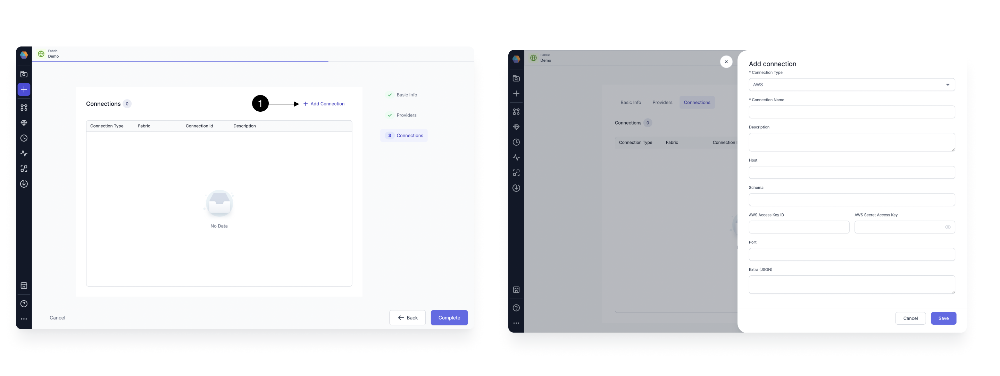
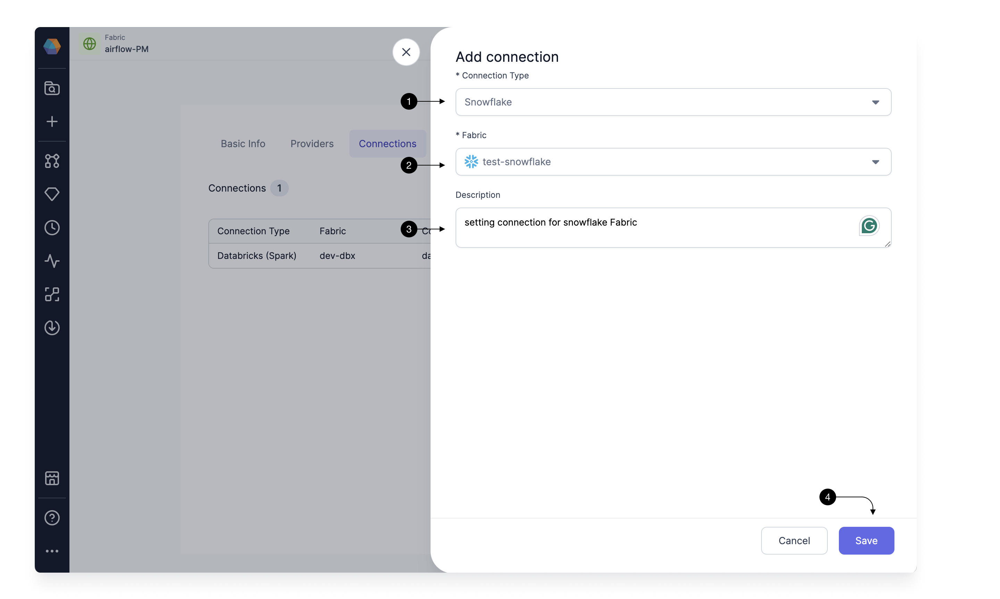

To be able to Run your Snowflake SQL models, you need to have connection from Prophecy Managed Airflow to your Snowflake Environment

### Add Snowflake connection (DBT)

To add a Snowflake connection, click on **+ Add Connection**.

Select Snowflake in **(1) Connection Type**. Now under the **(2) Fabric**, you would select the already created fabric for Snowflake and Prophecy would set up the connection. You can provide a description in the **(3) Description**. Once done, click **(4) Save**.

