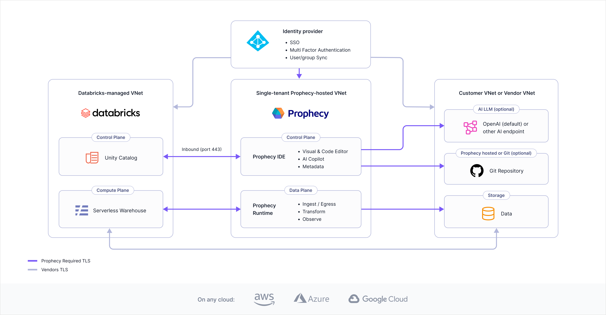
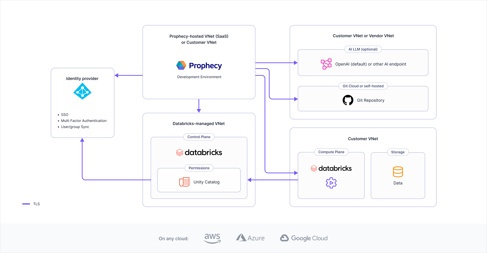

Prophecy is deployed as microservices orchestrated by Kubernetes in various cloud platforms.

## Components

The following are the main components of a successful Prophecy deployment.

- **Prophecy Studio**: The studio user interface lets you access and develop visual data pipelines in your various projects.

- **Prophecy Automate**: This is our built-in Prophecy runtime designed for ingestion, egress, and orchestration. It is available exclusively for Prophecy fabrics with SQL connections and does not apply to Spark-based projects.

- **External execution engine**: Prophecy runs data transformations on your own execution environment, such as Snowflake or Databricks. [Fabrics](docs/getting-started/concepts/fabrics.md) enable users to execute pipelines on these platforms. Prophecy does not persist your data.

- **Source control**: Prophecy integrates with Git for version control and supports both native and external Git options.

- **Copilot**: Our Copilot is an AI assistant powered by a knowledge graph of datasets, schemas, models, and pipelines. It sends enhanced prompts to an LLM, receives SQL or Spark code, verifies it, and generates visual components.

- **Authentication**: Prophecy supports multiple authentication methods, including Prophecy-managed authentication and integration with other identity providers.

## Prophecy for Analysts

Prophecy for Analysts leverages Prophecy Automate and an external SQL warehouse of your choice to build, run, and schedule pipelines. This architecture diagram demonstrates one example of the various components involved in a Prophecy deployment in their respective virtual networks.

Prophecy can accommodate a wide variety of architectures beyond this diagram. For example:

- The diagram shows Databricks as the data provider and SQL warehouse. Prophecy also supports Snowflake SQL warehouse.
- The diagram displays a connection to an external Git repository. You can also use Prophecy-managed Git for version control.
- The diagram places Prophecy Automate inside Prophecy. If necessary, Prophecy Automate can run in a customer network instead. If you opt to run Prophecy Automate in your customer network, then you must specify this in the Prophecy [fabric](docs/administration/fabrics/prophecy-fabrics/prophecy-fabrics.md).

## Prophecy for Engineers

Prophecy for Engineers privileges Spark to execute pipelines in a scalable and optimized way. This architecture diagram demonstrates one example of the various components involved in a Prophecy deployment in their respective virtual networks.

Prophecy can accommodate a wide variety of architectures beyond this diagram. For example:

- The diagram demonstrates Databricks as the execution engine. You can connect to other platforms like Amazon EMR and Google Cloud Dataproc, or use any Spark engine through [Apache Livy](https://livy.apache.org/).
- The diagram displays a connection to an external Git repository. You can connect to a variety of providers such as GitHub, Bitbucket, GitLab, and more.
