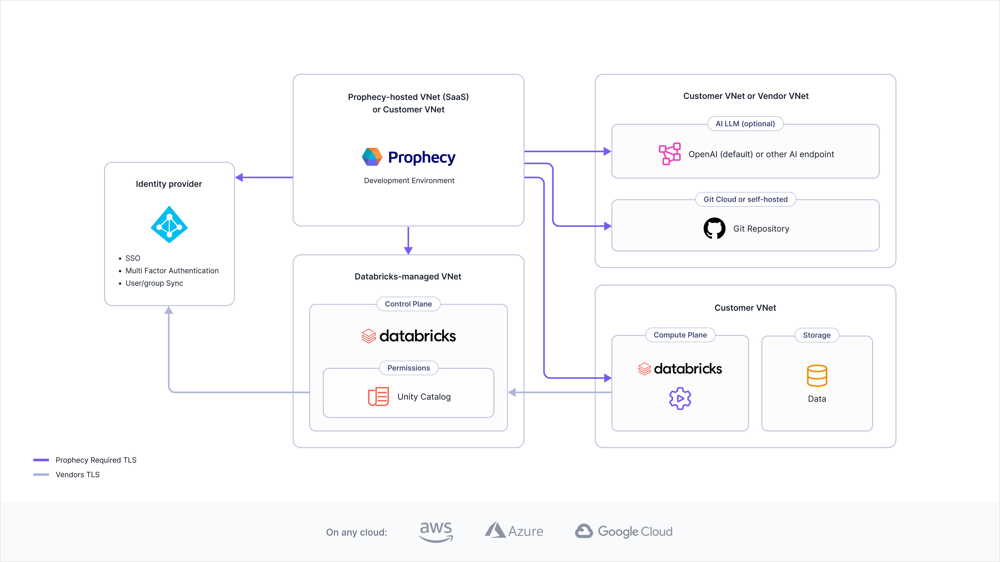

Prophecy operates as a distributed system built on microservices architecture, orchestrated by Kubernetes across multiple cloud platforms. The platform consists of several core components that work together to provide data transformation, orchestration, and management capabilities.

## Free and Professional Edition

The Free and Professional Editions provide a complete data platform with managed components.

| Component          | Description                                                                                                   |
| ------------------ | ------------------------------------------------------------------------------------------------------------- |
| Prophecy Studio    | The control plane that provides the user interface for developing visual data pipelines and managing projects |
| Prophecy Automate  | The native runtime designed for data ingestion, egress, and built-in scheduling capabilities                  |
| Prophecy Warehouse | The execution engine that processes data transformations using Prophecy-managed compute resources             |
| AI                 | Prophecy-managed LLM subscription and endpoint                                                                |
| Version control    | Git integration supporting both Prophecy-managed and external Git repositories                                |

:::info
**Deployment model**: SaaS only. Learn more in [Deployment models](docs/administration/prophecy-deployment.md).
:::

## Express Edition

The Express Edition provides enterprise-grade features scoped to leverage your existing SQL warehouse infrastructure.

| Component          | Description                                                                                                            |
| ------------------ | ---------------------------------------------------------------------------------------------------------------------- |
| Prophecy Studio    | The control plane that provides the user interface for developing visual data pipelines and managing projects          |
| Prophecy Automate  | The native runtime designed for data ingestion, egress, and built-in scheduling capabilities                           |
| External Warehouse | Your own Databricks SQL engine that executes data transformations, allowing you to leverage existing compute resources |
| AI                 | Customer-managed LLM subscription and endpoint                                                                         |
| Version control    | Git integration supporting both Prophecy-managed and external Git repositories                                         |

:::info
**Deployment model**: Dedicated SaaS only. Learn more in [Deployment models](docs/administration/prophecy-deployment.md).
:::

## Enterprise Edition

The Enterprise edition offers maximum flexibility with multiple execution engine options and deployment models.

| Component        | Description                                                                                                                                                                                                                                                                                               |
| ---------------- | --------------------------------------------------------------------------------------------------------------------------------------------------------------------------------------------------------------------------------------------------------------------------------------------------------- |
| Prophecy Studio  | The control plane that provides the user interface for developing visual data pipelines and managing projects across various data platforms                                                                                                                                                               |
| Execution engine | Flexible compute options including Spark clusters or external SQL warehouses combined with Prophecy Automate. Prophecy executes data transformations on your chosen execution environment. [Fabrics](/fabrics) enable users to execute pipelines on these platforms. Prophecy does not persist your data. |
| AI               | Customer-managed LLM subscription and endpoint                                                                                                                                                                                                                                                            |
| Version control  | Git integration supporting both Prophecy-managed and external Git repositories                                                                                                                                                                                                                            |

:::info
**Deployment model**: Dedicated SaaS preferred, Self-hosted supported, and SaaS available. Learn more in [Deployment models](#deployment-models).
:::

Prophecy can accommodate a wide variety of architectures beyond this diagram. For example:

- The diagram demonstrates Databricks as the execution engine. You can connect to other platforms like Amazon EMR and Google Cloud Dataproc, or use any Spark engine through [Apache Livy](https://livy.apache.org/).
- The diagram displays a connection to an external Git repository. You can connect to a variety of providers such as GitHub, Bitbucket, GitLab, and more.
