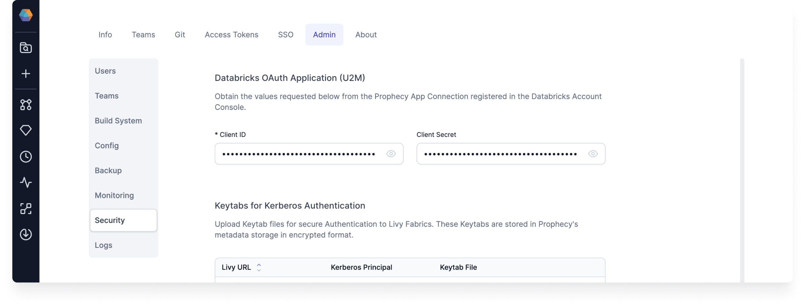
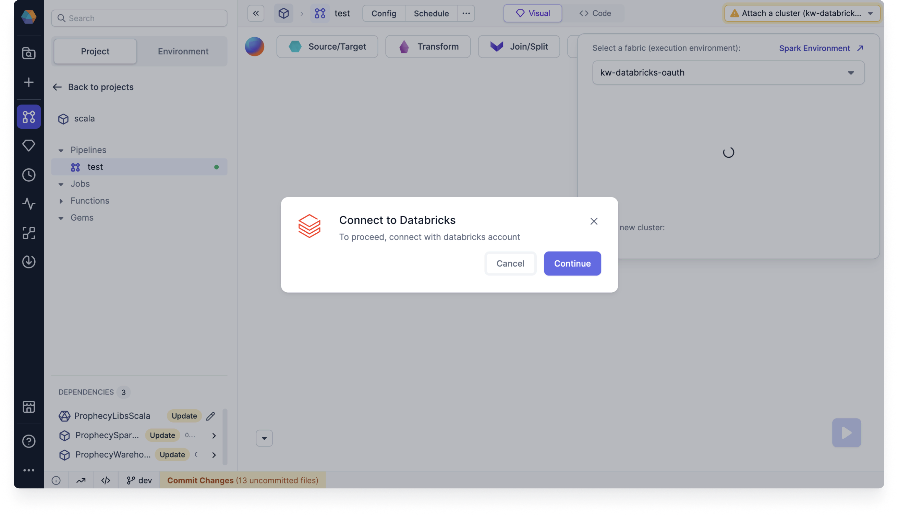
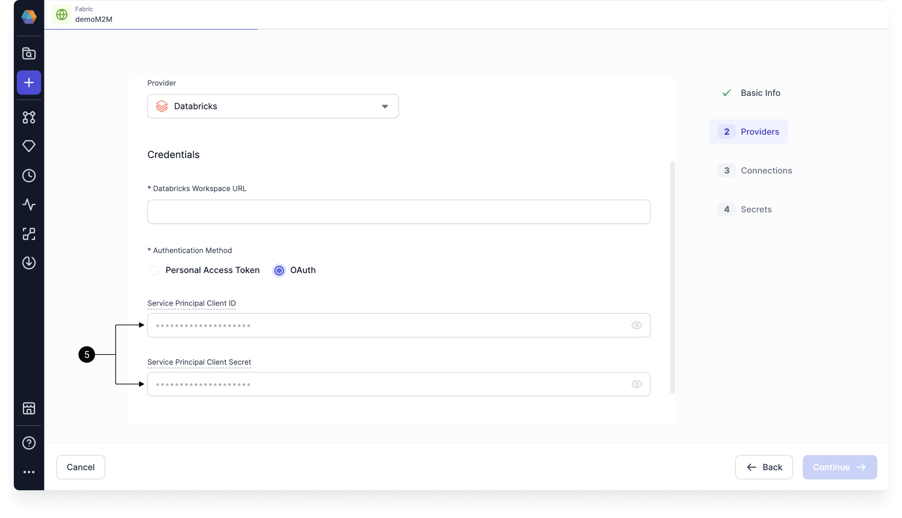

Prophecy provides Databricks OAuth to align with industry-standard authentication flows. This gives you more granular access control, making it a good alternative to Personal Access Tokens (PATs). This integration works with both Spark clusters and SQL warehouses.

## Requirements

- Prophecy 3.4.3.1 or later.
- An app connection between Databricks and Prophecy. This connection is set up by default in SaaS environments and no further action is needed.

For Dedicated SaaS and self-hosted deployments, follow the steps below. Prior to performing this one-time registration process, **users will see the OAuth option in fabrics but will be unable to use it.**

### Register Prophecy as an app connection in Databricks {#app-connection}

First, a Databricks [account admin](https://docs.databricks.com/en/admin/index.html#what-are-account-admins) needs to complete the following steps **once** for your Prophecy deployment:

1. On Databricks, navigate to **Account Settings > App connections** in your account console.
2. Create a new App connection for Prophecy. This process generates Databricks OAuth Application fields on the Prophecy side.
3. Under Client ID, copy your **OAuth Client ID** for the application, and share it with your Prophecy Cluster Admin.
4. Under Client secret, select **Generate a client secret**. Share it with your Prophecy Cluster Admin.
5. Click **Save**.

Then, the Prophecy cluster admin has to add the Databricks credentials to Prophecy:

1. Navigate to **Admin Settings > Security**.
2. Under **Databricks OAuth Application (U2M)**, paste the **Client ID** and the **Client Secret** into the respective fields.

Finally, the Prophecy Kubernetes cluster must be restarted to enact these changes.

## Use cases supported by Databricks

In Prophecy, you can use Databricks OAuth in two ways. The most common method is U2M, but you can optionally use M2M as well.

### [User-to-Machine (U2M)](https://docs.databricks.com/en/dev-tools/auth/oauth-u2m.html)

This method is used for **pipeline development** and **job configuration**. In this case, users authenticate individually via Databricks. In this case, users access data based on their individual identity and the permissions already defined within the Databricks Unity Catalog.

To configure a [fabric](docs/get-started/concepts/fabrics/fabrics.md) for this use case:

1. Create a new Spark or SQL fabric.
1. Choose **Databricks** as the provider.
1. Enter the relevant Databricks workspace URL.
1. Choose **OAuth** as the authentication method.
1. Click **Test Connection** to test the sign in to Databricks.
1. Finish the fabric configuration as normal and click **Complete**.

You **do not** have to fill out the Service Principal Client ID and Service Principal Client Secret for this use case.

Now, anyone who uses this fabric can use their individual Databricks credentials for authentication. Prophecy will automatically prompt users to sign in when necessary.

:::note
You only need to perform this authentication periodically, depending on the OAuth timeout settings within Databricks. SaaS deployments automatically use the default time period. If you have a Dedicated SaaS or self-hosted deployment, your Databricks Account Administrator can adjust the timeout setting.
:::

### [Machine-to-Machine (M2M)](https://docs.databricks.com/en/dev-tools/auth/oauth-m2m.html)

This method is used for **project deployment**. In this case, authentication is performed using Databricks [service principal](https://docs.databricks.com/en/dev-tools/auth/oauth-m2m.html) credentials for unattended operations (such as automated deployment). The minimum level of access that your service principal requires (including access to clusters, tables, etc.) will vary per use case.

To configure a [fabric](docs/get-started/concepts/fabrics/fabrics.md) for this use case:

1. Create a new Spark or SQL fabric.
1. Choose **Databricks** as the provider.
1. Enter the relevant Databricks workspace URL.
1. Choose **OAuth** as the authentication method.
1. Enter the **Service Principal Client ID** and **Service Principal Client Secret** into the respective fields. This is different from the Client ID and Client Secret that was used to set up the [app connection](#app-connection).
1. Click **Test Connection** to test the sign in to Databricks.
1. Finish the fabric configuration as normal and click **Complete**.

Now, when this fabric is used, **scheduled jobs will always run as the service principal**. In the Airflow and Databricks Job IDE, a warning will display if the connected fabric does not contain service principal OAuth Credentials.

Additionally, project releases and deployment will be performed by the service principal on behalf of the Prophecy team admin when using this fabric.

## Security

Prophecy ensures robust security measures during the OAuth authentication process, following best practices documented by Databricks. For example:

- The authentication process follows a three-step OAuth flow to generate tokens, leveraging Proof Key for Code Exchange (PKCE) to enhance security. Prophecy uses a Prophecy-hosted callback URL to capture and process authorization codes, issuing and securely storing access tokens.
- Prophecy securely stores the refresh token, which is used to renew itself and obtain new access tokens, to ensure uninterrupted authenticated connectivity to Databricks. Tokens are encrypted before being stored in the database, following the same stringent encryption standards applied to other credentials managed by Prophecy.
