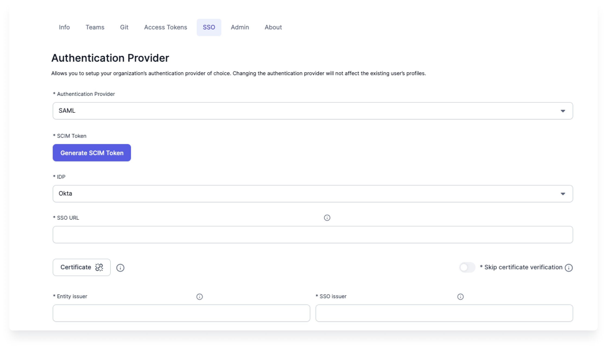
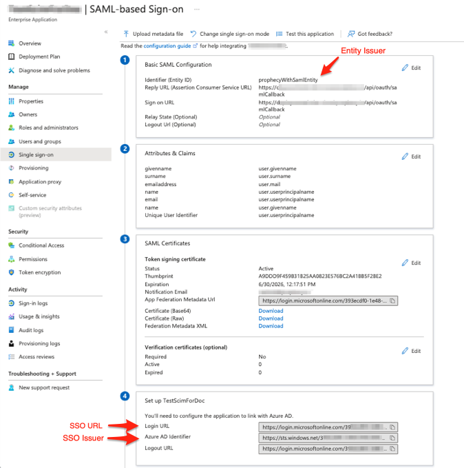
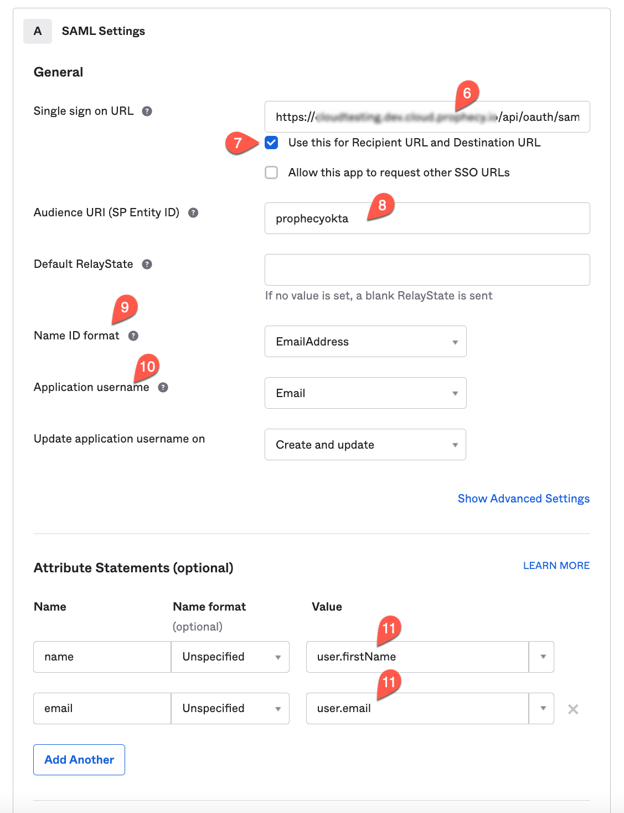
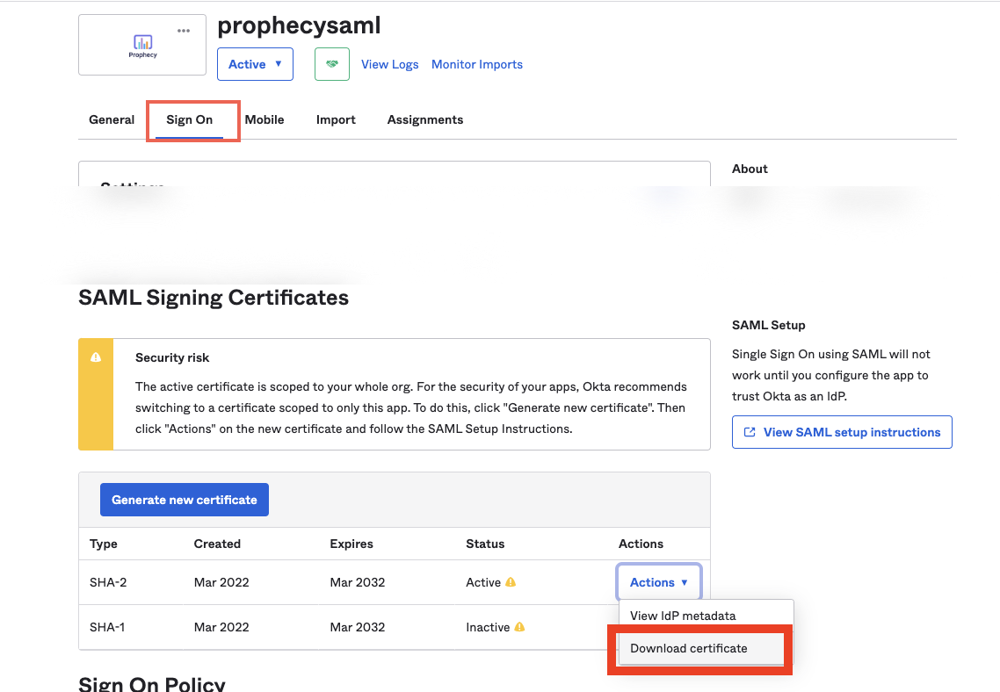
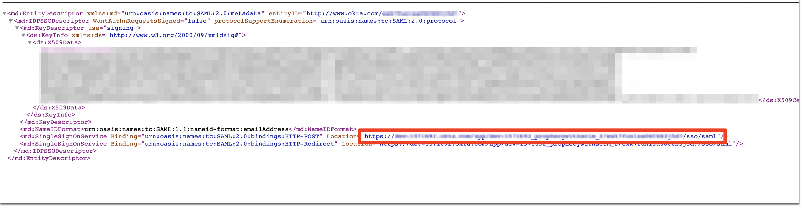

:::edition Enterprise
Available for Enterprise Edition only.
:::

Use this page to understand how to set up SAML authentication and SCIM provisioning in Prophecy.

## Requirements

- Organization admin role in Prophecy.
- SCIM enabled in Prophecy deployment `config` (Dedicated SaaS and self-hosted deployments only).

## SAML configuration

To set up SSO using SAML:

1. Navigate to **Settings > SSO**.
1. Choose **SAML** as the Authentication Provider.
1. Click **Generate SCIM Token**.
1. Choose the relevant **IDP**. This can be Okta, AzureAD, Google, or others.
1. Input your **SSO URL**.
1. Add your **Certificate** or skip certificate verification.
1. Fill in your **Entity issuer** and **SSO issuer**.
1. Click **Save**.

## Group Naming Conventions for SCIM

Groups defined in your SCIM protocol are mapped to teams and admins in Prophecy. Follow the naming convention below to assign the correct roles to users.

### Team Role Mapping

| **Group Name**     | **Role in Prophecy**                                                          |
| ------------------ | ----------------------------------------------------------------------------- |
| `<teamname>`       | Users will be assigned to the team with the same name in Prophecy.            |
| `<teamname>-admin` | Users will be assigned as Team Admins for the corresponding team in Prophecy. |

### Self-hosted Deployments Only

| **Group Name**   | **Role in Prophecy**                      |
| ---------------- | ----------------------------------------- |
| `prophecy-admin` | Users will be Cluster Admins in Prophecy. |

## Microsoft Entra ID (formerly Azure Active Directory)

Configure SAML for Microsoft Entra ID and enable SCIM provisioning

1. Log into AzureAD as an administrator and create a new Enterprise Application like `ProphecyAzureADApp`.
2. In the home page search bar, search for **Enterprise Applications**.
3. Click **New Application > Create your own application**.
4. Give name for the application like `ProphecyAzureADApp`.
5. Choose the radio button **Integrate any other application you don't find in the gallery (Non-gallery)**.
6. Click **Create**.
7. In Manage section on the left, click **Single sign-on**.
8. Choose **SAML** as the Single sign-on method.

Now the form for **Set up Single Sign-On with SAML** will open. You'll have to fill out different sections of the form.

### Basic SAML Configuration

1. Provide an Identifier (Entity ID) which is a unique ID to identify this application to Microsoft Entra ID.
2. In the same section, configure **Reply URL** and **Sign on URL** as:  
   `https://your-prophecy-ide-url.domain/api/oauth/samlCallback`
3. Click **Save**.

### Attributes & Claims

1. Click **Edit** button and then **Add new claim**.
2. Give **Name** as `email` and **Source Attribute** as `user.userprincipalname`, and click **Save**.
3. Add one more claim by clicking on **Add new claim**.
4. Give **Name** as `name` and **Source Attribute** as `user.givenname`, and click **Save**.

### SAML certificates

In the **SAML certificates** section, download `Certificate (Base64)` file to be used while configuring SSO in Prophecy UI.

### Set up ProphecyAzureADApp

In the **Set up ProphecyAzureADApp** section, copy `Login URL` and `Azure AD Identifier` to be used while configuring SSO in Prophecy UI.

## Okta

Configure SAML for Okta and enable SCIM provisioning

1. Log in to Okta as an administrator.
2. On the homepage, navigate to **Applications** > **Applications**.
3. Click **Create App Integration**.
4. Select **SAML 2.0** and click **Next**.
5. Enter **App Name** as _Prophecy SAML App_ and click **Next**.
6. For **Single Sign-On URL**, specify `https://your-prophecy-ide-url.domain/api/oauth/samlCallback`.
7. Select **Use this** for both **Recipient URL** and **Destination URL**.
8. In **Audience URI (SP Entity ID)**, provide a name to serve as the entity issuer ID (e.g., _prophecyokta_).
9. Set **Name ID format** to **EmailAddress** from the dropdown.
10. For **Application Username**, select **Email**.
11. Under **Attribute Statements**, add two attributes **name** and **email**.

12. Click **Next**.
13. Choose **I’m an Okta customer adding an internal app**.
14. Click **Finish**. The _Prophecy SAML App_ is now displayed.

### Information required from Okta

#### Download SAML Signing Certificate

1. Navigate to the **Sign On** tab of _Prophecy SAML App_ in Okta.
2. Locate the **SAML Signing Certificates** section.
3. Click the download button, as shown in the example below, to download the certificate:

#### SSO URL

1. In the same **Sign On** tab under **SAML Signing Certificates**, click **View IdP metadata**.
2. This action opens an XML file in a new browser tab.
3. Copy the red-highlighted text in the **Location** section of the XML file and use it as the **SSO URL** in Prophecy IDE.

#### Entity and SSO Issuer

1. Go to the **General** tab, then navigate to the **SAML Settings** section and click **Edit**.
2. Click **Next** to reach the **Configure SAML** section.
3. Scroll to the bottom and click the **Preview the SAML assertion** button.
4. This opens a new browser tab.
5. Copy the highlighted information from the preview and use it as the **Entity Issuer** and **SSO Issuer** in Prophecy IDE.

