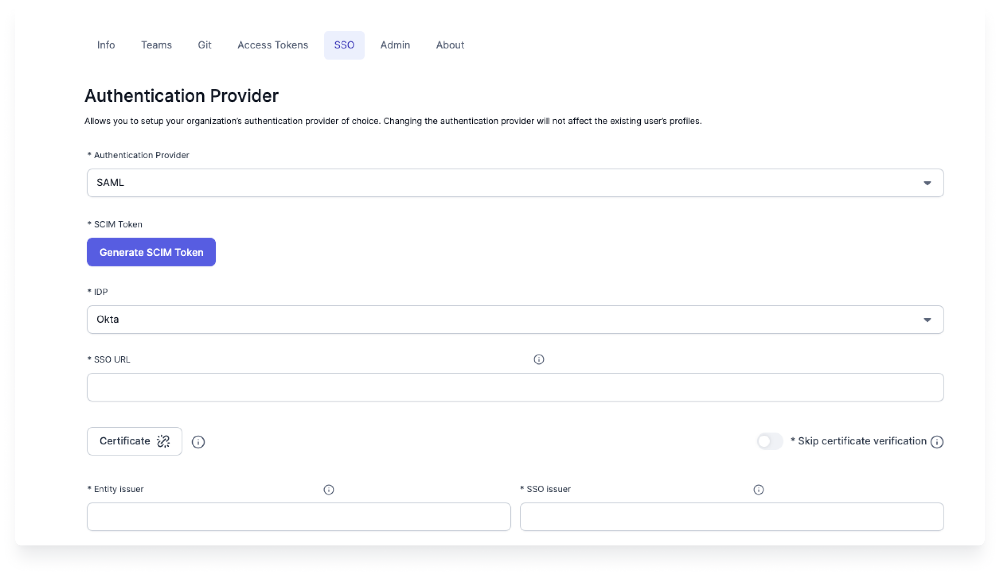

:::edition Express and Enterprise
Available for Express and Enterprise Editions only.
:::

Prophecy supports SAML for authentication.

## Prerequisites

Review the following prerequisites.

- To access SSO settings, you must be a cluster admin for your deployment.
- SAML is available for Express and Enterprise Editions.
- SCIM is only available for the Enterprise Edition. To enable SCIM in your environment, update the `config` in your Prophecy deployment.

## Supported identity providers

Prophecy supports the following identity providers (IdP):

- Google
- Okta
- Azure Active Directory (Microsoft Entra ID)
- Others (custom)

## SAML configuration

1. Log in to Prophecy as a cluster admin user.
1. Navigate to the **SSO** tab of the Prophecy **Settings** page.
1. Under **Authentication Provider**, select SAML.
1. Under IDP, select the appropriate identity provider.
1. Fill out the remaining parameters:

   | Parameter                     | Description                                                                                                                                        |
   | ----------------------------- | -------------------------------------------------------------------------------------------------------------------------------------------------- |
   | Generate SCIM Token           | If SCIM is enabled in your environment, click to create/rotate the SCIM bearer token used by your IdP/SCIM client to provision users and groups.   |
   | SSO URL                       | The Identity Provider Single Sign-On endpoint. Paste the SSO URL (Location) from your IdP metadata. Prophecy redirects users here to authenticate. |
   | Certificate                   | The IdP SAML signing certificate. Prophecy uses this to verify SAML response signatures.                                                           |
   | Skip certificate verification | Disable TLS certificate/host verification when calling the IdP SSO endpoint.                                                                       |
   | Entity issuer                 | The entity issuer you configured in the IdP. Usually, this is the label for your SAML configuration.                                               |
   | SSO issuer                    | The SSO issuer. For Azure AD this is the Azure AD Identifier; for Okta, it is the issuer link in the XML.                                          |

1. Click **Save** at the bottom of the page to save your changes.

## SCIM provisioning

Enable SCIM if you want Prophecy to automatically provision and deprovision users and teams.

See [Group-to-team mapping](docs/administration/authentication/group-team-mapping.md) for handling groups.

## IDP-specific steps

### Azure Active Directory

Configure SAML for Azure Active Directory (Microsoft Entra ID) and enable SCIM provisioning

1. Log into AzureAD as an administrator and create a new Enterprise Application like `ProphecyAzureADApp`.
2. In the home page search bar, search for **Enterprise Applications**.
3. Click **New Application > Create your own application**.
4. Give name for the application like `ProphecyAzureADApp`.
5. Choose the radio button **Integrate any other application you don't find in the gallery (Non-gallery)**.
6. Click **Create**.
7. In Manage section on the left, click **Single sign-on**.
8. Choose **SAML** as the Single sign-on method.

Now the form for **Set up Single Sign-On with SAML** will open. You'll have to fill out different sections of the form.

#### Basic SAML Configuration

1. Provide an Identifier (Entity ID) which is a unique ID to identify this application to Microsoft Entra ID. This will be added to the Entity issuer field in Prophecy.
2. In the same section, configure **Reply URL** and **Sign on URL** as:  
   `https://your-prophecy-ide-url.domain/api/oauth/samlCallback`
3. Click **Save**.

#### Attributes & Claims

1. Click **Edit** button and then **Add new claim**.
2. Give **Name** as `email` and **Source Attribute** as `user.userprincipalname`, and click **Save**.
3. Add one more claim by clicking on **Add new claim**.
4. Give **Name** as `name` and **Source Attribute** as `user.givenname`, and click **Save**.

#### SAML certificates

In the **SAML certificates** section, download `Certificate (Base64)` file to be used while configuring SSO in Prophecy UI.

#### Set up ProphecyAzureADApp

In the **Set up ProphecyAzureADApp** section, copy `Login URL` and `Azure AD Identifier` to be used while configuring SSO in Prophecy UI.

### Okta

Configure SAML for Okta and enable SCIM provisioning

1. Log in to Okta as an administrator.
2. On the homepage, navigate to **Applications** > **Applications**.
3. Click **Create App Integration**.
4. Select **SAML 2.0** and click **Next**.
5. Enter **App Name** as _Prophecy SAML App_ and click **Next**.
6. For **Single Sign-On URL**, specify `https://your-prophecy-ide-url.domain/api/oauth/samlCallback`.
7. Select **Use this** for both **Recipient URL** and **Destination URL**.
8. In **Audience URI (SP Entity ID)**, provide a name to serve as the entity issuer ID (e.g., _prophecyokta_).
9. Set **Name ID format** to **EmailAddress** from the dropdown.
10. For **Application Username**, select **Email**.
11. Under **Attribute Statements**, add two attributes **name** and **email**.

12. Click **Next**.
13. Choose **I’m an Okta customer adding an internal app**.
14. Click **Finish**. The _Prophecy SAML App_ is now displayed.

#### Information required from Okta

##### Download SAML Signing Certificate

1. Navigate to the **Sign On** tab of _Prophecy SAML App_ in Okta.
2. Locate the **SAML Signing Certificates** section.
3. Click the download button, as shown in the example below, to download the certificate:

##### SSO URL

1. In the same **Sign On** tab under **SAML Signing Certificates**, click **View IdP metadata**.
2. This action opens an XML file in a new browser tab.
3. Copy the red-highlighted text in the **Location** section of the XML file and use it as the **SSO URL** in Prophecy IDE.

##### Entity and SSO Issuer

1. Go to the **General** tab, then navigate to the **SAML Settings** section and click **Edit**.
2. Click **Next** to reach the **Configure SAML** section.
3. Scroll to the bottom and click the **Preview the SAML assertion** button.
4. This opens a new browser tab.
5. Copy the highlighted information from the preview and use it as the **Entity Issuer** and **SSO Issuer** in Prophecy IDE.

