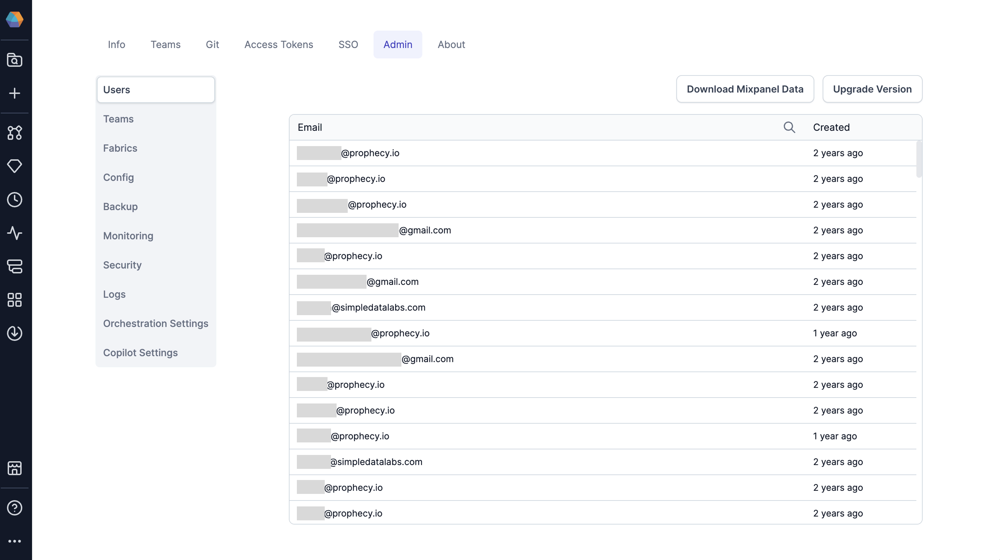

Cluster admins have access to additional settings in the **Settings** UI of their Prophecy environment. Not all of these settings will be applicable for SaaS and Dedicated SaaS deployments.

## Admin tabs

The Admin settings contains various tabs that serve different purposes.

| Tab        | Description                                                                                                   |
| ---------- | ------------------------------------------------------------------------------------------------------------- |
| Users      | View or remove users that exist in your deployment, download Mixpanel data, or upgrade your Prophecy version. |
| Teams      | View or remove teams in your deployment.                                                                      |
| Fabrics    | View fabrics and their teams and authors.                                                                     |
| Config     | Update configurations related to alerts, backups, logs, object store, etc.                                    |
| Backup     | View previous backup information and backup status.                                                           |
| Monitoring | Review the resource usage of various services in the Prophecy deployment.                                     |
| Security   | Global authentication settings like Databricks OAuth U2M setup, Kerberos Authentication, etc.                 |
| Logs       | Download system logs from a specific time range. Helpful for support cases.                                   |
