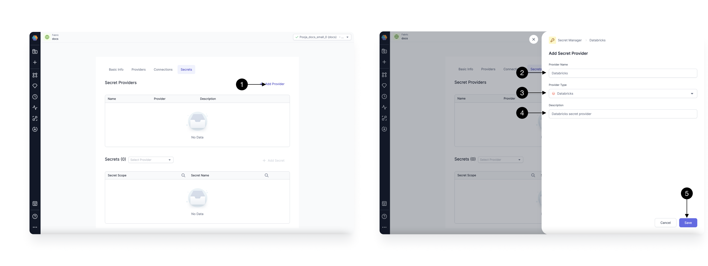
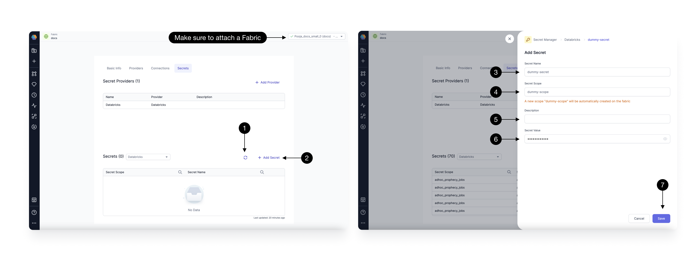

For users leveraging Databricks for Spark Execution, [Databricks Secrets](https://docs.databricks.com/en/security/secrets/index.html) stand out as the most popular Secret Provider within Prophecy.

## Manage Databricks Secret Provider

By default, a Databricks secret provider is added to all Databricks fabrics. Users can choose to delete it if they prefer to restrict using Databricks secrets and opt for another Secret Provider, such as [Hashicorp Vault](./hashicorp-vault.md).

To add a Databricks Secret Provider, click on the **(1) Add Provider** button, opening the Secret Provider form.

Provide a **(2) Name**, select **(3) Provider type** as **Databricks**, and add a **(4) Description** of your choice. A Databricks Secret Provider can only be created in a Databricks fabric, and you do not need to provide any other Authentication details here. Once done, click **(5) Save**.

## Manage Secrets and Scopes

After adding your Secret provider, click on the **(1) Refresh** button to fetch secrets already created in Databricks. Ensure you have attached a fabric from the top right corner for this.

To create a new Secret, click on the **(2) Add Secret** button, opening the Add secret form.

Provide a **(3) Secret Name**, and select a **(4) Secret Scope** from the dropdown. Note that if the scope doesn't exist, it will be auto-created.
Add a **(5) Description**, and the **(6) value** for your secret. Once done, click **(7) Save**. This will create the Secret with the given key and value in the mentioned scope.

You can also Edit/Delete an existing secret from the button next to the Secret in the table.

:::info
Users can only access the secrets, which they have permissions to according to the token provided in the fabric. Every User provides their own PAT in the Databricks fabric.
:::

## Managing secrets for Prophecy Managed Databricks

For POC and trial users exploring the product with Prophecy Managed fabrics, we support creating and managing Databricks Secrets in our Databricks Workspace. Each Prophecy Managed Trial fabric has a pre-created scope of its own. You can use/add/manage secrets in this pre-created Scope only.

:::info

Secrets created in one Prophecy Managed Databricks fabric can't be accessed from another. They're also deleted when the trial expires.
Your POC secrets are safe, but it's best not to use production systems for POC while using Prophecy Managed Databricks fabrics.
:::

To create a new Secret, click on the **Add Secret** button. In the form, you will notice a Secret-scope already selected. Go ahead and add your Secret name and value. Note that Prophecy doesn't store the Secret value.

Once you have created a Secret Provider and Secrets, you can start to [use](./using-secrets.md) them in your pipelines.
