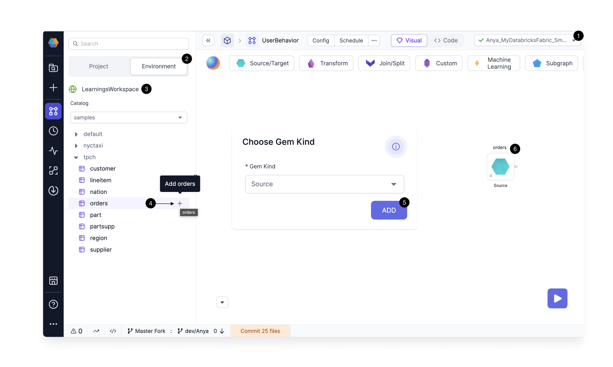
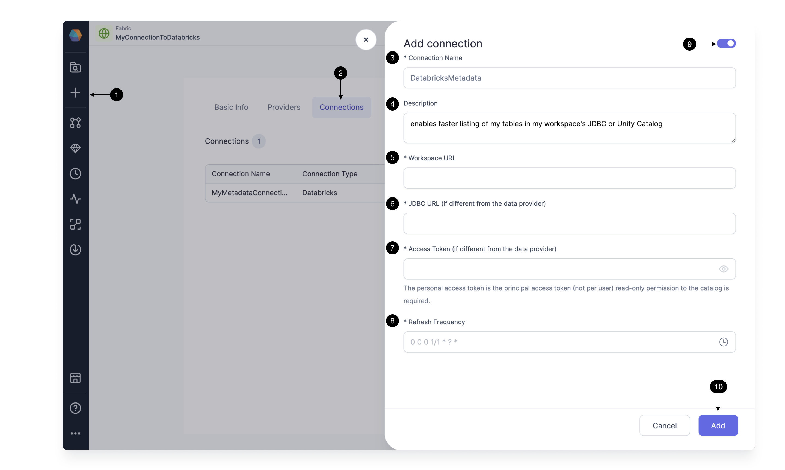

Prophecy lets you work with various data providers when building your pipelines and models. To make this easier, you can create **connections** between Prophecy and a data provider. Connections enable functionality such as:

- Reusing credentials that are established in the connection.
- Browsing data from the data provider in the [Environment tab](docs/getting-started/concepts/project.md#project-editor) of your Prophecy project.
- Auto-indexing data for search in the Prophecy interface.
- Syncing metadata on a regular basis for faster object fetching.

Connections are stored in [fabrics](docs/getting-started/concepts/fabrics.md).

:::info

Connection functionality will vary across data providers.

:::

## Add connection in a project

There are two ways to add connections inside of a project:

- Inside a gem
- In the Environment tab

### Browse data

1. Attach to a fabric that has a metadata connection.
1. Open the Environment tab to access the data.
1. Note the workspace that is synced at the frequency defined in the metadata connection.
1. Add a table to the canvas as a dataset.
1. Define whether your dataset should be added as a [Source or Target](docs/Spark/gems/source-target/source-target.md) gem.
1. Now the dataset appears on the canvas, ready for transformations.



## Add connection in a fabric

Metadata connections are set up inside individual fabrics. This means that anyone with access to the fabric can take advantage of the metadata connection.

1. Initiate the creation of a new fabric.
1. In the **Connections** tab, add a new connection.
1. Define a **Connection Name**.
1. Give the connection a **Description** (optional).
1. Add the **Workspace URL** for the connection. For example, this could be a Databricks workspace URL. In this case, the connection would sync all accessible Data Catalogs.
1. If you choose to define a **JDBC URL** different than that defined in the fabric, the Metadata Connection JDBC will be the only JDBC included in the syncing.
1. Add the **Access Token** for the connection (if different from the fabric). More information on access tokens can be found below.
1. Fill in the **Refresh Frequency** at which you want Prophecy to sync the metadata.
1. **Enable** the metadata connection.
1. **Add** the metadata connection to save it.



## Execution environment requirements

### SQL warehouses or clusters

Prophecy supports metadata collection through SQL warehouses and clusters on Databricks and Snowflake. In general, we recommend creating a [SQL warehouse](https://docs.databricks.com/en/sql/admin/create-sql-warehouse.html#create-a-sql-warehouse) or cluster dedicated to the metadata connection. Using this approach, the recurring metadata syncs can have a cluster defined with appropriate resources, whereas execution clusters defined in the [fabric](/docs/getting-started/concepts/fabrics.md) would have a separate resource profile.

### Provider tokens

Prophecy metadata connections use APIs to make calls to your data provider accounts. For this access, a service principal is recommended. For Databricks providers, follow these [instructions](https://docs.databricks.com/en/dev-tools/service-principals.html#provision-a-service-principal-for-databricks-automation---databricks-ui) to create a service principal and associated token. If you are unable to set up a service principal, use a standard Personal Access Token.

### Permissions

Regardless of the type of credentials you use, those credentials will need to come with access on the environment side to all workspaces, warehouses, or clusters you want to see with the metadata connection.

To grant permissions to the service principal on the Unity Catalog (granting the same permission on all schemas within that catalog), run the command:

```
GRANT SELECT ON CATALOG <catalog> TO <service_principal>;
```

To grant permissions to the service principal for Hive Metastore, run the command:

```
GRANT USAGE, READ_METADATA, SELECT ON CATALOG <hive_metastore> TO <service_principal>;
```
