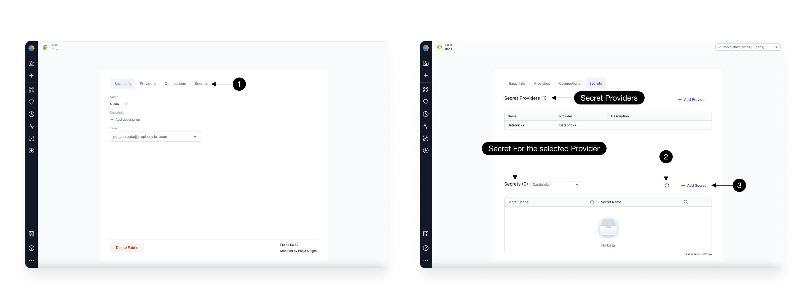
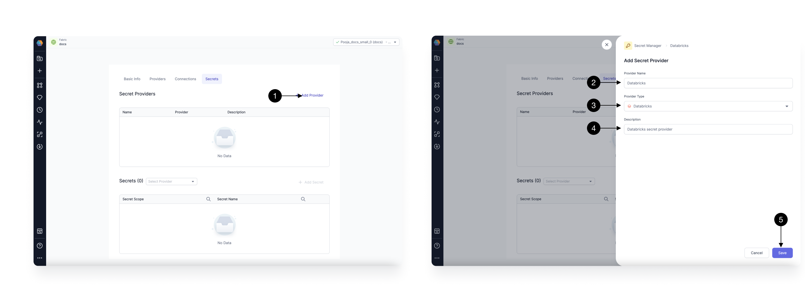

**Secrets** help you safeguard sensitive information such as API keys, passwords, and encryption keys. When you create a fabric, you can add one or more secret providers to manage your secrets for that fabric. Then, you can create secrets for [use in your pipelines](./using-secrets.md).

## Providers

You can configure multiple secret providers per fabric in the **Providers** tab of the fabric configuration. Providers and secrets can be added, edited, and deleted from Prophecy. We support the following providers.

| Secret Provider       | Details                                   |
| --------------------- | ----------------------------------------- |
| Databricks Secrets    | Available for **Databricks fabrics only** |
| HashiCorp Vault       | Available for all Spark fabrics           |
| Environment Variables | Available for all Spark fabrics           |

### Databricks

[Databricks](https://docs.databricks.com/en/security/secrets/index.html) is the most commonly used secret provider in Prophecy. By default, a Databricks secret provider is added to all Databricks fabrics. You can remove this if required.

If you add new secrets in Databricks, you can refresh secrets in Prophecy to fetch them. You can also add new secrets directly in Prophecy. To refresh or add secrets, you must be attached to a cluster. You can only access secrets that you also can access in Databricks.

:::info Free trials

If you are using a free trial, you can use Databricks as the secret provider. Your secrets will be automatically cleaned up after the trial expires. While Prophecy assigns a separate scope to each Prophecy-managed fabric, it is not recommended to use your production data tools for trials.

:::

### HashiCorp Vault

[HashiCorp Vault](https://developer.hashicorp.com/vault/docs/what-is-vault) is a comprehensive and highly scalable secrets management solution that provides centralized control over sensitive information such as API keys, passwords, and encryption keys. It ensures secure storage, dynamic secret generation, and fine-grained access policies. HashiCorp Vault secrets can be set up in any fabric.

When configuring HashiCorp Vault as a secret provider, you must include the vault **Address** and **Token**. Your Spark cluster will have to include these if they are configured as environment variables. In other words, the environment variables also must be set up in the Spark cluster.

If you add new secrets to your vault, you can refresh secrets in Prophecy to fetch them. You can also add new secrets directly in Prophecy. To refresh or add secrets, you must be attached to a cluster. You can only access secrets that you also have access to in your Spark cluster.

### Environment Variables

If you prefer simplicity in secret management, you can use environment variables that are present in your Spark cluster.

You must manually add your environment variables as secrets once you have set up the secret provider. When you create a secret in Prophecy, this sets up a mapping for environment variables. Ensure that the same environment variable exists on your Spark cluster with the correct value. This option does not enable refreshing or fetching.

## Secrets

Secrets have the following parameters:

| Parameter   | Description                 |
| ----------- | --------------------------- |
| Provider    | The secret provider         |
| Name        | The name of the secret      |
| Scope       | The scope of the secret     |
| Description | A description of the secret |
| Value       | The value of the secret     |
