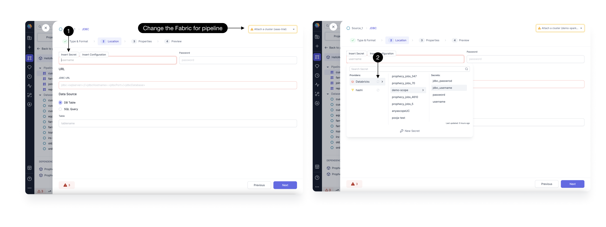

Once you have Secrets and [Secret Providers](./secret-management.md) created in fabrics, you can [Use a secret](./using-secrets.md) in your Source and Target gems in your pipelines directly.
Any gem which requires a Authentication Field like Username or password,you will have an option to Insert Secret as shown below.

Click on **(1) Insert Secret**, this will open the dropdown for all secrets and secrets providers available in your fabric.
If you don't see your secrets, confirm you have correct fabric selected in the top right corner.
Attach a Cluster from top right corner to be able to **(2) Refresh Secrets** for any Provider.
