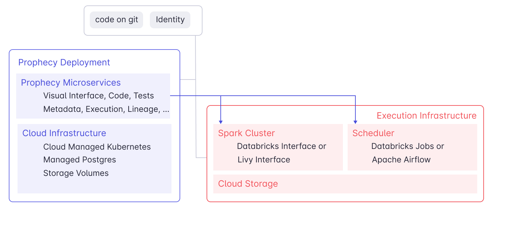
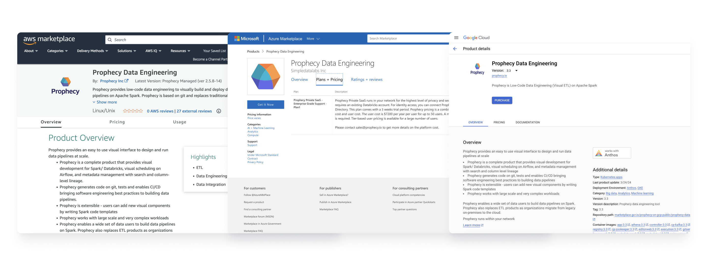

Prophecy deployment is simple and flexible. Prophecy is written as a set of microservices that run on Kubernetes and is built to be multi-tenant. There are three primary options within cloud deployment.

## Cloud Deployment

Prophecy in the cloud connects to your existing Spark and Scheduler/Orchestrator. Prophecy does not store any data, however, it does store metadata about your Pipelines, Datasets and schedules.

### Public SaaS

Public SaaS (Prophecy managed SaaS) is the default option when you connect from **Databricks Partner Connect** and is free for one user.
This option is heavily used by customers to try Prophecy. Our startup and midsize customers who like the convenience of a managed service prefer this option. You can also use this by directly going to the [Prophecy Application](https://app.prophecy.io/).

### Private SaaS (Customer VPC)

Customers in segments that deal with very sensitive data primarily use this option. Here, Prophecy runs within the **Customer VPC** and connects to the identity, Spark clusters and the scheduler within the VPC. For more information read the [private SAAS installation documentation](docs/administration/self-hosted/self-hosted.md) or reach out to our team by using [request a demo](https://www.prophecy.io/request-a-demo).

Ready to setup Prophecy to run in your VPC? Login into your preferred cloud marketplace: [AWS](https://aws.amazon.com/marketplace/pp/prodview-gh3pyflmu7mlu?sr=0-1&ref_=beagle&applicationId=AWSMPContessa#external-reviews), [Azure](https://azuremarketplace.microsoft.com/en-us/marketplace/apps/simpledatalabsinc1635791235920.prophecy-data-engineering), or [GCP](https://console.cloud.google.com/marketplace/product/prophecy-on-gcp-public/prophecy-data-engineering), and search for "Prophecy." The installation billing starts after 30 days.

### On-Premise Deployment

On rare occasions, Prophecy will deploy on-premise for large customers who are moving to the cloud. Often the order is that the organizations will move Pipelines from on-premise legacy ETL tools to Spark, then move it to Spark on the cloud.
