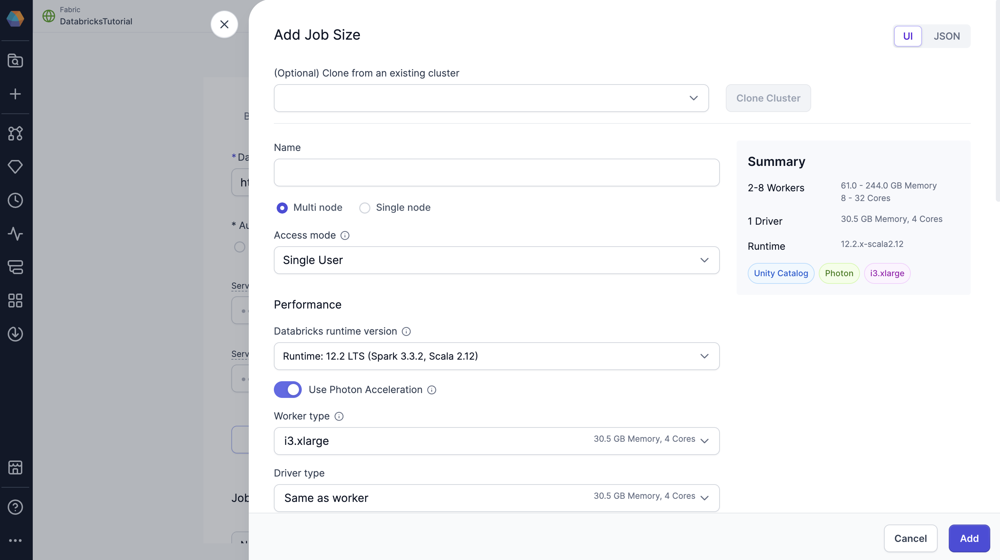

Create a Databricks fabric to connect Prophecy to your existing Databricks workspace. With a Databricks fabric, you can connect to existing Spark clusters or create new ones, run Spark pipelines, and read or write data, depending on your Databricks permissions.

## Fields

Learn about different fields to configure your Databricks Spark fabric.

### Team

Each fabric is associated with one team. All team members will be able to access the fabric in their projects.

### Credentials

Provide the following information to verify your Databricks credentials.

#### Databricks Workspace URL

The URL that points to the workspace that the fabric will use as the execution environment.

#### Authentication Method

Prophecy supports authentication via [Personal Access Token](https://docs.databricks.com/dev-tools/api/latest/authentication.html#generate-a-personal-access-token) (PAT) and [OAuth](/databricks-oauth-authentication).

:::caution
Each user in the team will have to authenticate individually using the method you select. An individual user's credentials will determine the level of access they have to Databricks from Prophecy. At minimum, you must have permission to attach clusters in Databricks to use the fabric.
:::

:::note
When using **Active Directory**, Prophecy takes care of the auto-generation and refreshing of the Databricks personal access tokens. Read more about it [here](https://docs.microsoft.com/en-us/azure/databricks/dev-tools/api/latest/aad/).
:::

#### Service Principal Configuration

You must provide the Service Principal Client Secret and Service Principal Client ID when you use [OAuth for project deployment](/databricks-oauth-authentication/#machine-to-machine-m2m).

### Job Sizes

Job sizes define the cluster configurations that Prophecy can spawn to run pipelines. We recommend choosing the smallest machine types and the fewest nodes necessary for your use case to optimize cost and performance.

By default, Prophecy includes a single job size that uses [Databricks Runtime 14.3](https://docs.databricks.com/aws/en/compute#databricks-runtime). You can modify this default configuration or define additional job sizes using the Prophecy UI.

To create or update a job size, use the form view or switch to the JSON editor to paste your existing compute configuration from Databricks.

:::note
The job size configuration mirrors the compute configuration in Databricks. To learn more about compute configuration in Databricks, visit their [reference](https://docs.databricks.com/aws/en/compute/configure) guide.
:::

:::caution
When using Unity Catalog clusters with standard (formerly shared) access mode, note their [particular limitations](https://docs.databricks.com/en/compute/access-mode-limitations.html#shared-access-mode-limitations-on-unity-catalog). You can see all supported Prophecy features in our [UC standard cluster support](./ucshared) documentation.
:::

### Prophecy Library

Prophecy libraries are Scala and Python libraries that extend the functionality of Apache Spark. These libraries are automatically installed in your Spark execution environment when you attach to a cluster or create a new one.

:::info Whitelist Prophecy libraries
To use Prophecy libraries in Databricks environments that have enabled Unity Catalog, you must whitelist the required Maven coordinates or JAR paths. Find instructions [here](/admin/dbx-whitelist-plibs).
:::

#### Public Central (Default)

Retrieve Prophecy libraries from the public artifact repository. Repositories are listed below.

- ProphecyLibsScala: [Maven](https://mvnrepository.com/artifact/io.prophecy/prophecy-libs)
- ProphecyLibsPython: [PyPI](https://pypi.org/project/prophecy-libs/)

#### Custom Artifactory

Retrieve Prophecy libraries from an Artifactory URL.

#### File System

Retrieve Prophecy libraries from a file system.

For example, you can add the public S3 bucket path: `s3://prophecy-public-bucket/prophecy-libs/`

:::note
A full list of public paths can be found in the documentation on [Prophecy libraries](/engineers/prophecy-libraries#download-prophecy-libraries). You also can set up [Prophecy libraries in your Databricks volumes](docs/administration/fabrics/Spark-fabrics/databricks/volumns-plibs.md).
:::

### Artifacts

Prophecy supports Databricks volumes. When you run a Python or Scala pipeline via a job, you must bundle them as whl/jar artifacts. These artifacts must then be made accessible to the Databricks job in order to use them as a library installed on the cluster. You can designate a path to a volume for uploading the whl/jar files under Artifacts.

## Databricks execution

To learn about Databricks execution, visit:

- [Interactive Execution](/engineers/execution)
- [Execution Metrics](/docs/Spark/execution/execution-metrics.md)
