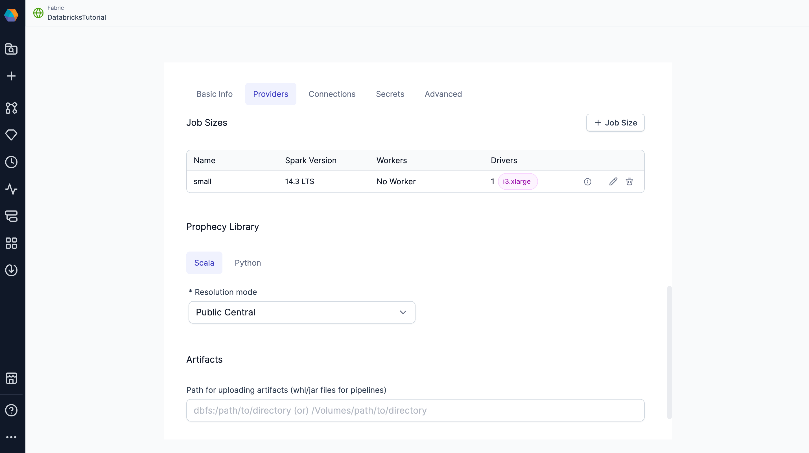

Create a Databricks fabric to connect Prophecy to your existing Databricks workspace. With a Databricks fabric, you can connect to existing Spark clusters or create new ones, run Spark pipelines, and read or write data, depending on your Databricks permissions. The following sections describe the parameters needed to set up a Databricks fabric.

## Basic Info

The **Basic Info** tab includes the following parameters:

| Parameter              | Description                                                                                                    |
| ---------------------- | -------------------------------------------------------------------------------------------------------------- |
| Name                   | Name used to identify the project.                                                                             |
| Description (Optional) | Description of the project.                                                                                    |
| Team                   | Each fabric is associated with one team. All team members will be able to access the fabric in their projects. |

## Providers

The **Providers** tab lets you configure the execution environment settings.

| Parameter     | Description                                                       |
| ------------- | ----------------------------------------------------------------- |
| Provider Type | Type of fabric to create (in this case, Spark).                   |
| Provider      | Provider of the execution environment (in this case, Databricks). |

### Credentials

Fill out the credentials section to verify your Databricks credentials.

| Parameter                | Description                                                                                 |
| ------------------------ | ------------------------------------------------------------------------------------------- |
| Databricks Workspace URL | The URL that points to the workspace that the fabric will use as the execution environment. |
| Authentication Method    | The method Prophecy will use to authenticate Databricks connections.                        |

#### Authentication methods

Prophecy supports multiple [Databricks authentication methods](https://docs.databricks.com/aws/en/dev-tools/auth):

| Method                        | Authenticated Identity                                                                                                                                   | Use Cases                                                   | Requirements                                                                                     |
| ----------------------------- | -------------------------------------------------------------------------------------------------------------------------------------------------------- | ----------------------------------------------------------- | ------------------------------------------------------------------------------------------------ |
| Personal Access Token         | A single user account is used and shared across the fabric. Access level is tied to that user’s permissions. Prophecy auto-refreshes PATs for AAD users. | All pipeline execution scenarios.                           | PAT generated from a Databricks user account.                                                    |
| User-based OAuth (U2M)        | Each user signs in with their own Databricks account. Access is scoped to the individual’s permissions. **Cannot be used for scheduled pipeline runs.**  | Interactive pipeline execution (e.g., development, testing) | [OAuth app connection](/databricks-oauth-authentication/#requirements) set up by Prophecy admin. |
| Service Principal OAuth (M2M) | Uses a shared service principal identity. Suitable for automation and scheduling.                                                                        | Scheduled pipeline execution and project deployment         | OAuth app connection + **Service Principal Client ID** and **Secret**                            |

At minimum, the authenticated user must have permission to attach clusters in Databricks to use the connection in Prophecy. Some [policies](https://docs.databricks.com/aws/en/admin/clusters/policy-families) additionally require Databricks Workspace Admin permissions.

### Job Sizes

Job sizes define the cluster configurations that Prophecy can spawn to run pipelines. We recommend choosing the smallest machine types and the fewest nodes necessary for your use case to optimize cost and performance.

By default, Prophecy includes a single job size that uses [Databricks Runtime 14.3](https://docs.databricks.com/aws/en/compute#databricks-runtime). You can modify this default configuration or define additional job sizes using the Prophecy UI.

To create or update a job size, use the form view or switch to the JSON editor to paste your existing compute configuration from Databricks.

:::note
The job size configuration mirrors the compute configuration in Databricks. To learn more about compute configuration in Databricks, visit their [reference guide](https://docs.databricks.com/aws/en/compute/configure).
:::

:::caution
When using Unity Catalog clusters with standard (formerly shared) access mode, note their [particular limitations](https://docs.databricks.com/en/compute/access-mode-limitations.html#shared-access-mode-limitations-on-unity-catalog). You can see all supported Prophecy features in our [UC standard cluster support](./ucshared) documentation.
:::

### Prophecy Library

Prophecy libraries are Scala and Python libraries that extend the functionality of Apache Spark. These libraries are automatically installed in your Spark execution environment when you attach to a cluster or create a new one.

| **Resolution mode**      | **Description**                                                                                                                                  |
| ------------------------ | ------------------------------------------------------------------------------------------------------------------------------------------------ |
| Public Central (Default) | Retrieve Prophecy libraries from the public artifact repository. Use Maven for Scala projects and PyPI for Python projects.                      |
| Custom Artifactory       | Retrieve Prophecy libraries from an Artifactory URL.                                                                                             |
| File System              | Retrieve Prophecy libraries from a file system. For example, you can add the public S3 bucket path: `s3://prophecy-public-bucket/prophecy-libs/` |

:::info Whitelist Prophecy libraries
To use Prophecy libraries in Databricks environments that have enabled Unity Catalog, you must whitelist the required Maven coordinates or JAR paths. Find instructions [here](/admin/dbx-whitelist-plibs).
:::

:::note
A full list of public paths can be found in the documentation on [Prophecy libraries](/engineers/prophecy-libraries#download-prophecy-libraries). You also can set up [Prophecy libraries in your Databricks volumes](docs/administration/fabrics/Spark-fabrics/databricks/volumns-plibs.md).
:::

### Artifacts

Prophecy supports Databricks volumes. When you run a Python or Scala pipeline via a job, you must bundle them as whl/jar artifacts. These artifacts must then be made accessible to the Databricks job in order to use them as a library installed on the cluster. You can designate a path to a volume for uploading the whl/jar files under Artifacts.

