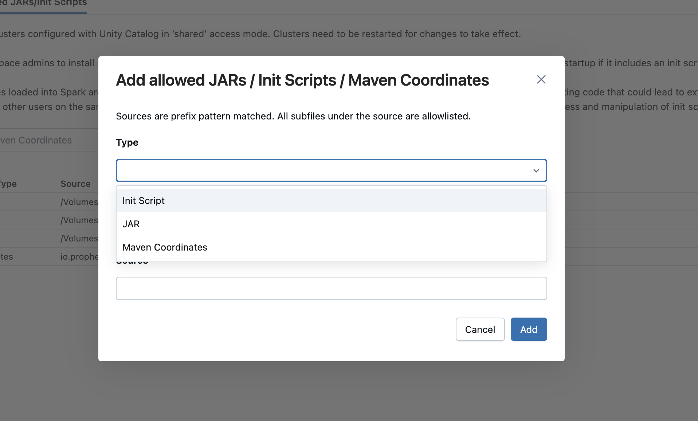

To use [Prophecy libraries](/engineers/prophecy-libraries) in Databricks environments that have enabled Unity Catalog, you must whitelist the required Maven coordinates or JAR paths. This page outlines different ways to do so.

:::info
For more information, see the Databricks documentation on [allowlists](https://docs.databricks.com/aws/en/data-governance/unity-catalog/manage-privileges/allowlist).
:::

## Prerequisites

To whitelist Prophecy libraries in Databricks, you need to be a [Databricks metastore admin](https://docs.databricks.com/aws/en/data-governance/unity-catalog/manage-privileges/admin-privileges#metastore-admins).

## Option 1: Edit allowlist in the Databricks UI

Follow the instructions to whitelist Prophecy libraries through the Databricks UI.

1. Check your Prophecy Library version.

   Find your project's Prophecy library version by checking the ProphecyLibs dependency in your [project metadata](/projects#metadata).

1. Note your Databricks cluster's Spark version.

1. Copy the corresponding Maven coordinate.

   Format: `io.prophecy:prophecy-libs_2.12:<version>`

   Example: `io.prophecy:prophecy-libs_2.12:3.5.0-8.0.31`

   You can look up versions on [Maven Repository](https://mvnrepository.com/artifact/io.prophecy/prophecy-libs) that are compatible with your Spark version.

1. Navigate to allowlist in Databricks.

   Go to **Catalog → Metastore → Allowed JARs/Init Scripts** to add the path or coordinates.

   

1. (Optional) Add initialization script to pre-configure allowlist behavior.

## Option 2: Edit allowlist via Python Notebook

Use the following Python code in a Databricks notebook to whitelist the Prophecy library Maven coordinates. This command whitelists any Maven coordinates that begin with `io.prophecy`.

```python
import requests

url = "https://<databricks-host>/api/2.1/unity-catalog/artifact-allowlists/LIBRARY_MAVEN"
headers = {
    "Content-Type": "application/json",
    "Authorization": "Bearer <your-token>",  # Replace with your PAT
}
data = {
    "artifact_matchers": [
        {
            "artifact": "io.prophecy",
            "match_type": "PREFIX_MATCH"
        }
    ]
}

response = requests.put(url, headers=headers, json=data)

print(f"Status Code: {response.status_code}")
print(f"Response Text: {response.text}")
```

## Option 3: Edit allowlist via cURL

### Prophecy library Maven coordinate

Run the following in the command line to whitelist the Prophecy library Maven coordinates. This command whitelists any Maven coordinates that begin with `io.prophecy`.

```bash
curl -v --location --request PUT '<databricks-host>/api/2.1/unity-catalog/artifact-allowlists/LIBRARY_MAVEN' \
--header 'Content-Type: application/json' \
--header 'Authorization: Bearer <your-token>' \
--data '{
  "artifact_matchers": [
    {
      "artifact": "io.prophecy",
      "match_type": "PREFIX_MATCH"
    }
  ]
}'
```

### Volume path for JARs

Run the following in the command line to whitelist a volume path for JARs. This is relevant if you have [set up Prophecy libraries in a Databricks volume](/engineers/dbx-volumes-plibs).

```bash
curl -v --location --request PUT '<databricks-host>/api/2.1/unity-catalog/artifact-allowlists/LIBRARY_JAR' \
--header 'Content-Type: application/json' \
--header 'Authorization: Bearer <your-token>' \
--data '{
  "artifact_matchers": [
    {
      "artifact": "/Volumes/shared-libs/",
      "match_type": "PREFIX_MATCH"
    }
  ]
}'
```
