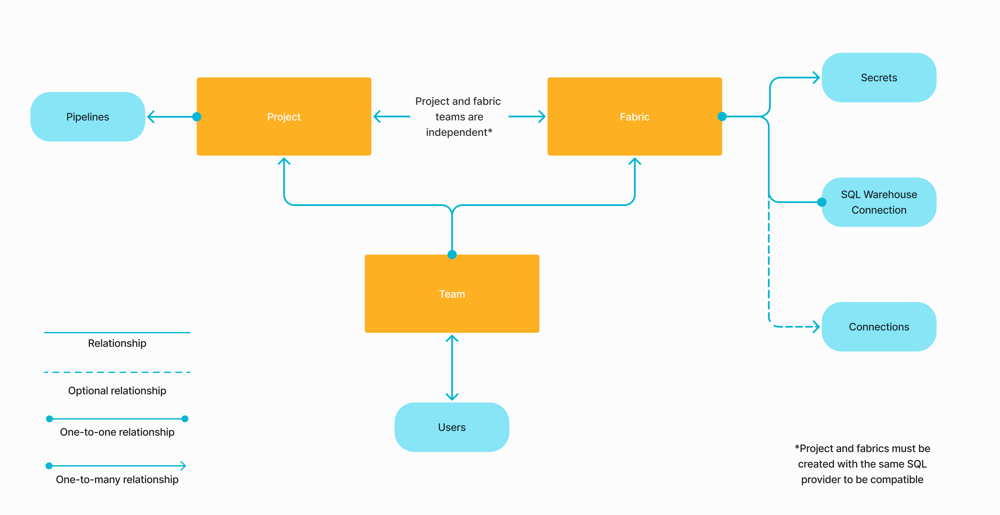

Prophecy lets you work with various data providers when building your pipelines. To make this easier, you can create **connections** between Prophecy and a data provider. Once you add connections a fabric and use that fabric in a project, you can:

- Reuse credentials that are established in the connection.
- Browse data from the data provider in the [Environment browser](/projects#project-editor) of your Prophecy project.
- Auto-index data for search in the Prophecy interface.

## Prerequisites

To leverage connections, you need a [Prophecy fabric](docs/administration/fabrics/prophecy-fabrics/prophecy-fabrics.md) and a [SQL project](/projects#project-types).

## Connections access

Prophecy controls access to connections through fabric-level permissions.

- To access a connection, you must have access to the fabric where it was created. You can only access fabrics that are assigned to one of your teams.
- To use a connection in your project, attach a fabric that includes that connection. You can attach any fabric that belongs to one of your teams.
- To create a new connection, you can do so inside of a fabric or in the project itself after attaching to a fabric.



:::info
Most connections are only used to read from and write to data sources. The SQL Warehouse connection is an exception—it also provides the compute environment for pipeline execution.
:::

## What's next

Visit the following pages to learn more about available connections.

```mdx-code-block
import DocCardList from '@theme/DocCardList';
import {useCurrentSidebarCategory} from '@docusaurus/theme-common';

<DocCardList items={useCurrentSidebarCategory().items}/>
```
