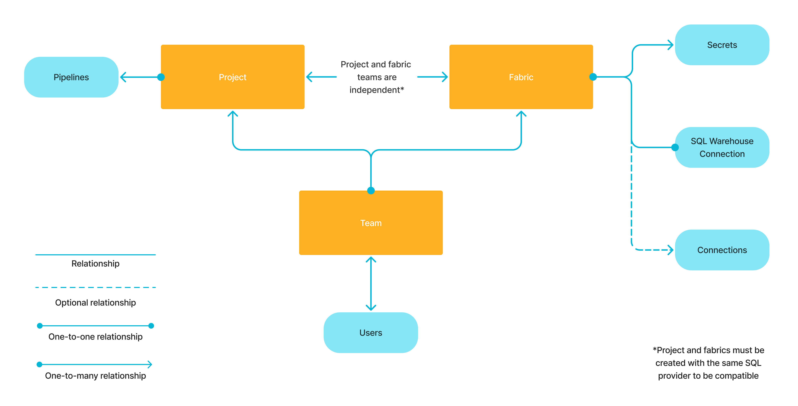

Prophecy lets you work with various data providers when building your pipelines. To read and write data from external sources, create **connections** inside a [Prophecy fabric](/administration/fabrics/prophecy-fabrics/).

When you attach to a fabric with connections, you can:

- Reuse credentials that are established in the connection.
- Browse data from the data provider in the [Environment browser](/projects#project-editor) of your Prophecy project.
- Auto-index data for search in the Prophecy interface.

## Connections access

Prophecy controls access to connections through fabric-level permissions. To access a connection, you must have access to the fabric that contains the connection. You can only access fabrics that are assigned to one of your teams.



:::info
Most connections are only used to read from and write to data sources. The SQL Warehouse connection is an exception—it also provides the compute environment for pipeline execution.
:::

## Add a new connection

To configure a new connection in a Prophecy fabric:

- Open the **Metadata** page from the left sidebar in Prophecy.
- Navigate to the **Fabric** tab.
- Open the fabric where you want to add the connection.
- Navigate to the **Connections** tab.
- Click **+ Add Connection**. This opens the **Create Connection** dialog.
- Select a data provider from the list of connection types.
- Click **Next** to open the connection details.
- Configure the connection and save your changes.

Learn about individual connection parameters in the connection's respective reference page.

:::note
You can also create connections inside the [project editor](/analysts/connections).
:::

## What's next

Visit the following pages to learn more about available connections.

```mdx-code-block
import DocCardList from '@theme/DocCardList';
import {useCurrentSidebarCategory} from '@docusaurus/theme-common';

<DocCardList items={useCurrentSidebarCategory().items}/>
```
