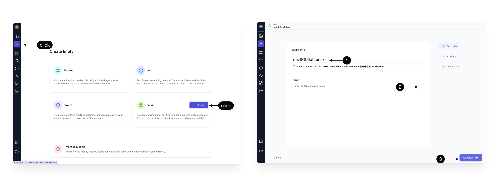

To run models on Databricks, you need to create a [SQL fabric](/administration/fabrics/sql-fabrics/Fabrics) with a Databricks connection.

:::info
SQL fabrics are for **models only**. Create a [Prophecy fabric](/administration/fabrics/prophecy-fabrics/) with a Databricks SQL warehouse connection to run pipelines.
:::

## Create a fabric

Fabrics define your Prophecy project execution environment. To create a new fabric:

1. Click on the **Create Entity** button from the left navigation bar.
1. Click on the **Fabric** tile.

## Basic Info

Next, complete the fields in the **Basic Info** page.

1. Provide a fabric title. It can be helpful to include descriptors like `dev` or `prod` in your title.
1. (Optional) Provide a fabric description.
1. Select a [team](/administration/teams-users/team-based-access) to own this fabric. Open the dropdown to see the teams you belong to.
1. Click **Continue**.

## Provider

The SQL provider is both the storage warehouse and the execution environment where your SQL code will run. To configure the provider:

1. Select **SQL** as the Provider type.
1. Click the dropdown menu for the list of supported Provider types, and select **Databricks**.
1. Copy the **JDBC URL** from the Databricks UI as shown. This is the URL that Prophecy will connect for SQL Warehouse data storage and execution.   
   :::note
   If using self-signed certificates, add `AllowSelfSignedCerts=1` to your JDBC URL.
   :::
1. Select [Personal Access Token](https://docs.databricks.com/aws/en/dev-tools/auth/pat) or [OAuth](/databricks-oauth-authentication) (recommended) for authentication with Databricks.
1. Enter the catalog and schema to be used as the default write location for target models.
1. Click **Continue**.

Prophecy respects **individual user credentials** when accessing Databricks catalogs, tables, databases, etc.

:::note
Prophecy supports Databricks Volumes. When you run a Python or Scala pipeline via a job, you must bundle them as whl/jar artifacts. These artifacts must then be made accessible to the Databricks job in order to use them as a library installed on the cluster. You can designate a path to a Volume for uploading the whl/jar files under Artifacts.
:::

### Optional: Connections

If you want to crawl your warehouse metadata on a regular basis, you can set a connection here.

## What's next

Attach a fabric to your SQL project and begin [data modeling](/engineers/models)!
