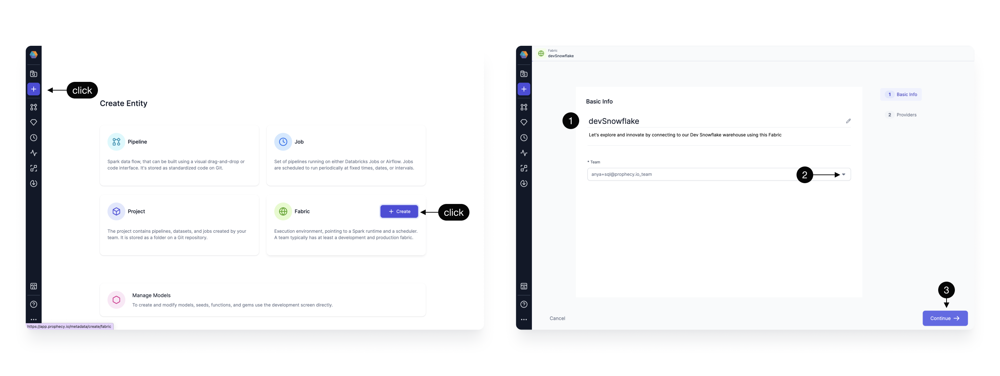
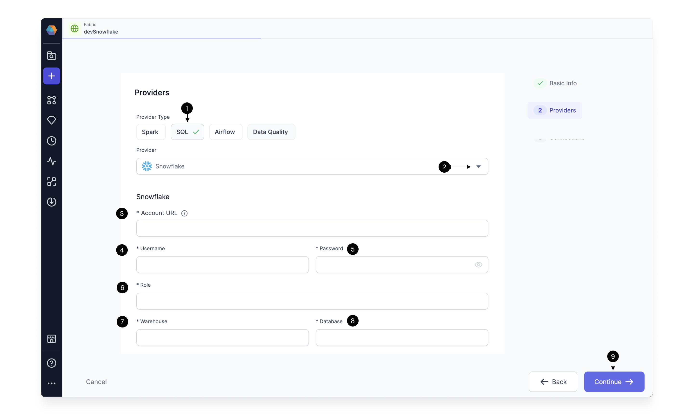

To run models on Snowflake, you need to create a SQL [fabric](docs/getting-started/concepts/fabrics.md) with a Snowflake connection.

:::info
SQL fabrics are not compatible with pipelines.
:::

## Create a fabric

Fabrics define your Prophecy project execution environment. To create a new fabric:

1. Click on the **Create Entity** button from the left navigation bar.
1. Click on the **Fabric** tile.

## Basic Info

Next, complete the fields in the **Basic Info** page.

1. Provide a fabric title. It can be helpful to include descriptors like `dev` or `prod` in your title.
1. (Optional) Provide a fabric description.
1. Select a [team](/administration/teams-users/team-based-access) to own this fabric. Open the dropdown to see the teams you belong to.
1. Click **Continue**.

## Provider

The SQL provider is both the storage warehouse and the execution environment where your SQL code will run. To configure the provider:

1. Select **SQL** as the Provider type.
1. Click the dropdown menu for the list of supported Provider types and select **Snowflake**.
1. Add the **Snowflake Account URL** (for example, `https://<org>-<account>.snowflakecomputing.com`).
1. Add the **username** that will be used to connect to the Snowflake Warehouse.
1. Add the **password** that will be used to connect to the Snowflake Warehouse.   
   :::info
   Each Prophecy user will provide their own username/password credential upon login. Prophecy respects the access scope of the Snowflake credentials, meaning users in Prophecy can read tables from each database and schema for which they have access in Snowflake. These username/password credentials are encrypted for secure storage.
   :::
1. Add the Snowflake [role](https://docs.snowflake.com/en/user-guide/security-access-control-overview#roles) that Prophecy will use to read data and execute queries on the Snowflake Warehouse. The role must be already granted to the username/password provided above.
1. Specify the **Snowflake warehouse** for default writes for this execution environment.
1. Specify the desired **Snowflake database and schema** where tables will be written to by default.
1. Click **Continue** to complete fabric setup.

## Schedule jobs

SQL models can be scheduled using Airflow to run on Snowflake. Create an [Airflow fabric](docs/administration/fabrics/airflow-fabrics/airflow-fabrics.md), and set up a Snowflake connection that references the Snowflake fabric created above.

## What's next

Attach a fabric to your SQL project and begin [data modeling](/engineers/models)!
