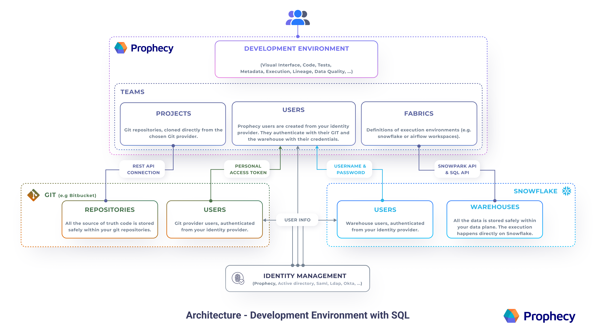

Prophecy is written as a set of microservices that run on Kubernetes, and it can run on various cloud platforms.

## Deployment

| Deployment Model                                                            | Description                                                                                                              |
| --------------------------------------------------------------------------- | ------------------------------------------------------------------------------------------------------------------------ |
| [SaaS](docs/administration/prophecy-deployment.md#saas)                     | Prophecy-managed, multi-tenant architecture. [Try it here](https://app.prophecy.io/).                                    |
| [Dedicated SaaS](docs/administration/prophecy-deployment.md#dedicated-saas) | Prophecy-managed, single-tenant architecture in Prophecy’s VPC.                                                          |
| [Self-hosted](docs/administration/prophecy-deployment.md#self-hosted)       | Self-managed and runs within the customer’s VPC. Formerly known as Private SaaS deployment. [Learn more](./self-hosted). |

## High-level architecture

There are four components of a successful Prophecy deployment:

| Component                          | Description                                                                                                                                                                                                                                                     |
| ---------------------------------- | --------------------------------------------------------------------------------------------------------------------------------------------------------------------------------------------------------------------------------------------------------------- |
| **Prophecy IDE**                   | The development environment, including Prophecy microservices and cloud infrastructure, that is deployed.                                                                                                                                                       |
| **Data engine**                    | The [SQL](#sql) or [Spark](#spark) execution environment, like Snowflake or Databricks. This is set up by a customer and connected to Prophecy through a secure and performant interface. No customer data is stored on Prophecy’s environment.                 |
| **Source control**                 | Prophecy works similar to code-first IDEs by natively integrating with [Git](#git) and platforms like Bitbucket. An encrypted copy of customer’s code is stored within Prophecy’s environment for fast access, while the source-of-truth code is stored on Git. |
| **Identity management (optional)** | For simple user authentication and permission control, Prophecy can connect your identity provider of choice.                                                                                                                                                   |

### Prophecy IDE

A user who logs into Prophecy has access to the integrated development environment (IDE). This includes everything needed to enable all data users to transform raw data into reliable, analytics-ready data using visual data pipelines.

Teams are the primary mechanism of ownership. Teams own projects where pipelines, datasets, and jobs live. Teams also own execution fabrics that provide the execution and storage resources for execution including on SQL Warehouses and Spark clusters.

### SQL

To allow for SQL query execution Prophecy can connect to Snowflake and Databricks warehouses. Connectors for additional SQL warehouses will be announced as they are added.

#### Snowflake

To connect with data stored in a SQL Warehouse, or to allow for interactive SQL execution, Prophecy can connect to an existing Snowflake execution environment through secure and performant [Snowpark](https://docs.snowflake.com/en/developer-guide/snowpark/index) or [Snowflake](https://docs.snowflake.com/en/developer-guide/sql-api/reference) APIs.

Each [fabric](/get-started/concepts/fabrics) defined in Prophecy connects to a single Snowflake Warehouse and each user is required to provide credentials to authenticate to it.

Notice the data provider (e.g. Snowflake) matches up to a fabric. For another scenario, consider the same architecture diagram where the fabric connects to a Databricks SQL warehouse instead of Snowflake.

### Spark

To allow for interactive code execution Prophecy can connect to either [Databricks](#databricks) or any other Spark through [Apache Livy](https://livy.apache.org/) (e.g. MapR, CDP, HDP, Spark on Kubernetes).

#### Databricks

Prophecy connects to Databricks using [Rest API](https://docs.databricks.com/dev-tools/api/latest/index.html). Each [fabric](/get-started/concepts/fabrics) defined in Prophecy connects to a single [Databricks workspace](https://docs.databricks.com/workspace/index.html). You can connect a Databricks workspace to your fabric using a [personal access token (PAT)](https://docs.databricks.com/dev-tools/api/latest/authentication.html) or [Databricks OAuth](docs/administration/authentication/databricks-oauth.md).

:::note
When using **Active Directory**, Prophecy takes care of the auto-generation and refreshing of the Databricks personal access tokens. Read more about it [here](https://docs.microsoft.com/en-us/azure/databricks/dev-tools/api/latest/aad/).
:::

Security-conscious enterprises that use Databricks with limited network access have to additionally add the **Prophecy Data Plane IP address** (`3.133.35.237`) to the Databricks allowed [access list](https://docs.databricks.com/security/network/ip-access-list.html#add-an-ip-access-list).

Prophecy primarily uses Databricks for the following functionalities:

- **Interactive Execution** - Prophecy allows its users to spin up new clusters or connect to existing clusters. When a cluster connection exists, Prophecy allows the user to run their code in the interactive mode. Interactive code queries are sent to Databricks using the [Databricks Command API 1.2](https://docs.databricks.com/dev-tools/api/1.2/index.html).
- **Scheduling** - Prophecy allows the user to build and orchestrate Databricks jobs. This works through the [Databricks Jobs API 2.1](https://docs.databricks.com/dev-tools/api/latest/jobs.html).

By default, Prophecy does not store any data samples when executing code using Databricks. Data samples can be optionally stored for observability purposes (execution metrics).

### Git

While all code generated by Prophecy is stored in a User’s Git repository, we temporarily store some of the generated code used during Interactive development in an encrypted cache.

Supported Git providers:

- **Prophecy Managed** - Prophecy automatically sets up the connectivity between itself and the repositories. Prophecy Managed is based on open-source [GitTea](https://github.com/go-gitea/gitea).
- **GitHub** (including GitHub Enterprise) - authenticates using per-user personal access tokens. [How to generate PAT?](https://docs.github.com/en/authentication/keeping-your-account-and-data-secure/creating-a-personal-access-token)
- **Bitbucket** (including Bitbucket self-hosted) - authenticates using per-user personal access tokens. [How to generate PAT?](https://confluence.atlassian.com/bitbucketserver072/personal-access-tokens-1005335924.html)
- **GitLab** (including GitLab self-hosted) - authenticates using per-user personal access tokens. [How to generate PAT?](https://docs.gitlab.com/ee/user/profile/personal_access_tokens.html)
- **Azure DevOps** - authenticates using per-user personal access tokens. [How to generate PAT?](https://docs.microsoft.com/en-us/azure/devops/organizations/accounts/use-personal-access-tokens-to-authenticate?view=azure-devops&tabs=Windows)

Security-conscious enterprises that use Git providers within private networks behind firewalls have to add the Prophecy Control Plane IP address (`3.133.35.237`) to the private network allow-list or to the Git provider [allow-list](https://github.blog/2019-12-12-ip-allow-lists-now-in-public-beta/).

## Security and privacy practices

The Prophecy team employs top-notch industry practices to safeguard the security of their application and maintain the privacy of customer data. Below are just a few components of our comprehensive security strategy and system structure:

- **General** - An annual penetration test is performed to validate Prophecy’s posture and identify vulnerabilities. Our latest penetration test report was issued in November 2022. Prophecy maintains SOC-2 compliance as audited by PrescientAssurance.

- **SaaS** - Prophecy IDE is hosted on secure servers on AWS. All storage systems are encrypted, and all servers are tightly access controlled and audited. Data is encrypted in transit at all times.

- **Self-hosted** - Alternatively, Prophecy’s IDE can be installed within an Enterprise network as desired. Prophecy’s IDE accesses your environment through a single IP address dedicated to you, allowing you to protect access to your data resources at the network level. The credentials are stored per user, and only a fully authenticated user can access their environment.

- **On-premise** - Prophecy complies with your security requirements on-premise; [reach out](https://www.prophecy.io/request-a-demo) to start the discussion.

Read more details on Prophecy’s security and compliance posture at our Security Portal [here.](https://security.prophecy.io/)
